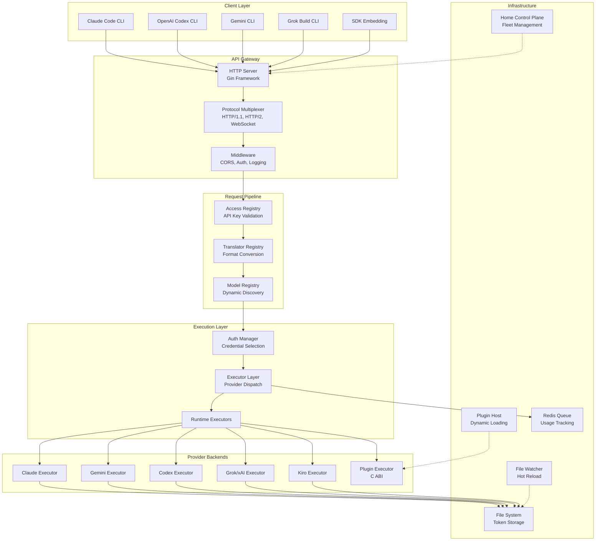

CLIProxyAPI Plus is an open-source proxy server that provides **OpenAI, Gemini, Claude, and Grok-compatible API endpoints** for CLI models. It bridges the gap between AI coding tools (Claude Code, OpenAI Codex, Gemini CLI, Grok Build) and standard AI APIs, enabling developers to use CLI models with tools and libraries designed for standard AI interfaces. This document provides a high-level architectural overview for beginners.

## What is CLIProxyAPI Plus?

At its core, CLIProxyAPI Plus acts as a **protocol translator and load balancer**. When you send a request to an OpenAI-compatible endpoint (like `/v1/chat/completions`), the proxy intercepts it, translates it to the appropriate provider's native format, executes it against the real provider (Claude, Gemini, Codex, etc.), and translates the response back to a standard format. This enables a single API interface to work with multiple AI providers seamlessly.

The system supports **streaming, non-streaming, and WebSocket responses**, along with **function calling/tools**, **multimodal input** (text and images), and **round-robin load balancing** across multiple accounts for each provider. Authentication is handled via OAuth flows initiated through simple CLI commands, with tokens stored locally for automatic refresh.

Sources: [README.md](README.md#L1-L50), [cmd/server/main.go](cmd/server/main.go#L1-L15)

## System Architecture

The following diagram illustrates the high-level architecture of CLIProxyAPI Plus, showing how client requests flow through the system and how the major components interact:



Sources: [internal/api/server.go](internal/api/server.go#L1-L50), [sdk/cliproxy/service.go](sdk/cliproxy/service.go#L1-L60), [internal/api/protocol_multiplexer.go](internal/api/protocol_multiplexer.go#L1-L50)

## Supported Providers

CLIProxyAPI Plus supports a comprehensive range of AI providers, each with dedicated authentication flows, executors, and translator implementations:

| Provider | Auth Method | Executor | Translator | Multi-Account |
|----------|------------|----------|------------|---------------|
| **Claude (Anthropic)** | OAuth Login | `claude_executor.go` | `claude/` | ✅ Round-robin |
| **Google Gemini** | OAuth Login | `gemini_executor.go` | `gemini/` | ✅ Round-robin |
| **OpenAI Codex** | OAuth + Device Code | `codex_executor.go` | `codex/` | ✅ Round-robin |
| **xAI/Grok** | OAuth + API Key | `xai_executor.go` | `openai/` | ✅ Round-robin |
| **Kiro (AWS)** | Google/IDC/AWS Auth | `kiro_executor.go` | `openai/` | ✅ Multi-account |
| **Kimi** | OAuth | `kimi_executor.go` | `openai/` | ✅ Multi-account |
| **Cursor** | OAuth | `cursor_executor.go` | `openai/` | ✅ Multi-account |
| **GitHub Copilot** | Device Code Flow | `github_copilot_executor.go` | `openai/` | ✅ Multi-account |
| **GitLab Duo** | OAuth + Token | `gitlab_executor.go` | `openai/` | ✅ Multi-account |
| **Kilo AI** | Device Flow | `kilo_executor.go` | `openai/` | ✅ Multi-account |
| **CodeBuddy** | Browser OAuth | `codebuddy_executor.go` | `openai/` | ✅ Multi-account |
| **Antigravity** | OAuth | `antigravity_executor.go` | `antigravity/` | ✅ Credits fallback |
| **Vertex AI** | Service Account | `gemini_vertex_executor.go` | `gemini/` | ✅ Multi-project |
| **OpenAI-Compatible** | API Key | `openai_compat_executor.go` | `openai/` | ✅ Per-entry config |

Sources: [internal/auth](internal/auth), [internal/runtime/executor](internal/runtime/executor), [internal/translator](internal/translator)

## Core Architectural Layers

### Request Lifecycle

Every request to CLIProxyAPI Plus follows a well-defined pipeline:

1. **Protocol Detection** — The protocol multiplexer identifies incoming connections as HTTP/1.1, HTTP/2, or WebSocket (for Codex/Gemini streaming protocols).
2. **API Key Validation** — The middleware layer validates the `Authorization` header against configured API keys.
3. **Model Resolution** — The model registry resolves the requested model name to the correct provider backend.
4. **Request Translation** — The translator registry converts the incoming request from its original format (e.g., OpenAI chat) to the target provider's native format.
5. **Credential Selection** — The auth manager selects an available credential using the configured routing strategy (round-robin or fill-first).
6. **Execution** — The appropriate executor sends the request to the upstream provider, handling retries and cooldown logic.
7. **Response Translation** — The response is translated back to the client's expected format.
8. **Usage Tracking** — Request metrics are optionally queued for usage statistics.

Sources: [internal/api/protocol_multiplexer.go](internal/api/protocol_multiplexer.go#L1-L138), [sdk/cliproxy/pipeline/context.go](sdk/cliproxy/pipeline/context.go)

### Plugin System (C ABI)

CLIProxyAPI Plus includes a dynamic plugin system that allows extending functionality without modifying the core codebase. Plugins are shared libraries (`.so`/`.dylib`/`.dll`) built using Go's `c-shared` buildmode or any language that implements the same C ABI and JSON method protocol.

Plugins can provide:
- **Custom executors** for new provider backends
- **Request/response translators** for API format conversion
- **Authentication callbacks** for custom OAuth flows
- **CLI flags and management API routes** for plugin-specific configuration

Sources: [internal/pluginhost](internal/pluginhost), [sdk/pluginabi/types.go](sdk/pluginabi/types.go), [examples/plugin](examples/plugin)

### Configuration Hot-Reload

The file watcher subsystem monitors the configuration file and authentication directory for changes. When modifications are detected, the system performs a hot-reload that updates clients, providers, and routing rules without requiring a server restart. This enables seamless credential rotation and configuration updates.

Sources: [internal/watcher](internal/watcher), [sdk/cliproxy/service.go](sdk/cliproxy/service.go#L1-L120)

### SDK for Embedding

CLIProxyAPI Plus exposes a reusable Go SDK that allows embedding the proxy service into other applications. The SDK provides:

- **Builder pattern** for constructing customized service instances
- **Pluggable providers** for authentication, translation, and execution
- **Lifecycle hooks** for pre/post start callbacks
- **Management API** for runtime configuration control

Sources: [sdk/cliproxy/builder.go](sdk/cliproxy/builder.go#L1-L100), [docs/sdk-usage.md](docs/sdk-usage.md)

## Project Structure

The codebase follows a clean separation between internal implementation and public SDK interfaces:

```
CLIProxyAPIPlus/
├── cmd/server/          # Application entry point and CLI flags
├── internal/            # Private implementation details
│   ├── api/             # HTTP server, routing, middleware
│   ├── auth/            # Provider-specific OAuth implementations
│   ├── config/          # YAML configuration parsing and management
│   ├── pluginhost/      # C ABI plugin loading and lifecycle
│   ├── registry/        # Dynamic model registry and discovery
│   ├── runtime/executor/# Provider-specific request execution
│   ├── translator/      # Request/response format conversion
│   ├── watcher/         # File system monitoring and hot-reload
│   └── tui/             # Terminal user interface
├── sdk/                 # Public SDK for embedding
│   ├── cliproxy/        # Core service builder and lifecycle
│   ├── auth/            # Authentication manager and token stores
│   ├── translator/      # Translator registry and format definitions
│   └── pluginabi/       # Plugin ABI type definitions
└── examples/            # Usage examples and plugin templates
```

Sources: [cmd/server/main.go](cmd/server/main.go#L1-L15), [sdk/cliproxy/builder.go](sdk/cliproxy/builder.go#L1-L50), [internal/api/server.go](internal/api/server.go#L1-L50)

## Deployment Options

CLIProxyAPI Plus supports multiple deployment modes:

| Mode | Description | Best For |
|------|-------------|----------|
| **Local Binary** | Direct execution of the compiled binary | Personal development machines |
| **Docker** | Containerized deployment with docker-compose | Team servers and cloud VMs |
| **Cluster Mode** | Multi-node deployment with Redis coordination | Enterprise fleet management |
| **Home Control Plane** | Centralized management via Redis protocol | Large-scale multi-node operations |
| **SDK Embedding** | Embedded as a library in Go applications | Custom tooling and integration |

Sources: [Dockerfile](Dockerfile), [docker-compose.yml](docker-compose.yml), [config.example.yaml](config.example.yaml#L1-L50)

## Reading Path

For the best learning experience, follow this progression through the documentation:

1. **[Quick Start](2-quick-start)** — Install and run CLIProxyAPI Plus in under 5 minutes with your first provider login.
2. **[Configuration Reference](3-configuration-reference)** — Understand all available configuration options and their defaults.
3. **[Docker Deployment](4-docker-deployment)** — Deploy using containers for team environments.
4. **[Application Entry Point and CLI Flags](5-application-entry-point-and-cli-flags)** — Deep dive into the main entry point and all command-line options.
5. **[HTTP Server and Protocol Multiplexing](6-http-server-and-protocol-multiplexing)** — Understand how the server handles different connection protocols.