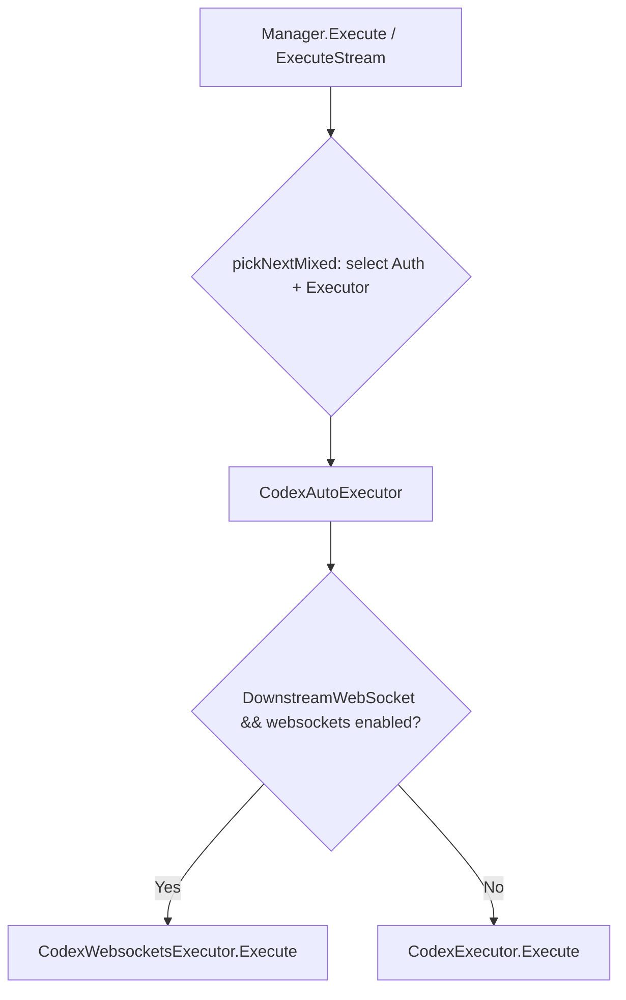
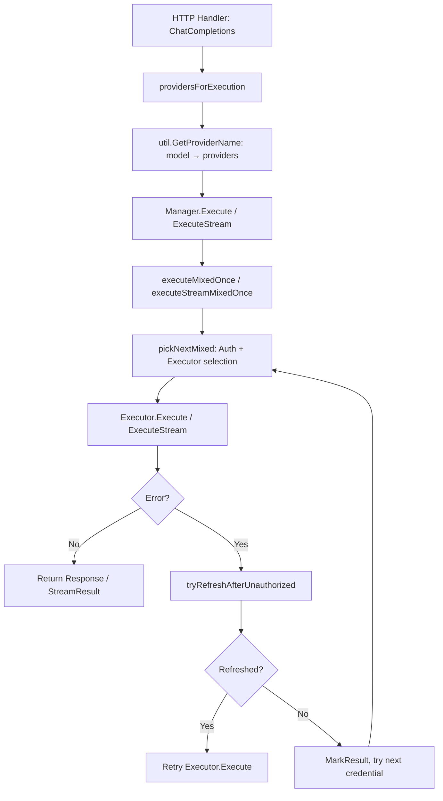
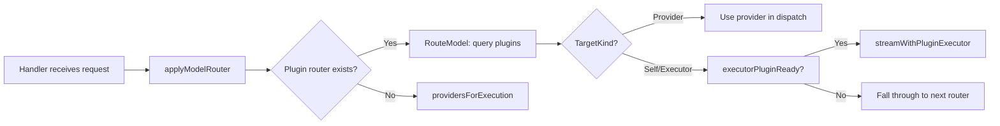
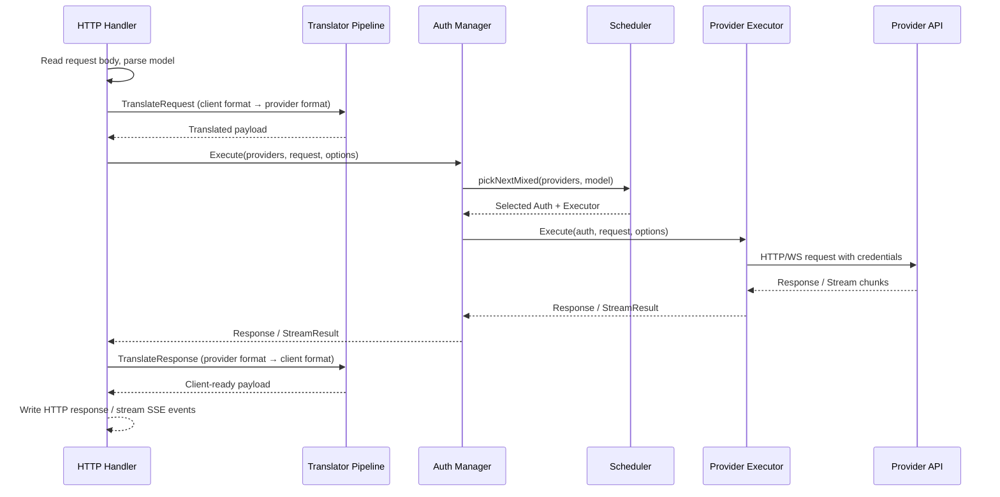

The executor architecture is the runtime execution backbone of CLIProxyAPI, responsible for translating requests into provider-specific API calls, managing credential selection, handling streaming responses, and implementing retry logic. This documentation explains how the system routes requests to the correct provider executor, how credentials are selected and cycled, and how plugin-based executors integrate into the same dispatch pipeline.

## Core Interface: ProviderExecutor

Every provider backend implements a single contract that the dispatch layer depends on. The `ProviderExecutor` interface defines five methods: `Identifier`, `Execute`, `ExecuteStream`, `Refresh`, and `HttpRequest`, plus optional capabilities like `CountTokens` and `RequestAuthPreparer`.

Sources: [sdk/cliproxy/auth/conductor.go#L43-L70](sdk/cliproxy/auth/conductor.go#L43-L70)

```go
type ProviderExecutor interface {
    Identifier() string
    Execute(ctx context.Context, auth *Auth, req Request, opts Options) (Response, error)
    ExecuteStream(ctx context.Context, auth *Auth, req Request, opts Options) (*StreamResult, error)
    Refresh(ctx context.Context, auth *Auth) (*Auth, error)
    CountTokens(ctx context.Context, auth *Auth, req Request, opts Options) (Response, error)
    HttpRequest(ctx context.Context, auth *Auth, req *http.Request) (*http.Response, error)
}
```

The `Identifier` method returns a canonical provider key (e.g. `"claude"`, `"codex"`, `"gemini"`, `"openai-compatibility"`) that the dispatch layer uses for lookup. `Execute` handles non-streaming calls and returns a complete `Response`. `ExecuteStream` returns a `StreamResult` containing upstream HTTP headers and a channel of `StreamChunk` values that the caller reads until closure or error. `Refresh` asks the executor to re-validate or re-authenticate credentials and return an updated `Auth`. `HttpRequest` is a low-level escape hatch that injects credentials into an arbitrary HTTP request and executes it, used by the model registry updater and other internal callers.

Sources: [sdk/cliproxy/executor/types.go#L44-L163](sdk/cliproxy/executor/types.go#L44-L163)

The `Request` and `Options` types carry all the information an executor needs. `Request` contains the upstream model name, the translated JSON payload, the payload format, and an optional metadata map. `Options` carries the streaming flag, original request bytes (before translation), source and response format identifiers, HTTP headers, query parameters, and a `RequestAfterAuthInterceptor` callback that runs after credential selection but before the executor translates the request.

## Native Executor Implementations

The runtime executor package ships one concrete executor per first-class provider. Each executor is stateless — it holds only the application configuration — and relies on the dispatched `Auth` credential for per-request authentication.

| Executor Struct | Provider Key | Transport | Primary API |
|---|---|---|---|
| `ClaudeExecutor` | `claude` | HTTP | Anthropic Messages API |
| `CodexExecutor` | `codex` | HTTP | OpenAI Responses API |
| `CodexWebsocketsExecutor` | `codex` | WebSocket | OpenAI Responses API (WebSocket upgrade) |
| `GeminiExecutor` | `gemini` | HTTP | Google Generative Language API |
| `GeminiVertexExecutor` | `vertex` | HTTP | Vertex AI endpoint |
| `XAIExecutor` | `xai` | HTTP | xAI API |
| `AntigravityExecutor` | `antigravity` | HTTP | Antigravity API |
| `KimiExecutor` | `kimi` | HTTP | Kimi API |
| `KiroExecutor` | `kiro` | HTTP | Kiro API |
| `KiloExecutor` | `kilo` | HTTP | Kilo API |
| `CursorExecutor` | `cursor` | HTTP | Cursor proxy API |
| `GitHubCopilotExecutor` | `github-copilot` | HTTP | GitHub Copilot API |
| `CodeBuddyExecutor` | `codebuddy` | HTTP | CodeBuddy API |
| `GitLabExecutor` | `gitlab` | HTTP | GitLab Duo API |
| `AIStudioExecutor` | `aistudio` | WebSocket | AI Studio WebSocket relay |
| `OpenAICompatExecutor` | dynamic key | HTTP | Any OpenAI-compatible endpoint |

Sources: [internal/runtime/executor/claude_executor.go#L46-L55](internal/runtime/executor/claude_executor.go#L46-L55)
Sources: [internal/runtime/executor/openai_compat_executor.go#L34-L39](internal/runtime/executor/openai_compat_executor.go#L34-L39)
Sources: [internal/runtime/executor/gemini_executor.go#L63-L68](internal/runtime/executor/gemini_executor.go#L63-L68)

The `OpenAICompatExecutor` is a generic executor that accepts a dynamic provider key at construction time. When the system encounters an auth entry for an unrecognized provider — or an explicit OpenAI-compatibility configuration — it creates an `OpenAICompatExecutor` bound to that provider key. This executor resolves the base URL and API key from the `Auth` entry, translates the payload to the `"openai"` format, and POSTs to the provider's `/chat/completions` (or `/responses/compact`) endpoint.

Sources: [internal/runtime/executor/openai_compat_executor.go#L36-L39](internal/runtime/executor/openai_compat_executor.go#L36-L39)

## Auto-Executor Pattern (Transport Selection)

Some providers support multiple transports. The auto-executor pattern wraps two concrete executors and selects between them at runtime based on context. `CodexAutoExecutor` wraps `CodexExecutor` (HTTP) and `CodexWebsocketsExecutor` (WebSocket), choosing WebSocket when the downstream connection is a WebSocket and the auth entry has `websockets: true`. `XAIAutoExecutor` follows the same pattern for xAI.

Sources: [internal/runtime/executor/codex_websockets_executor.go#L1840-L1910](internal/runtime/executor/codex_websockets_executor.go#L1840-L1910)



The auto-executor is always registered for the `"codex"` provider key. When a new codex auth entry appears, the system checks whether the existing executor is already a `CodexAutoExecutor`; if so, it skips replacement to avoid disrupting active sessions.

Sources: [sdk/cliproxy/service.go#L1044-L1052](sdk/cliproxy/service.go#L1044-L1052)

## Executor Registration

Executor registration happens in `Service.registerAvailableExecutors`, called during startup and on every config reload. The method iterates over auth entries and, based on the `Provider` field, instantiates and registers the appropriate executor with the core auth manager.

Sources: [sdk/cliproxy/service.go#L980-L1020](sdk/cliproxy/service.go#L980-L1020)

The registration order matters. Baseline providers (codex, claude, gemini, vertex, aistudio, antigravity, kimi, xai, openai-compatibility) are registered first with `forceReplace: true`. Then auth-derived entries are registered — these may override baseline executors when, for example, an OpenAI-compatibility entry provides a more specific provider key. Finally, plugin executors are registered via `registerPluginExecutors`, which delegates to `Host.RegisterExecutors`.

Sources: [sdk/cliproxy/service.go#L1002-L1017](sdk/cliproxy/service.go#L1002-L1017)

The core auth manager stores executors in a `map[string]ProviderExecutor` keyed by the lowercase provider string. `RegisterExecutor` replaces any existing executor for that key and, if the replaced executor implements `ExecutionSessionCloser`, asks it to close all active sessions. `UnregisterExecutor` simply deletes the entry.

Sources: [sdk/cliproxy/auth/conductor.go#L2122-L2157](sdk/cliproxy/auth/conductor.go#L2122-L2157)

## Provider Dispatch Flow

The dispatch flow starts when a handler (e.g. `OpenAIAPIHandler.ChatCompletions`) calls `ExecuteWithAuthManager` or `ExecuteStreamWithAuthManager`. These methods resolve the provider list from the model name, construct a `Request` and `Options`, and call the core manager's `Execute` or `ExecuteStream`.



Sources: [sdk/api/handlers/handlers.go#L1019-L1030](sdk/api/handlers/handlers.go#L1019-L1030)
Sources: [sdk/cliproxy/auth/conductor.go#L2330-L2400](sdk/cliproxy/auth/conductor.go#L2330-L2400)

### Provider Resolution

`providersForExecution` determines which provider keys to pass to the manager. When a model router plugin has set a specific provider in its route decision, that provider is used directly. Otherwise, `util.GetProviderName` queries the global model registry for all providers that have registered the requested model. If the registry has no entries for the model, the function returns an error. When Home mode is enabled, the provider list is always `["home"]` and the Home control plane handles the actual dispatch.

Sources: [sdk/api/handlers/handlers.go#L1611-L1645](sdk/api/handlers/handlers.go#L1611-L1645)
Sources: [internal/util/provider.go#L46-L95](internal/util/provider.go#L46-L95)

### Credential Selection (pickNextMixed)

`pickNextMixed` is the central dispatch function that selects both a credential and an executor. The algorithm varies depending on whether Home mode, plugin schedulers, or the legacy fast path is active.

In the **fast path** (no Home, no plugin scheduler, no route-aware auth), the function first filters the provider list to only those with registered executors. It then checks whether any auth entry requires route-aware selection; if so, it falls back to the legacy path. Otherwise, it delegates to `scheduler.pickMixed`, which implements round-robin or weighted selection across eligible credentials.

In the **legacy path** (`pickNextMixedLegacy`), the function iterates over providers and auth entries, calling `pickNext` for each provider. `pickNext` checks cooldown state, quota availability, and plugin scheduler eligibility to select the best credential.

In **Home mode** (`pickNextViaHome`), the function sends a request to the Home control plane, which returns the selected auth and executor.

Sources: [sdk/cliproxy/auth/conductor.go#L5108-L5195](sdk/cliproxy/auth/conductor.go#L5108-L5195)

### Retry and Refresh Logic

`executeMixedOnce` wraps the single-attempt execution with credential cycling. For each credential returned by `pickNextMixed`, it:

1. Prepares the request auth via `prepareRequestAuth` (calls `RequestAuthPreparer.PrepareRequestAuth` if the executor implements it).
2. Applies the `RequestAfterAuthInterceptor` callback, which lets the handler inject metadata (like pinned auth ID).
3. Calls `executor.Execute` (or `ExecuteStream`).
4. On 401/403 errors, attempts `tryRefreshAfterUnauthorized` which calls `executor.Refresh` and retries once with the refreshed credential.
5. On success, calls `MarkResult` to update scheduler statistics and returns.
6. On failure, records the error and moves to the next credential.

The outer `Execute` / `ExecuteStream` methods add an additional retry loop on top of `executeMixedOnce`, respecting configurable `maxRetryCredentials` and `maxWait` cooldown durations. After exhausting retries, the system may attempt an Antigravity credits fallback if the original provider was codex.

Sources: [sdk/cliproxy/auth/conductor.go#L2523-L2650](sdk/cliproxy/auth/conductor.go#L2523-L2650)

## Plugin Executor Integration

Plugins can provide executor capabilities through the plugin ABI. When a plugin declares `Capabilities.Executor`, the plugin host creates an `executorAdapter` that wraps the plugin's RPC-based executor and presents it as a standard `ProviderExecutor`.

### Registration

`Host.RegisterExecutors` iterates over active plugins, identifies those with executor capabilities, and creates `executorAdapter` instances. Before registering, it checks whether a native executor already exists for the provider key. If a native executor exists, the plugin's models are still registered in the model registry (so the plugin can contribute models to an existing provider), but the plugin executor itself is not registered — native executors take precedence.

Sources: [internal/pluginhost/adapters.go#L757-L840](internal/pluginhost/adapters.go#L757-L840)

The adapter selects input and output formats based on what the plugin declares it supports. If the incoming request format differs from the plugin's supported formats, the adapter translates the payload before forwarding. Response translation is similarly applied in reverse.

Sources: [internal/pluginhost/adapters.go#L1326-L1450](internal/pluginhost/adapters.go#L1326-L1450)

### Plugin Panic Safety

Every plugin executor call is wrapped with a `recover()` guard. If a plugin panics during `Execute` or `ExecuteStream`, the adapter catches the panic, fuses the plugin (marking it permanently unavailable), and returns an error. This prevents a buggy plugin from crashing the entire proxy.

Sources: [internal/pluginhost/adapters.go#L1592-L1650](internal/pluginhost/adapters.go#L1592-L1650)

## Model Router Plugin Integration

Before the core dispatch loop runs, the handler checks whether any model router plugin wants to override the provider selection. `RouteModel` iterates over active plugins that declare `Capabilities.ModelRouter`, calling each one in order. A router can return one of three target kinds:

| Target Kind | Meaning |
|---|---|
| `ModelRouteTargetProvider` | Route to a specific built-in provider (e.g. `"claude"`) |
| `ModelRouteTargetSelf` | Route to the plugin's own executor |
| `ModelRouteTargetExecutor` | Route to another plugin's executor by ID |

When the router targets an executor plugin, the handler calls `executorPluginReady` to verify the plugin can actually serve the request (checks executor capability, provider resolution, and format compatibility) before committing to that route.

Sources: [internal/pluginhost/model_router.go#L25-L85](internal/pluginhost/model_router.go#L25-L85)



## Request Lifecycle Diagram

The following diagram shows the complete request lifecycle from HTTP handler through translation, credential selection, execution, and response translation.



## Key Design Decisions

**Stateless executors.** Each executor struct holds only configuration, never per-request or per-credential state. This makes them safe for concurrent use across goroutines and simplifies lifecycle management — there is no executor state to clean up when credentials change.

**Credential cycling, not executor cycling.** The dispatch layer iterates over credentials (auth entries) rather than executors. Multiple credentials can share the same executor, and the scheduler rotates through them to distribute load and handle quota exhaustion gracefully.

**Native-first executor binding.** When both a native executor and a plugin executor exist for the same provider key, the native executor always wins. This ensures that first-class providers benefit from optimized code paths while plugins extend the system for new or niche providers.

**Auto-executor wrapping.** Transport selection (HTTP vs WebSocket) is encapsulated within auto-executor wrappers rather than being handled at the dispatch layer. This keeps the dispatch logic transport-agnostic and allows each provider to define its own transport selection criteria.