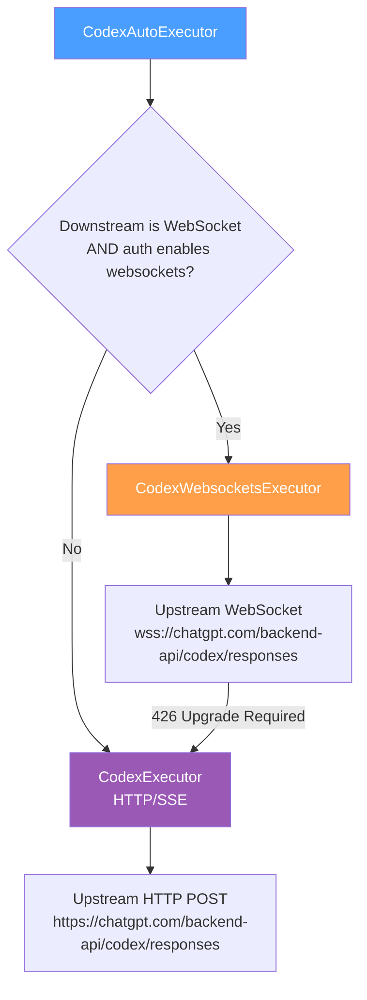
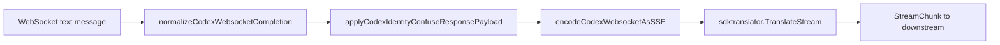
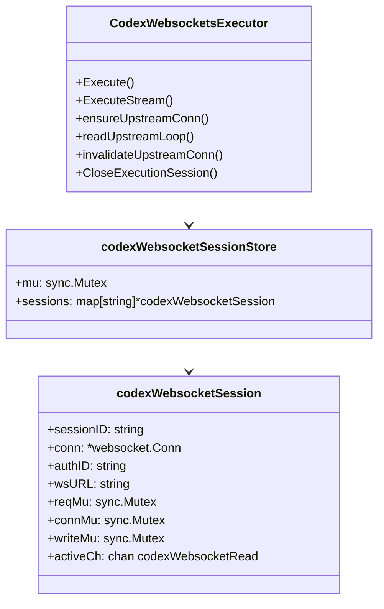
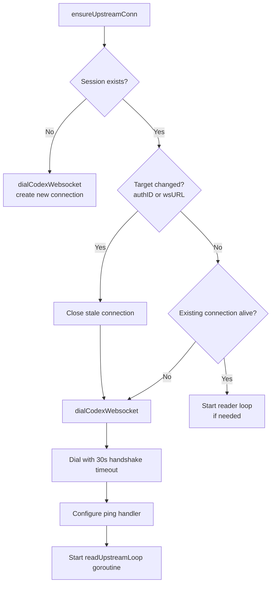
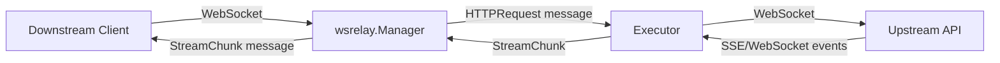

The Codex and WebSocket executor subsystem provides dual-transport execution for the OpenAI Responses API, implementing both a stateless HTTP/SSE path and a stateful WebSocket path with automatic routing between them. This system also establishes the shared WebSocket session infrastructure reused by the xAI WebSocket executor.

This page focuses exclusively on the Codex-specific and WebSocket-specific executor logic. For the broader executor dispatch architecture and how providers are registered, see [Executor Architecture and Provider Dispatch](10-executor-architecture-and-provider-dispatch).

## Dual-Transport Architecture

The system implements three nested executor types that form a transport-selection cascade:



The `CodexAutoExecutor` acts as the top-level entry point. It inspects the execution context to determine whether the downstream client connected via WebSocket, and checks the auth credentials for an explicit `websockets` flag. Only when **both** conditions are true does it delegate to the WebSocket executor; otherwise it falls back to the legacy HTTP implementation. This design ensures that existing HTTP-only deployments continue working unchanged while enabling WebSocket transport for clients that support it.

Sources: [codex_websockets_executor.go#L1835-L1886](internal/runtime/executor/codex_websockets_executor.go#L1835-L1886)

## ProviderExecutor Interface

All executors — HTTP, WebSocket, and auto — satisfy the `ProviderExecutor` interface defined in the auth conductor:

| Method | Purpose |
|--------|---------|
| `Identifier()` | Returns the provider key (`"codex"`) |
| `Execute()` | Non-streaming execution returning a complete response |
| `ExecuteStream()` | Streaming execution returning a `StreamResult` with a chunks channel |
| `Refresh()` | Refreshes provider credentials |
| `CountTokens()` | Token counting for the request |
| `HttpRequest()` | Direct HTTP request with injected credentials |

The WebSocket executor additionally satisfies `ExecutionSessionCloser` for managing session lifecycle:

| Method | Purpose |
|--------|---------|
| `CloseExecutionSession()` | Tears down a specific upstream WebSocket connection |
| `UpstreamDisconnectChan()` | Returns a channel that signals upstream disconnection |

Sources: [conductor.go#L36-L63](sdk/cliproxy/auth/conductor.go#L36-L63), [codex_websockets_executor.go#L1676-L1701](internal/runtime/executor/codex_websockets_executor.go#L1676-L1701)

## HTTP Executor (CodexExecutor)

The `CodexExecutor` is the original stateless executor that communicates over HTTP POST with Server-Sent Events (SSE) streaming. It handles all Codex-specific request processing before forwarding to the upstream API.

### Request Processing Pipeline

The non-streaming `Execute` method follows this pipeline:

```mermaid
flowchart LR
    A[Receive request] --> B[Translate format<br/>Claude/OpenAI → Codex]
    B --> C[Apply thinking<br/>reasoning mode]
    C --> D[Apply payload config<br/>model overrides]
    D --> E[Normalize instructions<br/>and parallel tools]
    E --> F[Apply reasoning<br/>replay cache]
    F --> G[Build HTTP request<br/>with identity confuse]
    G --> H[POST to /responses]
    H --> I[Parse SSE stream<br/>for response.completed]
    I --> J[Translate response<br/>back to source format]
```



Key payload manipulations performed before the upstream call include:

- **Format translation** via `sdktranslator.TranslateRequest` from the source format (Claude, OpenAI, etc.) to the Codex Responses format
- **Thinking/reasoning mode** application through `thinking.ApplyThinking`
- **Parallel tool call normalization** that adjusts the `parallel_tool_calls` field based on the Responses Lite header
- **Reasoning replay cache** insertion, which re-injects previously cached reasoning turns into the input stream
- **Identity confuse**, which replaces session-scoped identifiers with deterministic UUIDs to prevent upstream correlation

Sources: [codex_executor.go#L1104-L1295](internal/runtime/executor/codex_executor.go#L1104-L1295)

### SSE Stream Processing

The HTTP executor reads the upstream SSE stream line by line using a `bufio.Scanner` with a 50 MB buffer. It tracks `response.output_item.done` events and reconstructs the `response.output` array for the final `response.completed` event — a patching mechanism that handles upstream responses where the completed event's output array is empty but items were emitted individually.

Sources: [codex_executor.go#L1396-L1586](internal/runtime/executor/codex_executor.go#L1396-L1586), [codex_executor.go#L60-L100](internal/runtime/executor/codex_executor.go#L60-L100)

### /responses/compact Endpoint

A special path handles the `/responses/compact` endpoint for non-streaming compact completions. This bypasses the streaming pipeline entirely and returns the full JSON response in a single read. Streaming is explicitly rejected for this endpoint with a `400 Bad Request` error.

Sources: [codex_executor.go#L1297-L1394](internal/runtime/executor/codex_executor.go#L1297-L1394)

## WebSocket Executor (CodexWebsocketsExecutor)

The `CodexWebsocketsExecutor` embeds `*CodexExecutor` and overrides the `Execute` and `ExecuteStream` methods to use a WebSocket transport instead of HTTP. It preserves the HTTP executor as a fallback for endpoints not available over WebSocket and for upgrade failures.

### Transport Conversion

The WebSocket URL is derived from the HTTP base URL by swapping the scheme:

| HTTP URL | WebSocket URL |
|----------|---------------|
| `https://chatgpt.com/backend-api/codex/responses` | `wss://chatgpt.com/backend-api/codex/responses` |
| `http://localhost:8080/responses` | `ws://localhost:8080/responses` |

The WebSocket beta header `OpenAI-Beta: responses_websockets=2026-02-06` is always set on the upgrade request. A `session_id` header is generated (UUID) when the client User-Agent contains "Mac OS" and no session ID is present.

Sources: [codex_websockets_executor.go#L984-L1001](internal/runtime/executor/codex_websockets_executor.go#L984-L1001), [codex_websockets_executor.go#L1046-L1108](internal/runtime/executor/codex_websockets_executor.go#L1046-L1108)

### Request Envelope

Every WebSocket request body is wrapped with `"type": "response.create"` before being sent as a text message. This differs from the HTTP executor which sends the bare request body as the POST payload.

```json
{
  "type": "response.create",
  "model": "o4-mini",
  "input": [...],
  "stream": true
}
```

Sources: [codex_websockets_executor.go#L869-L885](internal/runtime/executor/codex_websockets_executor.go#L869-L885)

### Response Normalization

The WebSocket executor normalizes `response.done` events to `response.completed` to maintain compatibility with the HTTP executor's event handling logic. It also encodes each WebSocket text message as an SSE-formatted line (`data: {...}`) before passing it through the translator pipeline:



Sources: [codex_websockets_executor.go#L1421-L1439](internal/runtime/executor/codex_websockets_executor.go#L1421-L1439)

### HTTP Fallback

When the WebSocket upgrade fails with `426 Upgrade Required`, the executor transparently falls back to the HTTP executor for that specific request:

```go
if respHS != nil && respHS.StatusCode == http.StatusUpgradeRequired {
    return e.CodexExecutor.Execute(ctx, auth, req, opts)
}
```

This ensures requests succeed even when the upstream does not support WebSocket transport.

Sources: [codex_websockets_executor.go#L337-L339](internal/runtime/executor/codex_websockets_executor.go#L337-L339)

## Session Management

The WebSocket executor manages persistent upstream connections through a global session store. Sessions are keyed by an `executionSessionID` extracted from the request metadata, allowing multiple sequential requests within the same logical session to reuse a single WebSocket connection.

### Session Store Architecture



The store uses a **global singleton** pattern (`globalCodexWebsocketSessionStore`) that survives executor instance replacement during hot-reload. This is critical because config or credential changes create a new executor instance, but in-flight WebSocket sessions must not be disrupted.

Sources: [codex_websockets_executor.go#L55-L89](internal/runtime/executor/codex_websockets_executor.go#L55-L89), [codex_websockets_executor.go#L1506-L1532](internal/runtime/executor/codex_websockets_executor.go#L1506-L1532)

### Connection Lifecycle

The connection management follows a disciplined lifecycle with three levels of locking:

| Lock | Protects | Granularity |
|------|----------|-------------|
| `reqMu` | Serializes requests within a session | Per-request |
| `connMu` | Connection object and URL/auth tracking | Per-connection swap |
| `writeMu` | WebSocket write operations | Per-message write |

The `ensureUpstreamConn` method implements the core connection acquisition logic:



Sources: [codex_websockets_executor.go#L1542-L1593](internal/runtime/executor/codex_websockets_executor.go#L1542-L1593)

### Reader Loop

A dedicated goroutine (`readUpstreamLoop`) runs for each active WebSocket connection. It continuously reads messages and dispatches them to the active request's channel. If the connection encounters an error or receives an unexpected binary message, it signals the active request and invalidates the connection.

Sources: [codex_websockets_executor.go#L1595-L1647](internal/runtime/executor/codex_websockets_executor.go#L1595-L1647)

### Automatic Retry on Send Failure

When a WebSocket message send fails within a session, the executor invalidates the stale connection and retries once with a fresh dial. This handles the common case where the upstream closes the socket between sequential requests in the same session:

Sources: [codex_websockets_executor.go#L370-L411](internal/runtime/executor/codex_websockets_executor.go#L370-L411)

## Proxy Support

The WebSocket dialer supports multiple proxy configurations through the `proxyutil` package:

| Proxy Scheme | Implementation |
|-------------|----------------|
| `socks5://`, `socks5h://` | `golang.org/x/net/proxy.SOCKS5` dialer |
| `http://`, `https://` | `http.ProxyURL` on the gorilla dialer |
| Direct mode | No proxy applied |

Proxy URLs are resolved from the auth credential's `proxy_url` attribute first, then from the global `config.ProxyURL`. The dialer uses a 30-second handshake timeout and 30-second keepalive interval.

Sources: [codex_websockets_executor.go#L921-L982](internal/runtime/executor/codex_websockets_executor.go#L921-L982)

## Transport Selection Decision

The auto-routing decision depends on two independent signals:

### 1. Downstream WebSocket Detection

The `DownstreamWebsocket(ctx)` context value is set by the downstream WebSocket relay system (see [WebSocket Relay](#websocket-relay-system)) when the incoming client connection is a WebSocket. This is a purely transport-level check with no business logic.

Sources: [context.go#L7-L23](sdk/cliproxy/executor/context.go#L7-L23)

### 2. Auth-Level WebSocket Enablement

The `codexWebsocketsEnabled(auth)` function checks two locations for an explicit `websockets` boolean:

| Source | Key | Type |
|--------|-----|------|
| `auth.Attributes` | `"websockets"` | string (parsed as bool) |
| `auth.Metadata` | `"websockets"` | bool or string |

When the auth credential has no explicit `websockets` flag, the executor defaults to HTTP transport. This conservative default ensures backward compatibility.

Sources: [codex_websockets_executor.go#L1916-L1946](internal/runtime/executor/codex_websockets_executor.go#L1916-L1946)

## xAI WebSocket Executor

The xAI WebSocket executor (`XAIWebsocketsExecutor`) follows the same architectural pattern as the Codex WebSocket executor but adds an **ID mapping layer** to handle response ID translation between downstream and upstream. It reuses the same `codexWebsocketSessionStore` and `codexWebsocketSession` types for connection management.

### Key Differences from Codex

| Aspect | Codex WebSocket | xAI WebSocket |
|--------|----------------|---------------|
| ID mapping | None (direct passthrough) | `xaiWebsocketIDState` with bidirectional map |
| Transcript replay | Via reasoning replay cache | `transcriptInput` field on session state |
| Compaction trigger | Not supported | Dedicated `compaction_trigger` handling |
| Request ID rewriting | Not needed | `previous_response_id` mapped per-session |
| Base URL | `chatgpt.com/backend-api/codex` | `api.x.ai` (from `xaiauth.DefaultAPIBaseURL`) |

Sources: [xai_websockets_executor.go#L12-L56](internal/runtime/executor/xai_websockets_executor.go#L12-L56), [xai_websockets_executor.go#L104-L265](internal/runtime/executor/xai_websockets_executor.go#L104-L265)

## WebSocket Relay System

The `wsrelay` package provides a separate WebSocket relay layer for proxying requests to downstream WebSocket clients. This is the **client-facing** WebSocket endpoint, distinct from the **upstream-facing** WebSocket connections managed by the executors.



| Component | Purpose |
|-----------|---------|
| `Manager` | HTTP upgrade handler, session registry, request routing |
| `session` | Per-client connection with heartbeat, read loop, pending request dispatch |
| `Message` | JSON envelope with `id`, `type`, and `payload` fields |
| `HTTPRequest` / `HTTPResponse` | HTTP proxy envelope for non-streaming relay |
| `StreamEvent` | Streaming response event with type, status, headers, and payload |

The relay supports both non-streaming (`NonStream`) and streaming (`Stream`) request modes. For streaming, the protocol uses `stream_start`, `stream_chunk`, and `stream_end` message types to frame the SSE data.

Sources: [manager.go#L18-L80](internal/wsrelay/manager.go#L18-L80), [message.go#L1-L28](internal/wsrelay/message.go#L1-L28), [http.go#L14-L100](internal/wsrelay/http.go#L14-L100)

## Configuration

### codex-header-defaults

Configures fallback header values injected into Codex requests when the client omits them:

```yaml
codex-header-defaults:
  user-agent: "my-codex-client/1.0"
  beta-features: "feature-a,feature-b"
```

| Field | Applies To | Default |
|-------|-----------|---------|
| `user-agent` | HTTP and WebSocket | `codex-tui/0.135.0 (Mac OS 26.5.0; arm64) ...` |
| `beta-features` | WebSocket only | `responses_websockets=2026-02-06` |

Sources: [config.go#L296-L302](internal/config/config.go#L296-L302), [codex_websocket_header_defaults_test.go#L9-L32](internal/config/codex_websocket_header_defaults_test.go#L9-L32)

### codex.identity-confuse

When enabled, replaces session-scoped identifiers (prompt cache keys, installation IDs, turn IDs) with deterministic UUIDs derived from the auth ID. This prevents the upstream from correlating requests across different CLIProxyAPI instances or user accounts.

Sources: [config.go#L304-L307](internal/config/config.go#L304-L307), [codex_executor.go#L1849-L1861](internal/runtime/executor/codex_executor.go#L1849-L1861)

### codex-api-key

Per-key configuration entries that can override the base URL and API key used for upstream requests. Each entry can optionally associate a base URL with a specific API key, enabling per-credential routing to different upstream endpoints.

Sources: [config.go#L532-L569](internal/config/config.go#L532-L569), [codex_executor.go#L2307-L2321](internal/runtime/executor/codex_executor.go#L2307-L2321)

## Error Handling

### WebSocket-Specific Error Parsing

The `parseCodexWebsocketError` function handles errors returned as WebSocket text messages with a `"type": "error"` envelope. It maps the status code to standard HTTP error semantics and extracts retry-after hints:

| Error Code | Mapping |
|------------|---------|
| `websocket_connection_limit_reached` | Instant retry (zero delay) |
| `retry-after` header | Parsed as HTTP date or seconds |
| `resets_in_seconds` field | Converted to `time.Duration` |

Sources: [codex_websockets_executor.go#L1316-L1344](internal/runtime/executor/codex_websockets_executor.go#L1316-L1344)

### Stream Incomplete Error

Both executors emit a `codexIncompleteStreamError` when the upstream stream terminates before a `response.completed` event. This error is request-scoped (not retryable at the transport level) and carries a `408 Request Timeout` status code.

Sources: [codex_executor.go#L45-L58](internal/runtime/executor/codex_executor.go#L45-L58)

### Binary Message Rejection

Both WebSocket executors reject binary WebSocket messages with an error, as the upstream protocol only uses text messages for JSON payloads. On encountering a binary message, the connection is invalidated to prevent protocol confusion.

Sources: [codex_websockets_executor.go#L425-L435](internal/runtime/executor/codex_websockets_executor.go#L425-L435)

## Next Steps

- For the broader executor dispatch and provider routing, see [Executor Architecture and Provider Dispatch](10-executor-architecture-and-provider-dispatch)
- For the authentication system that produces the auth credentials consumed by these executors, see [Authentication System and Provider Login Flows](7-authentication-system-and-provider-login-flows)
- For the translation pipeline that converts between source formats and the Codex Responses format, see [Translator Registry and Format Conversion](8-translator-registry-and-format-conversion)
- For the thinking/reasoning mode handling applied before upstream calls, see [Thinking and Reasoning Mode Handling](19-thinking-and-reasoning-mode-handling)