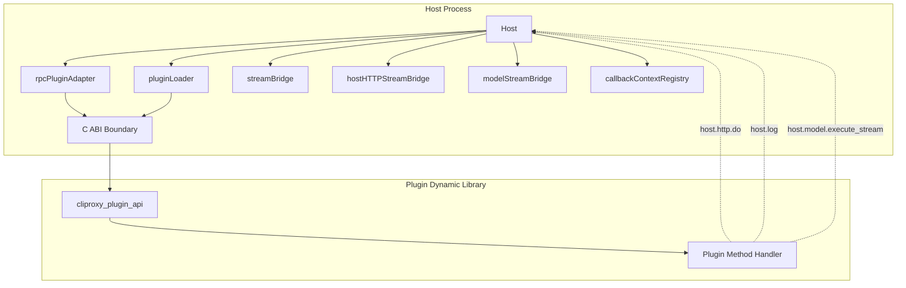
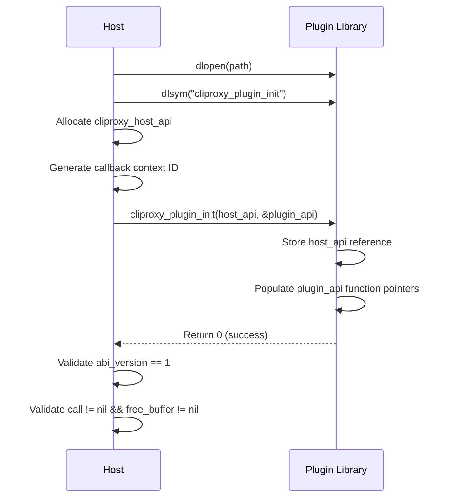
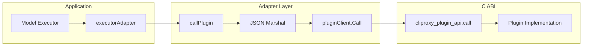

The plugin host is the runtime backbone that discovers, loads, registers, and orchestrates native dynamic library plugins through a stable C ABI contract. This page explains the two-layer architecture — a binary-level C interface for cross-language loading and a JSON-RPC schema for semantic capability negotiation — along with host callbacks, streaming bridges, and the lifecycle that keeps plugins safely fused, retired, or hot-reloaded at runtime.

## Architecture Overview

The plugin system is built around three distinct layers that separate concerns cleanly. At the lowest level sits the **C ABI contract**: a pair of struct-based API tables exchanged at plugin initialization time. Above that, a **JSON-RPC envelope** carries all semantic method calls between host and plugin. Finally, the **capability adapter layer** maps individual plugin responses into Go interface implementations that the rest of the application consumes.



The host process loads each plugin as a shared library (`.dylib`, `.so`, or `.dll`), resolves the `cliproxy_plugin_init` symbol, and exchanges two API tables. The plugin receives a `cliproxy_host_api` that grants it access to host-side services; the host receives a `cliproxy_plugin_api` through which it issues all semantic method calls. Every method call and response crosses the ABI boundary as a `(method string, request []byte)` → `([]byte, error)` pair, with JSON-RPC envelopes on both sides.

Sources: [loader_unix.go](internal/pluginhost/loader_unix.go#L1-L100) · [abi.go](internal/pluginhost/abi.go#L1-L19)

## C ABI Contract

The C ABI is deliberately minimal — only three function pointers change per direction — ensuring that plugins compiled with any C-compatible toolchain (Go, C, C++, Rust, Zig) can interoperate without shared header files at build time. The contract is versioned by `pluginHostABIVersion` (currently **1**), and both sides must agree on this number before proceeding.

### Host-to-Plugin API Table

The host passes a `cliproxy_host_api` struct to the plugin's initialization function. This struct provides the plugin with the ability to call back into the host for services like HTTP proxying, model execution, and logging.

| Field | Type | Purpose |
|-------|------|---------|
| `abi_version` | `uint32` | Declares the ABI version the host supports |
| `host_ctx` | `void*` | Opaque pointer passed back to host callbacks for plugin identification |
| `call` | `cliproxy_host_call_fn` | Callback function: `(host_ctx, method, request, request_len) → response` |
| `free_buffer` | `cliproxy_host_free_fn` | Frees response buffers allocated by the host |

Sources: [loader_unix.go](internal/pluginhost/loader_unix.go#L30-L49) · [host_callbacks_unix.go](internal/pluginhost/host_callbacks_unix.go#L1-L66)

### Plugin-to-Host API Table

The plugin populates a `cliproxy_plugin_api` struct during initialization. The host uses this table for all subsequent RPC calls into the plugin.

| Field | Type | Purpose |
|-------|------|---------|
| `abi_version` | `uint32` | Echoed from the host to confirm ABI compatibility |
| `call` | `cliproxy_plugin_call_fn` | RPC entry point: `(method, request, request_len) → response` |
| `free_buffer` | `cliproxy_plugin_free_fn` | Frees response buffers allocated by the plugin |
| `shutdown` | `cliproxy_plugin_shutdown_fn` | Optional graceful teardown callback |

Sources: [loader_unix.go](internal/pluginhost/loader_unix.go#L51-L58) · [simple/c/src/plugin.c](examples/plugin/simple/c/src/plugin.c#L18-L34)

### Initialization Protocol

The initialization sequence follows a strict handshake:

1. The host calls `dlopen` (or `LoadLibrary` on Windows) on the plugin file
2. The host resolves the `cliproxy_plugin_init` symbol
3. The host allocates and populates `cliproxy_host_api` with its callback functions
4. The host calls `cliproxy_plugin_init(host_api, &plugin_api)`
5. The plugin populates `cliproxy_plugin_api` and returns `0` on success
6. The host validates the ABI version and function table completeness



If the plugin returns a non-zero code, or the ABI versions do not match, the host immediately calls `cliproxy_shutdown_plugin` and releases the library handle. The `guardedPluginClient` wrapper then protects all subsequent `Call` invocations with a mutex that blocks concurrent calls during shutdown.

Sources: [loader_unix.go](internal/pluginhost/loader_unix.go#L120-L175) · [client_guard.go](internal/pluginhost/client_guard.go#L1-L80)

### Buffer Memory Management

All data crossing the ABI boundary is heap-allocated by the producing side and freed by the consuming side. The protocol uses a `cliproxy_buffer` struct:

```c
typedef struct {
    void* ptr;
    size_t len;
} cliproxy_buffer;
```

When the host calls a plugin method, the plugin writes its response into a `cliproxy_buffer`. The host copies the bytes into Go memory via `C.GoBytes`, then calls `plugin.free_buffer(ptr, len)` to release the plugin-allocated memory. The same pattern applies in reverse when the plugin calls back into the host.

Sources: [loader_unix.go](internal/pluginhost/loader_unix.go#L200-L220) · [host_callbacks_unix.go](internal/pluginhost/host_callbacks_unix.go#L55-L66)

## JSON-RPC Schema and Method Catalog

Above the binary ABI, all semantic communication uses JSON-RPC envelopes. The `pluginabi.Envelope` type defines the wire format:

```json
{
  "ok": true,
  "result": { ... },
  "error": { "code": "...", "message": "...", "retryable": false }
}
```

Every method call from host to plugin passes a JSON-serialized request through the plugin's `call` function pointer. The plugin returns a JSON envelope. The `pluginabi.SchemaVersion` (currently **1**) tracks the JSON contract version separately from the binary ABI version, allowing schema-level evolution without changing the C interface.

### Complete Method Catalog

The system defines a rich set of RPC methods organized by plugin capability domain:

| Domain | Methods | Direction |
|--------|---------|-----------|
| **Lifecycle** | `plugin.register`, `plugin.reconfigure`, `plugin.shutdown` | Host → Plugin |
| **Model** | `model.register`, `model.static`, `model.for_auth` | Host → Plugin |
| **Auth** | `auth.identifier`, `auth.parse`, `auth.login.start`, `auth.login.poll`, `auth.refresh` | Host → Plugin |
| **Frontend Auth** | `frontend_auth.identifier`, `frontend_auth.authenticate` | Host → Plugin |
| **Scheduler** | `scheduler.pick` | Host → Plugin |
| **Model Router** | `model.route` | Host → Plugin |
| **Executor** | `executor.identifier`, `executor.execute`, `executor.execute_stream`, `executor.count_tokens`, `executor.http_request` | Host → Plugin |
| **Translation** | `request.translate`, `request.normalize`, `response.translate`, `response.normalize_before`, `response.normalize_after` | Host → Plugin |
| **Interception** | `request.intercept_before`, `request.intercept_after`, `response.intercept_after`, `response.intercept_stream_chunk` | Host → Plugin |
| **Thinking** | `thinking.identifier`, `thinking.apply` | Host → Plugin |
| **Usage** | `usage.handle` | Host → Plugin |
| **CLI** | `command_line.register`, `command_line.execute` | Host → Plugin |
| **Management** | `management.register`, `management.handle` | Host → Plugin |
| **Host Callbacks** | `host.http.do`, `host.http.do_stream`, `host.http.stream_read`, `host.http.stream_close`, `host.model.execute`, `host.model.execute_stream`, `host.model.stream_read`, `host.model.stream_close`, `host.stream.emit`, `host.stream.close`, `host.log`, `host.auth.list`, `host.auth.get`, `host.auth.get_runtime`, `host.auth.save` | Plugin → Host |

Sources: [pluginabi/types.go](sdk/pluginabi/types.go#L1-L94) · [host_callbacks.go](internal/pluginhost/host_callbacks.go#L86-L102)

## Host Callback System

Plugins can invoke host services through the `cliproxy_host_api.call` function pointer. Each callback includes a `host_callback_id` that lets the host resolve the calling plugin's identity, apply the correct request context, and skip the caller's own interceptors to prevent infinite recursion in model execution chains.

### Callback Registration and Context

When the host loads a plugin, it allocates a unique `hostCallbackID` (atomic counter) and stores a `dynamicHostCallbackEntry` mapping that ID back to the `Host` instance and plugin identifier. The plugin receives this ID as an opaque `uintptr` inside `host_ctx`. When the plugin calls back, the host dereferences `host_ctx` to recover the entry.

For long-lived callback contexts (such as streaming model execution), the `callbackContextRegistry` opens a named context slot that persists across multiple callback invocations. This registry also stores cleanup functions that fire when the callback context is closed, ensuring stream bridges and cancellations are properly torn down.

Sources: [loader_unix.go](internal/pluginhost/loader_unix.go#L101-L115) · [callback_contexts.go](internal/pluginhost/callback_contexts.go#L1-L100)

### Host Callback Methods

The host exposes fifteen callback methods to plugins:

| Callback | Purpose |
|----------|---------|
| `host.http.do` | Execute an HTTP request through the host's transport policy |
| `host.http.do_stream` | Execute a streaming HTTP request; returns a `stream_id` |
| `host.http.stream_read` | Read the next chunk from a streaming HTTP response |
| `host.http.stream_close` | Close and clean up a streaming HTTP response |
| `host.model.execute` | Execute a model request through the host's model pipeline |
| `host.model.execute_stream` | Execute a streaming model request; returns a `stream_id` |
| `host.model.stream_read` | Read the next chunk from a streaming model response |
| `host.model.stream_close` | Close and clean up a streaming model response |
| `host.stream.emit` | Emit a chunk to the downstream client stream |
| `host.stream.close` | Close the downstream client stream |
| `host.log` | Write a log entry through the host's logging system |
| `host.auth.list` | List all configured auth records |
| `host.auth.get` | Read a specific auth record |
| `host.auth.get_runtime` | Read runtime auth metadata |
| `host.auth.save` | Persist auth data through the host's store |

Sources: [host_callbacks.go](internal/pluginhost/host_callbacks.go#L103-L165) · [host_model_stream_callbacks.go](internal/pluginhost/host_model_stream_callbacks.go#L1-L88)

## Capability Adapter Layer

When a plugin registers with the host via `plugin.register`, the host receives an `rpcRegistration` payload containing metadata, capability flags, and a `SchemaVersion`. The `registerRPCPlugin` function in `rpc_client.go` translates these flags into a `pluginapi.Plugin` struct where each declared capability becomes a Go interface backed by an `rpcPluginAdapter`.

The adapter is the critical bridge: it holds a reference to the plugin's `pluginClient` and serializes all Go interface method calls into JSON-RPC calls through the C ABI. For example, when the rest of the application calls `executor.Execute(ctx, auth, request, options)`, the adapter marshals the `ExecutorRequest` into JSON, calls `client.Call(ctx, "executor.execute", jsonBytes)`, and unmarshals the response envelope.



The adapter layer handles several important responsibilities:

- **Format negotiation**: The `executorAdapter` selects compatible input/output formats from the plugin's declared `ExecutorInputFormats` and `ExecutorOutputFormats`, normalizing legacy names like `"chat-completions"` to the canonical `sdktranslator.FormatOpenAI`
- **Metadata sanitization**: All metadata maps crossing the JSON boundary are stripped of non-JSON-compatible Go types to prevent marshaling errors
- **Panic recovery**: Every adapter call is wrapped in a `defer/recover` that fuses (permanently disables) the plugin if it panics
- **Error normalization**: Plugin errors with HTTP status codes are wrapped as `rpcPluginError` so callers can propagate status codes correctly

Sources: [rpc_client.go](internal/pluginhost/rpc_client.go#L1-L200) · [adapters.go](internal/pluginhost/adapters.go#L60-L100)

## Plugin Capability Interfaces

The `pluginapi.Capabilities` struct declares 23 optional interfaces. A plugin advertises its capabilities as boolean flags during registration, and the host wraps the corresponding RPC adapter only for capabilities the plugin declares. This means a plugin that does not implement `Executor` will never receive `executor.execute` calls.

| Capability Interface | Method | Description |
|---------------------|--------|-------------|
| `ModelRegistrar` | `model.register` | Contributes model metadata to the host registry |
| `ModelProvider` | `model.static`, `model.for_auth` | Provides per-provider static and per-auth model lists |
| `AuthProvider` | `auth.parse`, `auth.login.start/poll`, `auth.refresh` | Full OAuth lifecycle for a custom provider |
| `FrontendAuthProvider` | `frontend_auth.authenticate` | Authenticates inbound frontend requests |
| `Scheduler` | `scheduler.pick` | Overrides the built-in auth scheduling algorithm |
| `ModelRouter` | `model.route` | Routes requests to a specific plugin executor or built-in provider |
| `Executor` | `executor.execute`, `executor.execute_stream` | Sends requests to upstream providers |
| `RequestTranslator` | `request.translate` | Converts canonical payloads to provider format |
| `RequestNormalizer` | `request.normalize` | Converts provider payloads to canonical format |
| `ResponseTranslator` | `response.translate` | Converts canonical responses to provider format |
| `ResponseNormalizer` (before/after) | `response.normalize_before/after` | Normalizes upstream responses at two pipeline stages |
| `RequestInterceptor` | `request.intercept_before/after` | Rewrites requests pre- and post-auth selection |
| `ResponseInterceptor` | `response.intercept_after` | Rewrites non-streaming HTTP responses |
| `StreamChunkInterceptor` | `response.intercept_stream_chunk` | Rewrites individual SSE chunks |
| `ThinkingApplier` | `thinking.apply` | Applies reasoning budget configuration to payloads |
| `UsagePlugin` | `usage.handle` | Observes completed usage records |
| `CommandLinePlugin` | `command_line.register/execute` | Extends the host CLI with plugin-specific flags |
| `ManagementAPI` | `management.register/handle` | Adds routes to the management HTTP API |

Sources: [pluginapi/types.go](sdk/pluginapi/types.go#L82-L136) · [rpc_schema.go](internal/pluginhost/rpc_schema.go#L25-L65)

## Streaming Architecture

The plugin system supports bidirectional streaming through three specialized bridge implementations, all using the same pattern: the host opens a named stream, returns a `stream_id` to the plugin, and the plugin reads chunks by ID through subsequent callbacks.

### Stream Bridge Types

| Bridge | Purpose | Opened By |
|--------|---------|-----------|
| `streamBridge` | Downstream client streaming (SSE chunks) | Plugin via `host.stream.emit` |
| `hostHTTPStreamBridge` | Upstream HTTP streaming responses | Plugin via `host.http.do_stream` |
| `modelStreamBridge` | Model execution streaming | Plugin via `host.model.execute_stream` |

Each bridge maintains a map of `stream_id → chan` pairs with atomic ID generation. When the plugin calls `host.http.do_stream`, the bridge opens a channel, returns the stream ID, and starts feeding response chunks from the upstream HTTP client into the channel. The plugin then polls with `host.http.stream_read` to consume chunks. Cleanup happens through explicit `host.http.stream_close` calls or automatic closure when the callback context is torn down.

Sources: [stream_bridge.go](internal/pluginhost/stream_bridge.go#L1-L94) · [http_stream_bridge.go](internal/pluginhost/http_stream_bridge.go) · [host_model_stream_callbacks.go](internal/pluginhost/host_model_stream_callbacks.go#L1-L88)

## Plugin Lifecycle and Hot Reload

The `Host.ApplyConfig` method drives the entire plugin lifecycle. It is serialized by `applyMu` to prevent concurrent config applications from racing on the loaded plugin maps.

### Discovery and Selection

Plugin files are discovered by scanning the configured plugins directory for platform-appropriate dynamic library extensions (`.dylib` on macOS, `.so` on Linux, `.dll` on Windows). File naming follows the convention `<plugin-id>-v<version>.<ext>`: a file named `my-plugin-v1.2.3.dylib` is parsed as plugin ID `my-plugin` at version `1.2.3`. When multiple versions of the same plugin exist, the highest version is selected, and the configuration can pin specific versions through `plugins.configs.<id>.version`.

Sources: [platform.go](internal/pluginhost/platform.go#L60-L160) · [config.go](internal/pluginhost/config.go#L1-L60)

### Load → Register → Activate

For each enabled plugin file, the host:

1. Opens the dynamic library through `pluginLoader.Open`
2. Calls `plugin.register` with the plugin's YAML configuration subtree
3. Records the returned `capabilityRecord` containing metadata and capability adapters
4. Rebuilds the active plugin maps (sorted by priority)
5. Stores a new `Snapshot` in the atomic snapshot slot

Plugins that were previously loaded but have a different file path are *retired*: the old client is moved to the `retired` map and shut down asynchronously, while the new version takes over the `loaded` map. This prevents request disruption during hot reload.

Sources: [host.go](internal/pluginhost/host.go#L200-L340) · [snapshot.go](internal/pluginhost/snapshot.go#L1-L80)

### Plugin Fusing

If a plugin panics during any capability call, the host *fuses* it: the plugin ID is added to the `fused` map, and all subsequent calls to that plugin's capabilities are silently skipped. Fusing is irreversible for the lifetime of the process — the plugin remains loaded (its dynamic library handle stays open), but it stops receiving calls. This prevents a single misbehaving plugin from disrupting the entire proxy pipeline.

Sources: [scheduler.go](internal/pluginhost/scheduler.go#L56-L66) · [model_router.go](internal/pluginhost/model_router.go#L72-L80)

### Shutdown

`ShutdownAll` iterates every loaded and retired plugin, calls `client.Shutdown()` (which invokes the plugin's optional `cliproxy_plugin_shutdown_fn`), frees all host-side callback contexts, closes stream bridges, and resets every runtime map to its initial state. The `UnloadPlugin(id)` method does the same for a single plugin, allowing surgical removal without restarting the process.

Sources: [host.go](internal/pluginhost/host.go#L399-L460)

## Cross-Language Plugin Development

The C ABI design ensures that plugins can be written in any language that can produce a shared library with C-compatible function exports. The repository ships complete examples in **Go**, **C**, and **Rust** for every major capability.

### Language-Specific Bindings

| Language | Mechanism | Notes |
|----------|-----------|-------|
| **Go** | `//export` directives + CGo | Requires CGo-enabled build; uses `C.CBytes`/`C.GoBytes` for data transfer |
| **C** | Standard `dlopen`/`dlsym` | Direct struct manipulation; most portable |
| **Rust** | `#[no_mangle] pub extern "C"` | Uses `libc` types; safe Rust wrappers around raw pointers |

Each example plugin re-implements the same ABI struct definitions locally — there is no shared header file. The ABI is intentionally self-describing: the struct layouts are fixed by the spec and documented by the example code. A plugin that misinterprets the struct will fail the version check or return garbage, never corrupt host memory, because all data flows through the `cliproxy_buffer` heap-copy protocol.

Sources: [simple/go/main.go](examples/plugin/simple/go/main.go#L1-L100) · [simple/c/src/plugin.c](examples/plugin/simple/c/src/plugin.c#L1-L34) · [simple/rust/src/lib.rs](examples/plugin/simple/rust/src/lib.rs#L1-L100)

## Platform-Specific Loading

The host uses three build-tag-gated loader implementations:

| Platform | File | Loading Mechanism |
|----------|------|-------------------|
| Linux, macOS, FreeBSD (with CGo) | `loader_unix.go` | `dlopen` / `dlsym` / `dlclose` via CGo |
| Windows | `loader_windows.go` | `syscall.LoadDLL` / `FindProc` with shadow-copy to avoid file locking |
| Unsupported (no CGo, non-Windows) | `loader_unsupported.go` | Returns a descriptive error |

The Windows loader includes a **shadow-copy mechanism**: before loading a plugin DLL, it copies the file to a temporary directory with a process-specific prefix. This avoids file locking issues during hot reload, where the host may need to overwrite a plugin file while the previous version is still loaded. A `shadowPluginCleanupOnce` sync.Once ensures stale shadow copies from previous process runs are cleaned up.

Sources: [loader_unix.go](internal/pluginhost/loader_unix.go#L1-L233) · [loader_windows.go](internal/pluginhost/loader_windows.go#L1-L100) · [loader_unsupported.go](internal/pluginhost/loader_unsupported.go#L1-L16)

## Plugin Configuration

Each plugin receives its configuration subtree during `plugin.register` and `plugin.reconfigure` as a YAML byte slice. The configuration structure is defined by the host:

```yaml
plugins:
  enabled: true
  dir: plugins
  configs:
    my-plugin-id:
      enabled: true
      priority: 10
      version: "1.2.3"
      # Plugin-specific fields passed as raw YAML
      config1: true
      config2: "value"
```

The `priority` field controls plugin ordering: when multiple plugins declare overlapping capabilities (e.g., two executors for the same model), the higher-priority plugin wins. When two plugins share the same priority, the one loaded first (alphabetically by ID) takes precedence. The `version` field can pin a specific plugin version when multiple versions coexist in the plugins directory.

Sources: [config.go](internal/pluginhost/config.go#L1-L100) · [platform.go](internal/pluginhost/platform.go#L160-L200)

## Model Router and Scheduler Integration

Two plugin capabilities — `ModelRouter` and `Scheduler` — participate in the critical request dispatch path and deserve special attention.

### Model Routing

When a model request arrives, the host iterates all active plugins declaring a `ModelRouter` capability. Each router receives a `ModelRouteRequest` containing the requested model, available providers, and request metadata. The router returns a `ModelRouteResponse` indicating one of three target kinds:

| Target Kind | Meaning |
|-------------|---------|
| `provider` | Route to a built-in provider (e.g., `openai`, `claude`) |
| `self` | Route to the router plugin's own executor |
| `executor` | Route to a different plugin's executor by ID |

Before accepting a route, the host validates that the target is available: built-in providers must be configured, and executor plugins must have a non-fused executor capability with compatible input/output formats. Invalid routes are logged and skipped, allowing the next router in priority order to try.

Sources: [model_router.go](internal/pluginhost/model_router.go#L1-L100) · [executor_route.go](internal/pluginhost/executor_route.go#L1-L50)

### Auth Scheduling

The scheduler plugin sits between auth discovery and request execution. When the host needs to select an auth candidate, it calls `scheduler.pick` on the single active scheduler plugin (only one is supported). The scheduler can return a specific `auth_id` to select, a `delegate_builtin` string to hand control back to the host's built-in scheduler, or deny the pick entirely.

Sources: [scheduler.go](internal/pluginhost/scheduler.go#L1-L112)

## SDK Embedding Surface

The `sdk/pluginhost` package provides a public `Host` wrapper that embeds the internal plugin host behind a clean API for external consumers. It exposes `ApplyConfig`, `ShutdownAll`, `PluginBusy`, `UnloadPlugin`, and model/auth/executor registration methods that translate between the public `RuntimeConfig` format and the internal `config.Config` structure.

The `sdk/pluginabi` package defines the stable ABI constants and envelope types, while `sdk/pluginapi` provides all capability interfaces and request/response types. Plugin authors should depend only on these SDK packages — never on `internal/pluginhost` — to maintain source compatibility across releases.

Sources: [sdk/pluginhost/host.go](sdk/pluginhost/host.go#L1-L100) · [sdk/pluginabi/types.go](sdk/pluginabi/types.go#L1-L94) · [sdk/pluginapi/types.go](sdk/pluginapi/types.go#L1-L136)

## Further Reading

- For plugin distribution and installation workflows, see [Plugin Store, Install, and Lifecycle](13-plugin-store-install-and-lifecycle)
- For how plugins integrate with the translation pipeline, see [Translator Registry and Format Conversion](8-translator-registry-and-format-conversion)
- For runtime executor dispatch details, see [Executor Architecture and Provider Dispatch](10-executor-architecture-and-provider-dispatch)
- For embedding the plugin host in your own application, see [SDK Architecture for Embedding](21-sdk-architecture-for-embedding)
- For a complete plugin example, see the [`examples/plugin/`](examples/plugin) directory containing Go, C, and Rust implementations for every capability