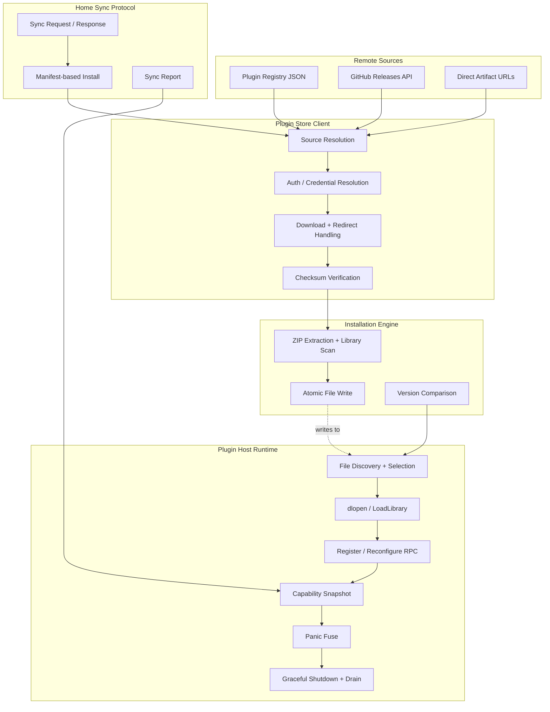

The plugin store, install, and lifecycle subsystem governs how external dynamic-library plugins are discovered from remote registries, downloaded and verified for integrity, installed to the local filesystem, loaded into the running process via CGO, and managed through hot-reload and graceful shutdown. This page covers the full journey from registry metadata to runtime registration, skipping the C ABI mechanics covered in [Plugin Host and C ABI Integration](12-plugin-host-and-c-abi-integration).

## Plugin Registry and Source Model

Every plugin in the store is described by a **Registry** — a JSON document that contains a schema version and an array of plugin entries. Each plugin entry carries identity fields (`id`, `name`, `description`, `author`), display metadata (`logo`, `homepage`, `license`, `tags`), and an **install plan** that declares how the artifact should be obtained.

A **Source** is a named pointer to a registry URL. The system ships with one default source:

| Field | Value |
|---|---|
| Source ID | `official` |
| Source Name | `Official` |
| URL | `https://raw.githubusercontent.com/router-for-me/CLIProxyAPI-Plugins-Store/main/registry.json` |

Custom sources are added via the `plugin-stores` configuration key. Each URL is assigned a deterministic source ID derived from a SHA-256 hash of the URL, and duplicate URLs or ID collisions are rejected at normalization time. Sources are normalized into a deduplicated list with the default always first. ([Sources: [registry.go](internal/pluginstore/registry.go#L86-L111)])

The registry supports two schema versions:

| Schema Version | Capability |
|---|---|
| `1` | GitHub Release installs only |
| `2` | Both GitHub Release and Direct artifact installs |

Schema version 1 explicitly rejects plugins with `InstallTypeDirect`, requiring schema version 2 for direct artifact distributions. ([Sources: [registry.go](internal/pluginstore/registry.go#L166-L184)])

## Plugin Install Types

The system supports exactly two install strategies, determined by the `install.type` field on a plugin entry:

### GitHub Release (`github-release`)

This is the default when `install.type` is absent. The client resolves the latest release (or a pinned tag) from the plugin's GitHub repository, downloads a platform-specific ZIP archive and a `checksums.txt` file, verifies the SHA-256 checksum, extracts the dynamic library, and writes it atomically to the plugins directory. The archive naming convention follows the pattern `{id}_{version}_{goos}_{goarch}.zip`. ([Sources: [github.go](internal/pluginstore/github.go#L306-L335)])

### Direct (`direct`)

Introduced in schema version 2, direct install embeds explicit artifact URLs (one per target platform) directly in the registry or manifest. Each artifact specifies `goos`, `goarch`, a download `url`, and a `sha256` checksum. This decouples distribution from GitHub Releases entirely, enabling private artifact hosting or alternative platforms. The client selects the artifact matching the runtime's `GOOS`/`GOARCH` pair, downloads it, and verifies the embedded checksum before proceeding. ([Sources: [direct.go](internal/pluginstore/direct.go#L11-L56)])

## Installation Flow

The `Install` method is the primary entry point. Its decision tree is:

1. Validate the plugin descriptor.
2. Determine the install type via `PluginInstallType`.
3. If **direct**: normalize the version, delegate to `InstallDirect`.
4. If **GitHub release**: fetch the latest release, derive the version from the tag, delegate to `installRelease`.

Both paths converge on the same archive-handling core: `InstallArchive`. ([Sources: [install.go](internal/pluginstore/install.go#L47-L66)])

### Archive Processing and Atomic Write

`InstallArchive` performs the following steps:

1. Open the downloaded byte slice as a ZIP archive.
2. Scan entries for the target dynamic library (matching `{id}.dylib`/`.so`/`.dll` or its versioned variant). Reject archives with multiple candidates, entries at non-root paths, or non-regular files.
3. Compute the target path: `{pluginsDir}/{goos}/{goarch}/{id}-v{version}{ext}`.
4. If the target already exists, compare byte-for-byte. If identical, skip the write and return with `Skipped: true`.
5. Before overwriting, invoke the `BeforeWrite` callback (used by the host to re-check plugin load status on Windows).
6. On Windows, if the plugin is currently loaded, reject the install with `ErrLoadedPluginLocked`.
7. Perform an atomic write: create a temporary file, `Chmod` it, write data, `Sync`, close, then `os.Rename` to the final path. On Windows where rename-over-existing fails, it falls back to remove-then-rename. ([Sources: [install.go](internal/pluginstore/install.go#L243-L308)])

### InstallOptions and Platform Resolution

`InstallOptions` carries the target `PluginsDir`, `GOOS`, `GOARCH`, and two optional callbacks: `PluginLoaded` (checked before Windows overwrites) and `BeforeWrite` (pre-replacement hook). When left at zero values, defaults are `plugins/`, the runtime's OS/arch, and nil callbacks. The `normalizeInstallOptions` function ensures these defaults are applied and that platform aliases are resolved (e.g., `macos` → `darwin`, `x86_64` → `amd64`). ([Sources: [install.go](internal/pluginstore/install.go#L20-L31)], [install.go](internal/pluginstore/install.go#L580-L596)])

### Versioned File Naming

Installed plugin files follow the naming convention `{id}-v{version}{ext}`, where `ext` is `.dylib` (macOS), `.so` (Linux), or `.dll` (Windows). The version embedded in the filename is stripped of any leading `v`/`V` prefix. This convention allows the host to parse both the plugin ID and version directly from the filename during discovery. ([Sources: [install.go](internal/pluginstore/install.go#L371-L373)], [install.go](internal/pluginstore/install.go#L508-L517)])

## Manifest System

A **Manifest** is a portable, self-describing representation of a single plugin installation. It carries the same identity fields as a registry `Plugin` plus a `release-tag`, `source-url`, and `install` plan. Manifests serve as the exchange format between the store client and the Home control plane's sync protocol.

The system creates manifests from two sources:
- `ManifestFromRelease` — constructed from a GitHub Release and its resolved version.
- `ManifestFromPlugin` — constructed directly from a registry plugin entry (direct installs only, since GitHub release manifests require a resolved release). ([Sources: [manifest.go](internal/pluginstore/manifest.go#L28-L61)])

Validation varies by install type:

| Install Type | Required Fields | Additional Checks |
|---|---|---|
| `github-release` | `version`, `release-tag` | Tag must resolve to the declared version; repository must parse as `owner/repo` |
| `direct` | `version`, `id` (if no artifacts inline), `source-url` (if no artifacts inline) | Artifact URLs must use HTTPS; no credentials, query params, or fragments in pinned URLs |

([Sources: [manifest.go](internal/pluginstore/manifest.go#L102-L148)])

## Plugin Sync Protocol

The Home control plane can orchestrate plugin installation across cluster nodes via a sync protocol. The client sends a `PluginSyncRequest` containing the target platform and a map of currently installed versions; the server responds with a `PluginSyncResponse` containing manifests and optional resolved auth credentials, plus an expiry timestamp.

`SyncPlatformWithReport` is the core sync loop. For each plugin configuration entry:
1. Extract the `store` manifest from the plugin's YAML config.
2. Call `installManifest`, which delegates to the appropriate `InstallManifest` or `InstallDirect` path.
3. Track the result (`installed`, `skipped`, or `failed`) in a `SyncReport`.
4. After all plugins are processed, the report is finalized with aggregate success/error status. ([Sources: [homeplugins/sync.go](internal/homeplugins/sync.go#L122-L193)])

The sync protocol also supports **resolved auth** — pre-resolved credentials from the Home server with an expiry time. These are used for private registries where the client should not hold long-lived tokens. After installation, credentials are securely cleared. ([Sources: [homeplugins/sync.go](internal/homeplugins/sync.go#L195-L246)], [homeplugins/sync.go](internal/homeplugins/sync.go#L771-L777)])

### Plugin Deletion

`DeleteWithReport` handles uninstallation: it checks if the plugin is busy (loaded or loading), attempts to unload it, then removes all matching files from the plugin directory. On Windows, if the library cannot be unloaded, deletion fails with `ErrLoadedPluginLocked`. ([Sources: [homeplugins/sync.go](internal/homeplugins/sync.go#L366-L435)])

### Load Verification

After sync, `MarkLoadResults` inspects the plugin host to confirm that each installed plugin was successfully loaded and registered. Plugins that were installed but not loaded are reported as `load_status: failed`. This two-phase verification (install then load-check) ensures the sync report reflects actual runtime state. ([Sources: [homeplugins/sync.go](internal/homeplugins/sync.go#L633-L672)])

## Authentication for Store Operations

The store client supports per-request-kind authentication via URL pattern matching. Three request kinds exist:

| Request Kind | Purpose |
|---|---|
| `registry` | Fetching the registry JSON |
| `metadata` | Fetching GitHub release metadata |
| `artifact` | Downloading plugin archives/checksums |

Each `AuthConfig` rule specifies a `match` URL pattern, an `apply-to` list of request kinds, and a credential type. Supported credential types are `bearer`, `basic`, `header`, and `github-token`. Credentials are resolved lazily from environment variables at request time. HTTP URLs are rejected unless a matching `allow-insecure` rule exists. ([Sources: [auth.go](internal/pluginstore/auth.go#L13-L35)], [auth.go](internal/pluginstore/auth.go#L310-L330)])

For Home-synced auth, `ResolvedAuthConfig` carries pre-resolved secret bytes instead of env-var names. Secrets implement the `Clear` method that zeros the backing memory before release. ([Sources: [auth.go](internal/pluginstore/auth.go#L37-L71)])

## Checksum Verification

Both install types use SHA-256 integrity verification:

- **GitHub Release**: The client downloads `checksums.txt` from the release, parses its `hash  filename` lines (skipping comments and blank lines), and verifies the archive checksum before extraction. ([Sources: [checksum.go](internal/pluginstore/checksum.go#L10-L45)])
- **Direct Install**: Each `Artifact` embeds its expected SHA-256 hex digest. After download, `VerifyArtifactChecksum` recomputes the hash and rejects mismatches. Direct artifacts also validate that the declared `Size` is non-negative and that the downloaded payload does not exceed it. ([Sources: [direct.go](internal/pluginstore/direct.go#L45-L56)])

## Plugin Version Management

The `UpdateAvailable` function compares two semver-style version strings by splitting on `.` and comparing numeric segments left-to-right, with missing segments treated as zero. Non-numeric segments cause a fallback to lexicographic comparison. A leading `v`/`V` is stripped on both sides. This function drives both the UI update check and the host's file-selection logic. ([Sources: [version.go](internal/pluginstore/version.go#L13-L24)])

## Plugin File Discovery and Selection

The host discovers plugins by scanning two candidate directories:
1. `{root}/{goos}/{goarch}/` — platform-specific directory (preferred)
2. `{root}/` — fallback for legacy layouts

For each directory, all files matching the platform's dynamic library extension are enumerated. Files are parsed into `(id, version)` pairs using the `{id}-v{version}{ext}` convention. When multiple files share the same plugin ID, the selection algorithm prefers:
1. A file matching the desired version (from config `store.version` or `store.release-tag`).
2. Otherwise, the file with the highest version number (by numeric comparison). ([Sources: [platform.go](internal/pluginhost/platform.go#L119-L175)], [platform.go](internal/pluginhost/platform.go#L192-L216)])

After loading, old files for the same plugin ID that were not selected are cleaned up automatically. ([Sources: [platform.go](internal/pluginhost/platform.go#L252-L289)])

## Host Runtime Lifecycle

The `Host` struct manages the complete lifecycle of loaded plugins through its `ApplyConfig` method, which is the central orchestrator called on startup and on configuration hot-reload.

### Loading Phase

For each plugin file selected by the discovery algorithm:
1. The host calls `loader.Open(file, host)`, which invokes CGO's `dlopen` (on Unix) or `LoadLibrary` (on Windows) to load the dynamic library into the process address space.
2. The returned handle is wrapped in a `guardedPluginClient` that tracks active call count and blocks `Shutdown` until all in-flight calls complete.
3. If the file path differs from what was previously loaded for the same ID, the old instance is **retired** — moved to the `retired` map for graceful drain.
4. The host calls `plugin.Register` (or `plugin.Reconfigure` for re-registration) via RPC to obtain the plugin's `Metadata` and `Capabilities`.
5. If the call panics, the plugin is "fused" — permanently disabled for the remainder of the process lifetime. ([Sources: [host.go](internal/pluginhost/host.go#L182-L326)], [host.go](internal/pluginhost/host.go#L596-L628)])

### Capability Registration

After successful registration, the plugin's capabilities (model registrar, model provider, auth provider, executor, scheduler, model router, request/response translators, usage plugin, thinking applier, management API, etc.) are extracted and stored in the host's snapshot. The snapshot is an `atomic.Value` swap — all readers see a consistent, immutable view of the active capability set. ([Sources: [host.go](internal/pluginhost/host.go#L297-L306)], [host.go](internal/pluginhost/host.go#L314-L316)])

### Hot Reload

When a plugin file is replaced (e.g., by a new install during a config reload), `ApplyConfig` detects the path change and:
1. Loads the new file.
2. Retires the old instance (moving it to the `retired` list for drain).
3. Clears the plugin's fused state.
4. Removes stale runtime state (management routes, resource routes, command-line flags, model registrations).
5. Stores a new snapshot with the updated capabilities.
6. Logs the hot-reload event with old/new version and path information. ([Sources: [host.go](internal/pluginhost/host.go#L236-L276)])

### Graceful Shutdown

`UnloadPlugin` removes a single plugin and `ShutdownAll` removes all. Both:
1. Acquire the `applyMu` mutex (serializing with `ApplyConfig`).
2. Collect all targets (active + retired instances).
3. Remove internal maps and update the snapshot.
4. Call `client.Shutdown()` on each target's `guardedPluginClient`.

The `guardedPluginClient.Shutdown()` method blocks until all in-flight RPC calls complete (using a condition variable), then delegates to the underlying dynamic library loader's `Shutdown` function. ([Sources: [host.go](internal/pluginhost/host.go#L382-L497)], [client_guard.go](internal/pluginhost/client_guard.go#L54-L79)])

### Plugin Fuse (Panic Recovery)

Every capability adapter call is wrapped in a `safePluginCall` that recovers from panics. When a panic occurs:
1. `fusePlugin` records the plugin ID in the `fused` map with the panic message.
2. All subsequent calls to the fused plugin's capabilities short-circuit (returning nil/false).
3. The plugin remains loaded in the process but is logically disabled until the next `ApplyConfig` cycle. ([Sources: [host.go](internal/pluginhost/host.go#L630-L647)], [adapters.go](internal/pluginhost/adapters.go#L1240-L1259)])

### Runtime Configuration

Each plugin's runtime configuration is derived from its `config.PluginInstanceConfig`. The `runtimeConfigFromConfig` function extracts enabled status, priority, desired version, and serializes the config node to YAML for passing to the plugin's `Reconfigure` method. The default config is `enabled: false, priority: 0`. ([Sources: [pluginhost/config.go](internal/pluginhost/config.go#L15-L27)], [pluginhost/config.go](internal/pluginhost/config.go#L29-L70)])

## SDK Facade Layer

The `sdk/pluginstore` package provides a thin public facade over `internal/pluginstore`, re-exporting all types as aliases and delegating every method call. This ensures embedders (such as CLIProxyAPIHome) can use the plugin store API without importing internal packages, while the actual implementation remains colocated with the rest of the system. ([Sources: [sdk/pluginstore/pluginstore.go](sdk/pluginstore/pluginstore.go#L1-L64)])

## Architecture Overview

## Key Data Structures Summary

| Structure | Location | Purpose |
|---|---|---|
| `Registry` | [registry.go](internal/pluginstore/registry.go#L34-L37) | Top-level JSON document: schema version + plugin list |
| `Plugin` | [registry.go](internal/pluginstore/registry.go#L39-L53) | Single plugin descriptor with versions and install plan |
| `InstallPlan` | [registry.go](internal/pluginstore/registry.go#L60-L63) | Install type + artifact list for direct installs |
| `Manifest` | [manifest.go](internal/pluginstore/manifest.go#L9-L26) | Portable install descriptor for sync protocol |
| `InstallResult` | [install.go](internal/pluginstore/install.go#L37-L45) | Outcome of an install operation |
| `Client` | [github.go](internal/pluginstore/github.go#L24-L31) | Store client with HTTP, auth, and registry URL |
| `AuthConfig` | [auth.go](internal/pluginstore/auth.go#L25-L35) | URL-matched credential rule |
| `SyncReport` | [homeplugins/sync.go](internal/homeplugins/sync.go#L36-L50) | Per-plugin install/load status report |
| `Host` | [pluginhost/host.go](internal/pluginhost/host.go#L43-L74) | Runtime plugin manager with loaded/retired/fused maps |
| `Snapshot` | [pluginhost/snapshot.go](internal/pluginhost/snapshot.go#L19-L22) | Immutable capability record set (atomic swap) |
| `guardedPluginClient` | [pluginhost/client_guard.go](internal/pluginhost/client_guard.go#L9-L15) | Ref-counted shutdown guard around dynamic library handle |

## Further Reading

- For the C ABI mechanics of how plugins are loaded and communicate, see [Plugin Host and C ABI Integration](12-plugin-host-and-c-abi-integration).
- For how configuration changes trigger plugin reload, see [Configuration Hot-Reload and File Watching](15-configuration-hot-reload-and-file-watching).
- For the Home control plane that orchestrates sync across cluster nodes, see [Home Control Plane Integration](16-home-control-plane-integration).
- For the Management API routes that plugins can register, see [Management API](17-management-api).
- For the SDK embedding architecture, see [SDK Architecture for Embedding](21-sdk-architecture-for-embedding).