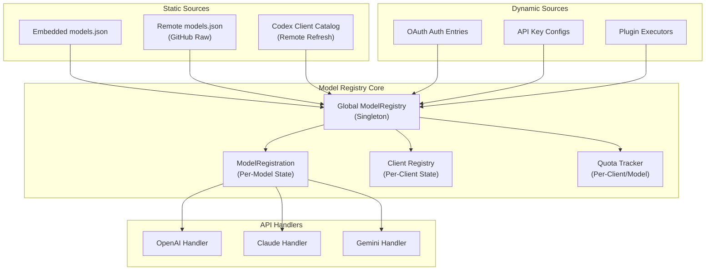
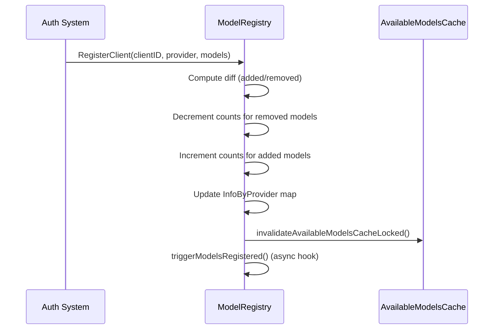

The Dynamic Model Registry and Discovery system is the centralized model management backbone of CLIProxyAPI. It provides a unified interface for tracking available AI models across all providers, managing client lifecycle, handling quota constraints, and exposing model metadata through provider-specific API formats. This system enables the proxy to dynamically discover, register, and serve models as OAuth credentials and API keys are added or removed at runtime.

## Architecture Overview

The model registry follows a **dual-source architecture** that merges static model definitions with dynamic runtime registrations. This design ensures model metadata is always available (via embedded catalogs) while reflecting real-time client availability.



The system operates on three key principles: **reference counting** for availability, **provider-specific metadata** for format conversion, and **automatic cleanup** for transient failures.

Sources: [model_registry.go](internal/registry/model_registry.go#L1-L50)

## Core Data Structures

### ModelInfo — The Universal Model Descriptor

Every model in the system is represented by a `ModelInfo` struct that captures all metadata needed for routing, display, and capability negotiation. This struct is format-agnostic and gets converted to provider-specific formats at the API handler layer.

The structure includes standard fields like `ID`, `DisplayName`, and `OwnedBy`, alongside capability descriptors such as `ContextLength`, `MaxCompletionTokens`, and `SupportedEndpoints`. A key addition is the `Thinking` field, which describes provider-specific reasoning budget capabilities — supporting discrete token ranges (min/max), zero-disable, dynamic budgeting (`-1`), and level-based reasoning (e.g., "low", "medium", "high").

The `Config` field holds optional runtime overrides loaded from `models.json`, currently supporting `OverrideHeader` for forcing specific upstream request headers per model. The `UserDefined` flag marks models defined through the YAML config file's `models[]` arrays, which bypass thinking validation.

Sources: [model_registry.go](internal/registry/model_registry.go#L53-L115)

### ModelRegistration — Per-Model Runtime State

Each model tracked by the registry maintains a `ModelRegistration` that aggregates availability across all clients. The `Count` field tracks how many clients currently provide this model, while `Providers` maps provider identifiers to client counts — enabling the system to report which providers serve a given model and in what quantity.

`QuotaExceededClients` maps client IDs to timestamps of when quota was exceeded, with a configurable 5-minute recovery window (`modelQuotaExceededWindow`). `SuspendedClients` tracks temporarily disabled clients with optional reason strings, supporting both quota-related suspensions and other transient states.

`InfoByProvider` preserves provider-specific `ModelInfo` instances, enabling the registry to return the correct metadata when a model is served by multiple providers with different capabilities.

Sources: [model_registry.go](internal/registry/model_registry.go#L117-L135)

### ModelRegistry — The Central Coordinator

The global `ModelRegistry` maintains four primary maps: `models` (model ID → registration), `clientModels` (client ID → model list), `clientModelInfos` (client ID → model metadata map), and `clientProviders` (client ID → provider identifier). A `sync.RWMutex` ensures thread-safe access across concurrent handler goroutines.

The `availableModelsCache` stores per-handler-type snapshots with TTL expiration, reducing lock contention during high-throughput model listing requests. Cache entries are invalidated whenever models are registered, unregistered, or their availability state changes (quota exceeded, suspended, etc.).

The optional `hook` field supports the `ModelRegistryHook` interface for external integrations to observe model list changes asynchronously, with panic recovery and timeout guards.

Sources: [model_registry.go](internal/registry/model_registry.go#L137-L165)

## Static Model Catalog System

### Embedded and Remote Catalogs

Static model definitions are maintained in `internal/registry/models/models.json`, a structured JSON file organized by provider sections: `claude`, `gemini`, `vertex`, `aistudio`, `codex-free`, `codex-team`, `codex-plus`, `codex-pro`, `kimi`, `antigravity`, and `xai`. This file is embedded into the binary at compile time via Go's `//go:embed` directive and serves as the startup fallback.

The `modelUpdater` system fetches the same catalog from a remote GitHub URL every 3 hours (`modelsRefreshInterval`), comparing the fetched data against the current catalog using JSON-level diff detection. When changes are detected, the system identifies affected providers and triggers a `ModelRefreshCallback` that causes all affected auth entries to re-register their models with the latest metadata.

Sources: [model_updater.go](internal/registry/model_updater.go#L1-L80)

### Codex Client Model Catalog

The Codex provider uses a separate catalog system for its client-facing model definitions (`codex_client_models.json`). This catalog includes rich metadata like `context_window`, `max_context_window`, `supported_reasoning_levels`, `tool_mode`, and `truncation_policy` — fields specific to the Codex CLI client protocol.

The catalog is refreshed independently every 3 hours from multiple remote URLs with fallback, validated for required fields (including the mandatory `gpt-5.5` template model), and exposed via `GetCodexClientModelsSnapshot()` with a revision counter for change detection.

Sources: [codex_client_models.go](internal/registry/codex_client_models.go#L1-L50), [codex_client_models_updater.go](internal/registry/codex_client_models_updater.go#L1-L60)

### Provider-Specific Static Definitions

Some providers have their model definitions hardcoded in Go files rather than `models.json`:

| Provider | Source File | Characteristics |
|----------|-------------|-----------------|
| **Kiro** | `kiro_model_converter.go` | Dynamic discovery from Kiro API, merged with static metadata |
| **Kilo** | `kilo_models.go` | Single `kilo/auto` model with thinking support |
| **CodeBuddy** | `model_definitions.go` | 5 GLM models via Tencent's copilot API |
| **GitHub Copilot** | `model_definitions.go` | GPT-4o variants + Claude models with conservative context limits |
| **Antigravity** | `model_definitions.go` | Hardcoded Gemini 2.5 models added via `upsertModelInfos()` |

Sources: [kilo_models.go](internal/registry/kilo_models.go#L1-L22), [kiro_model_converter.go](internal/registry/kiro_model_converter.go#L1-L50), [model_definitions.go](internal/registry/model_definitions.go#L96-L170)

## Client Registration Lifecycle

### Registration Flow

When a credential (OAuth token or API key) becomes available, the system registers it as a client with the global registry. The `RegisterClient` method accepts a client ID, provider identifier, and a list of `ModelInfo` structs. The method performs differential reconciliation: it computes added and removed models compared to the client's previous registration, adjusts reference counts accordingly, and updates provider-specific metadata.



Re-registration of an existing client resets quota cooldown and suspension state for that client's models, ensuring a fresh availability snapshot. Provider changes for overlapping models are handled by decrementing the old provider's count before incrementing the new one.

Sources: [model_registry.go](internal/registry/model_registry.go#L265-L400)

### Unregistration and Cleanup

Client unregistration decrements reference counts and removes models with zero remaining clients from the global map. The `CleanupExpiredQuotas` method periodically removes stale quota tracking entries that have exceeded the 5-minute recovery window, invalidating the cache when entries are cleaned.

The registry also provides `SuspendClientModel` and `ResumeClientModel` for temporarily disabling specific client-model pairs without full unregistration, used for transient error handling and cooldown scheduling.

Sources: [model_registry.go](internal/registry/model_registry.go#L619-L690)

## Model Discovery and Lookup

### LookupModelInfo — The Primary Query Interface

The `LookupModelInfo` function is the primary entry point for resolving model metadata. It performs a two-tier lookup: first checking the dynamic registry (with provider-specific override support), then falling back to static model definitions. This ensures that user-defined models from config files and dynamically discovered models from OAuth entries both resolve correctly.

```go
// Resolution order:
// 1. Dynamic registry → provider-specific InfoByProvider
// 2. Dynamic registry → global Info (last registered)
// 3. Static models.json → all provider sections
```

The provider parameter enables provider-specific metadata resolution. For example, a Claude model registered via both the `claude` and `github-copilot` providers will return different `ModelInfo` instances depending on which provider is requested, reflecting different context limits or supported endpoints.

Sources: [model_registry.go](internal/registry/model_registry.go#L178-L195)

### GetAvailableModels — Handler-Specific Listings

The `GetAvailableModels(handlerType)` method returns models formatted for specific API handlers (`"openai"`, `"claude"`, `"gemini"`). It computes availability by subtracting quota-exceeded and suspended clients from the total count, and includes models that have temporarily exhausted clients but still have pending recovery windows.

Results are cached per handler type with automatic invalidation on registry changes. The cache uses time-based expiration aligned with the earliest quota recovery time, ensuring stale data is never served beyond the recovery window.

Sources: [model_registry.go](internal/registry/model_registry.go#L806-L870)

### Provider-Specific Format Conversion

The `convertModelToMap` method transforms `ModelInfo` into handler-specific map formats:

| Handler Type | Key Differences |
|-------------|-----------------|
| **openai** | `id`, `object: "model"`, `owned_by`, `context_length`, `max_completion_tokens` |
| **claude** | `created_at` as RFC3339, `thinking: true` boolean, `extended_thinking` budget object |
| **gemini** | `name` (not `id`), `models/` prefix, `inputTokenLimit`/`outputTokenLimit`, `supportedGenerationMethods` |
| **kiro/antigravity** | Claude-compatible format with thinking support fields |

Sources: [model_registry.go](internal/registry/model_registry.go#L1200-L1320)

## Quota and Availability Management

### Three-State Availability Model

Each model's availability is computed from three independent state vectors:

1. **Total Clients** (`Count`): Raw reference count of registered clients
2. **Quota-Exceeded Clients**: Clients that exceeded quota within the last 5 minutes (`modelQuotaExceededWindow`)
3. **Suspended Clients**: Clients explicitly suspended (e.g., transient errors, quota cooldown)

The effective availability formula is:

```
effectiveClients = Count - expiredClients - otherSuspended
```

A model remains listed if `effectiveClients > 0` OR if it has pending recovery windows (quota exceeded or cooldown-suspended clients without other suspensions). This ensures clients see models that will recover shortly rather than experiencing flickering availability.

Sources: [model_registry.go](internal/registry/model_registry.go#L825-L865)

### Quota Recovery Windows

The quota system uses a sliding window rather than permanent marking. When `SetModelQuotaExceeded` is called, the client-model pair is marked with a timestamp. The `buildAvailableModelsLocked` method checks each marked client against the 5-minute window, automatically recovering clients whose cooldown has expired. The cache TTL is set to the earliest recovery time across all models, ensuring efficient re-computation.

Sources: [model_registry.go](internal/registry/model_registry.go#L668-L688)

## Model Refresh and Propagation

### Periodic Catalog Refresh

The `StartModelsUpdater` function launches a background goroutine that fetches the model catalog immediately on startup and then every 3 hours. The refresh process follows a compare-and-notify pattern:

1. Fetch from remote URLs with fallback
2. Parse and validate the catalog (duplicate detection, required sections)
3. Diff against current catalog by provider
4. If changes detected, trigger the registered `ModelRefreshCallback`

The callback (registered in `sdk/cliproxy/service.go`) iterates all auth entries whose provider was affected and re-registers their models with the updated catalog metadata. This ensures display names, context limits, and thinking configurations stay current without requiring credential re-authentication.

Sources: [model_updater.go](internal/registry/model_updater.go#L88-L140), [sdk/cliproxy/service.go](sdk/cliproxy/service.go#L240-L290)

### Kiro Dynamic Discovery

Kiro models use a unique discovery pattern where model IDs are fetched dynamically from the Kiro API at authentication time, then merged with static metadata (thinking support, context limits) via `ConvertKiroAPIModels` and `MergeWithStaticMetadata`. The converter normalizes model IDs (e.g., `claude-sonnet-4.5` → `kiro-claude-sonnet-4-5`), applies default thinking budgets, and generates `-agentic` variants optimized for coding agents with chunked writes.

Sources: [kiro_model_converter.go](internal/registry/kiro_model_converter.go#L60-L100), [kiro_model_converter.go](internal/registry/kiro_model_converter.go#L130-L160)

## Plugin Integration

### Plugin Model Registration

The plugin system integrates with the registry through the `Host.RegisterExecutors` method, which bridges plugin-declared capabilities to the global model registry. Each plugin declares its supported models via the `Capabilities.Executor` interface, which the host translates to `ModelInfo` structs using `pluginModelInfoToRegistryModelInfo`.

Plugins can declare `ExecutorModelScope` to control which model sources they participate in: `static` (catalog models only), `oauth` (credential-backed models only), or `both`. This enables plugins to selectively override routing for specific model categories without affecting others.

### Plugin Model Routing

The `Host.RouteModel` method enables plugins to intercept and redirect model routing decisions. Model routers are called in plugin registration order, with each router receiving the full list of available providers. A router can redirect to a specific provider, to itself (as an executor), or to another plugin executor. Invalid targets (unavailable providers, fused plugins) are automatically skipped.

Sources: [model_router.go](internal/pluginhost/model_router.go#L1-L80), [adapters.go](internal/pluginhost/adapters.go#L1-L50)

## Configuration Integration

### Model Aliases and Exclusions

The configuration system provides two global mechanisms for model list customization:

- **`oauth-excluded-models`**: Per-provider lists of model IDs to hide from listings and routing
- **`oauth-model-alias`**: Per-provider alias mappings that create additional model entries (with `fork: true`) or replace existing ones

Default aliases are auto-generated for providers like GitHub Copilot (dot → hyphen normalization for Claude model IDs) and Kiro (exposing standard Claude IDs alongside `kiro-` prefixed variants).

Sources: [oauth_model_alias_defaults.go](internal/config/oauth_model_alias_defaults.go#L1-L62), [config.go](internal/config/config.go#L171-L181)

### Per-Credential Model Configuration

Individual credentials can define custom model mappings through `models[]` arrays in the YAML configuration. Each entry specifies an upstream `name`, a client-facing `alias`, optional `display-name`, and `force-mapping` for response rewriting. User-defined models (marked with `UserDefined: true`) bypass thinking validation, allowing custom model definitions with non-standard thinking configurations.

Sources: [config.go](internal/config/config.go#L485-L492), [model_registry.go](internal/registry/model_registry.go#L112-L115)

## API Endpoint Exposure

The registry data flows through provider-specific API handlers, each calling `GetAvailableModels` with their handler type identifier:

| Endpoint | Handler | Format | Notes |
|----------|---------|--------|-------|
| `/v1/models` | OpenAI | Filtered (4 fields only) | Supports `?client_version` for Codex catalog |
| `/models` | Gemini | Full Gemini format | Adds `models/` prefix, defaults `supportedGenerationMethods` |
| `/v1/models` | Claude | Claude Code format | Includes `thinking`, `extended_thinking`, context limits |
| `/responses` | OpenAI Responses | OpenAI format | Separate handler with own `Models()` implementation |

The Codex `/v1/models` endpoint with `?client_version` query parameter returns the specialized `codex_client_models.json` catalog instead of the standard model list, providing the rich metadata needed by the Codex CLI client.

Sources: [openai_handlers.go](sdk/api/handlers/openai/openai_handlers.go#L53-L110), [gemini_handlers.go](sdk/api/handlers/gemini/gemini_handlers.go#L45-L85), [code_handlers.go](sdk/api/handlers/claude/code_handlers.go#L58-L66)

## Key Design Decisions

The registry's design reflects several deliberate architectural choices:

- **Global singleton pattern** ensures consistent state across all API handlers and background goroutines
- **Defensive copying** of all `ModelInfo` instances prevents data races between registry internals and consumers
- **Cache invalidation on every mutation** trades slightly more computation for guaranteed consistency
- **Provider-specific InfoByProvider map** supports the reality that the same model ID can have different capabilities when served by different providers
- **Asynchronous hook execution** with panic recovery and timeout guards prevents external integrations from blocking the critical path
- **Embedded fallback catalog** ensures the system can start and serve models even when remote fetch fails during initialization