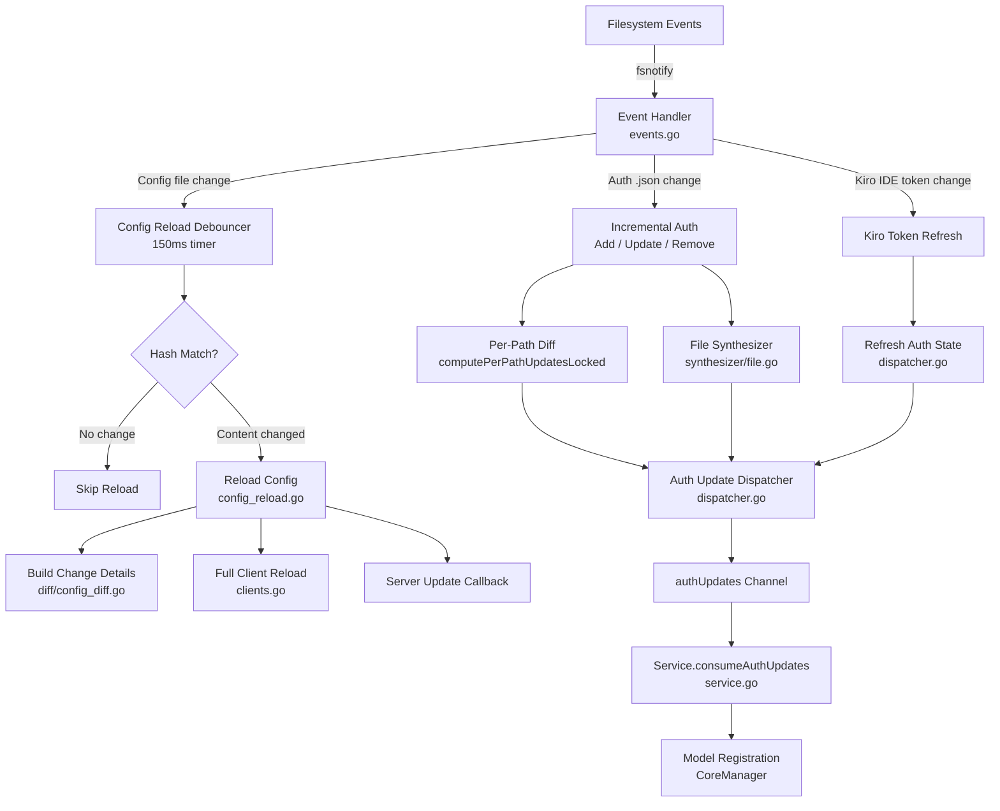
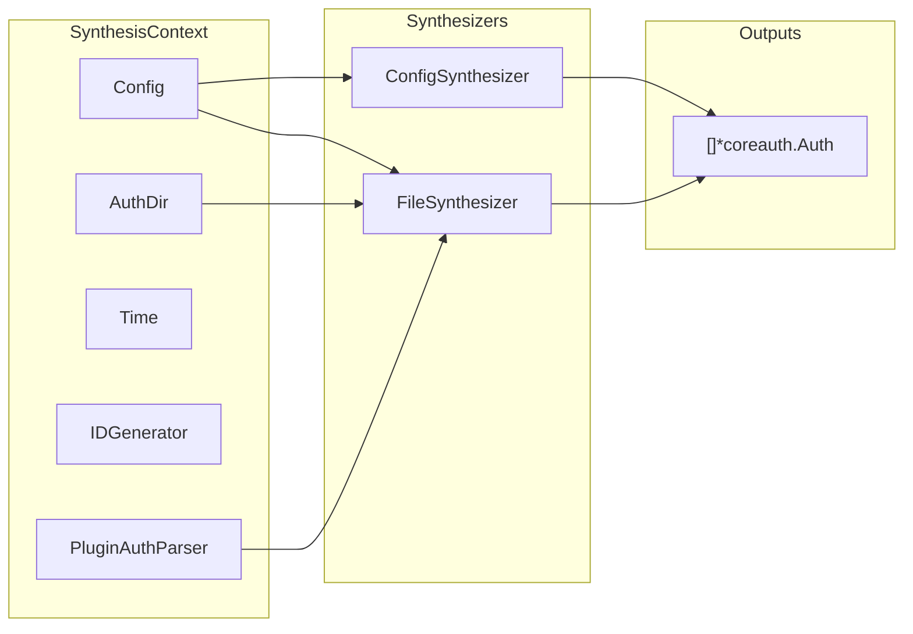
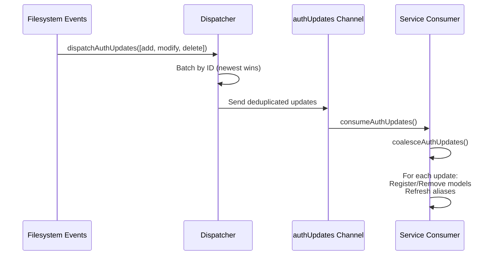

CLIProxyAPI provides a zero-downtime configuration hot-reload system powered by filesystem watchers. When you modify the YAML configuration file or drop new OAuth token files into the auth directory, the running server detects changes, diffs them against known state, and applies updates incrementally — without requiring a restart. This page explains the architecture, event flow, debouncing strategies, and the synthesis pipeline that converts raw files into in-memory authentication state.

## Architecture Overview

The hot-reload subsystem is orchestrated by the `Watcher` struct, which lives in `internal/watcher/` and is wrapped at the SDK boundary by a `WatcherWrapper` created through a factory function. The diagram below shows the major data paths from filesystem events to the running proxy service:

Sources: [watcher.go](internal/watcher/watcher.go#L1-L60), [events.go](internal/watcher/events.go#L1-L25), [config_reload.go](internal/watcher/config_reload.go#L1-L15)

## Watcher Lifecycle

The `Watcher` is created during `Service.Run()` via a pluggable factory. The default factory lives at [sdk/cliproxy/watcher.go](sdk/cliproxy/watcher.go#L15-L20), which delegates to `watcher.NewWatcher`. After creation, the service wires the update queue and kicks off the initial client load:

1. **Factory creation** — `defaultWatcherFactory` constructs a `WatcherWrapper` that exposes Start, Stop, SetConfig, and queue-binding methods.
2. **Queue binding** — `Service.Run` calls `ensureAuthUpdateQueue`, creating a buffered channel of capacity 256, then binds it via `SetAuthUpdateQueue`.
3. **Config seeding** — `SetConfig` snapshots the current YAML bytes so the watcher can detect subsequent changes.
4. **Start** — `watcherWrapper.Start(ctx)` adds the config file path and the auth directory to the `fsnotify` watcher, launches the `processEvents` goroutine, and performs the first full client reload.

Sources: [service.go](sdk/cliproxy/service.go#L1756-L1790), [watcher.go](internal/watcher/watcher.go#L115-L135)

## Event Detection and Filtering

The `processEvents` loop reads from the `fsnotify` event channel and delegates to `handleEvent`. Not every filesystem event is relevant — the handler applies three filtering rules before acting:

| Filter | Condition | Actions Processed |
|--------|-----------|-------------------|
| **Config event** | Normalized path matches `configPath` | Write, Create, Rename |
| **Auth JSON event** | File is inside `authDir` and ends with `.json` | Create, Write, Remove, Rename |
| **Kiro IDE token** | Path matches `~/.aws/sso/cache/**/kiro-auth-token.json` | Create, Write, Remove, Rename |

All other files (cookie snapshots, log files, etc.) are silently discarded. Path normalization lowercases and cleans separators, with special handling for Windows UNC prefixes on Darwin builds.

Sources: [events.go](internal/watcher/events.go#L79-L120)

## Configuration Hot-Reload

When a config file event passes filtering, the watcher schedules a debounced reload rather than acting immediately. This coalesces rapid successive edits (e.g., editor save-triggers) into a single reload cycle.

### Debouncing Strategy

| Timer | Duration | Purpose |
|-------|----------|---------|
| `configReloadDebounce` | 150 ms | Coalesce rapid config file writes |
| `serverUpdateDebounce` | 1 s | Throttle server update callbacks |
| `replaceCheckDelay` | 50 ms | Wait for atomic rename to settle |
| `authRemoveDebounceWindow` | 1 s | Deduplicate Remove events during atomic replace |

The debounce chain works as follows: `scheduleConfigReload` starts a 150 ms `time.AfterFunc`. If another write arrives before it fires, the timer is reset. When it finally fires, `reloadConfigIfChanged` reads the file and computes a SHA-256 hash. If the hash matches the previously stored hash, the reload is skipped entirely — no parsing, no diff, no client disruption.

Sources: [config_reload.go](internal/watcher/config_reload.go#L23-L75), [watcher.go](internal/watcher/watcher.go#L57-L60)

### Change Detection and Diffing

When the hash indicates a real change, the full reload pipeline executes:

1. **Parse** — `config.LoadConfig` deserializes the YAML into a `Config` struct.
2. **Resolve** — The auth directory path is resolved (respecting `mirroredAuthDir` for token store-managed instances).
3. **Diff** — `diff.BuildConfigChangeDetails` compares every non-secret field between old and new configs. The diff output is logged at debug level, listing every changed field with before/after values (redacted for secrets like API keys).
4. **Selective refresh** — Certain changes trigger targeted actions:
   - `AuthDir` change → marks auth directory rescan needed
   - `ForceModelPrefix` or `OAuthModelAlias` change → forces full auth refresh
   - `RequestRetry` / `MaxRetryInterval` / `MaxRetryCredentials` change → forces auth refresh
   - `OAuthExcludedModels` change → identifies affected OAuth providers
5. **Client reload** — `reloadClients` rebuilds API key clients from config, optionally rescans the auth directory, synthesizes auth entries, and triggers the server update callback.
6. **Persistence** — If a capability-aware token store is connected, `persistConfigAsync` writes the parsed config back asynchronously.

Sources: [config_reload.go](internal/watcher/config_reload.go#L77-L145), [diff/config_diff.go](internal/watcher/diff/config_diff.go#L1-L50)

## Auth File Watching (Incremental)

Auth directory changes bypass the full reload path and instead use an **incremental** strategy. Each `.json` file is processed independently:

### Add/Update Flow

When a Create or Write event arrives for an auth file:

1. **Read and hash** — The file is read and SHA-256 hashed. If the hash matches the cached hash for that path, processing stops.
2. **Parse** — The JSON is unmarshalled into a `coreauth.Auth` and passed to the synthesizer pipeline.
3. **Synthesize** — `synthesizer.SynthesizeAuthFile` applies a chain of strategies (plugin parser → built-in file synthesis) to produce one or more `Auth` entries. A single file can yield multiple virtual auths (e.g., multi-account codex tokens).
4. **Per-path diff** — `computePerPathUpdatesLocked` compares the new auth set for this file against the old set. This yields `AuthUpdateActionAdd`, `AuthUpdateActionModify`, or `AuthUpdateActionDelete` entries.
5. **Dispatch** — Updates are pushed into the dispatcher for batching and deduplication.

### Remove Flow

Remove events are debounced against atomic replace patterns. If a file disappears but reappears within 50 ms, the watcher treats it as a modification rather than a deletion. The `shouldDebounceRemove` function prevents duplicate remove events within a 1-second window for the same normalized path.

### Kiro IDE Token Changes

The watcher additionally monitors `~/.aws/sso/cache/` for Kiro IDE SSO token updates. When detected, it loads the token with retry logic (to handle file lock contention on Windows) and triggers a full `refreshAuthState` + server update callback.

Sources: [clients.go](internal/watcher/clients.go#L230-L310), [events.go](internal/watcher/events.go#L140-L190)

## Auth Synthesis Pipeline

The synthesizer subsystem converts raw inputs (config API keys and OAuth JSON files) into normalized `coreauth.Auth` objects. It follows the **Strategy pattern**:

### ConfigSynthesizer

Generates auth entries from inline YAML API key configuration. Each provider key section (`gemini-api-key`, `claude-api-key`, `codex-api-key`, `xai-api-key`, `interactions-api-key`, `kiro`, `openai-compatibility`, `vertex-compat`) produces auth objects with attributes sourced from the config — including base URLs, headers, model lists, and priority values. IDs are deterministically generated from the key material, ensuring the same config always produces the same auth entries.

### FileSynthesizer

Reads `.json` files from the auth directory. Each file is parsed, and its `type` field determines the provider. The synthesizer:
- Delegates to plugin parsers first (if registered)
- Falls back to built-in handling for known providers (codex, gemini-cli, etc.)
- Extracts per-account metadata: excluded models, model aliases, custom headers, priority, and notes
- Handles disabled accounts by setting `StatusDisabled`

Sources: [synthesizer/interface.go](internal/watcher/synthesizer/interface.go#L1-L17), [synthesizer/config.go](internal/watcher/synthesizer/config.go#L1-L50), [synthesizer/file.go](internal/watcher/synthesizer/file.go#L1-L50)

## Auth Update Dispatcher

The dispatcher sits between the watcher's filesystem processing and the service's update consumer. Its job is to **batch, deduplicate, and order** auth updates:

The dispatcher uses a condition variable (`dispatchCond`) to wake the background `dispatchLoop` goroutine when new updates arrive. This avoids busy-polling while ensuring updates are delivered promptly. The loop drains the pending map in a single batch, maintaining insertion order.

The service-side consumer (`Service.consumeAuthUpdates`) performs a second coalescing pass using `coalesceAuthUpdates`, which deduplicates by auth ID — if the same auth is modified multiple times between consumer cycles, only the latest state is processed.

Sources: [dispatcher.go](internal/watcher/dispatcher.go#L1-L50), [service.go](sdk/cliproxy/service.go#L462-L490)

## State Management and Concurrency

The `Watcher` maintains several concurrent-safe state maps protected by `clientsMutex` (RWMutex):

| State | Type | Purpose |
|-------|------|---------|
| `lastAuthHashes` | `map[string]string` | SHA-256 hash per normalized auth file path |
| `lastAuthContents` | `map[string]*coreauth.Auth` | Cached parsed auth for debug-level diffing |
| `fileAuthsByPath` | `map[string]map[string]*coreauth.Auth` | Auth entries produced per file (supports multi-auth files) |
| `currentAuths` | `map[string]*coreauth.Auth` | Global active auth state by ID |
| `runtimeAuths` | `map[string]*coreauth.Auth` | Non-file auths pushed by runtime providers |
| `lastConfigHash` | `string` | SHA-256 hash of the last loaded config YAML |

The `authRescanMu` mutex serializes full directory rescans against incremental file processing. The `configReloadMu` mutex serializes config reload timers. Server update callbacks use a separate debounce timer (`serverUpdateTimer`) to prevent callback storms during rapid configuration changes.

Sources: [watcher.go](internal/watcher/watcher.go#L30-L56), [clients.go](internal/watcher/clients.go#L78-L130)

## Persistence Integration

When the watcher detects a capability-aware token store (implementing `storePersister`), it triggers asynchronous persistence after changes:

- **Config changes** → `persistConfigAsync` calls `store.PersistConfig` with a 30-second timeout.
- **Auth file changes** → `persistAuthAsync` calls `store.PersistAuthFiles` with the affected file paths, enabling synchronization to remote storage (e.g., the Home control plane).

This persistence path is **fire-and-forget** — the watcher never blocks on I/O or surfaces persistence errors to the hot-reload pipeline. If persistence fails, the in-memory state is still correct; only the durable snapshot is stale.

Sources: [clients.go](internal/watcher/clients.go#L345-L377)

## Debug-Level Observability

When `debug: true` is set in the configuration, the watcher provides rich observability:

- **Config changes** are logged as a list of human-readable field diffs (e.g., `port: 8080 → 9090`, `debug: false → true`). Sensitive values like API keys are never printed — only structural changes like count changes are shown.
- **Auth file changes** are logged as field-level diffs between the old and new parsed auth objects.
- **File hash matches** are logged with "skipping reload" messages, confirming that no-op events were correctly filtered.
- **Full client load** reports the total count of clients by source type (auth files, Gemini API keys, Claude API keys, etc.).