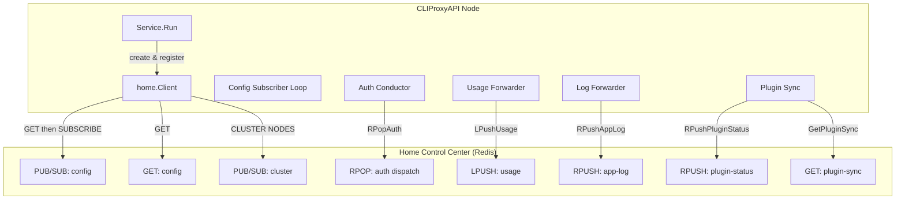
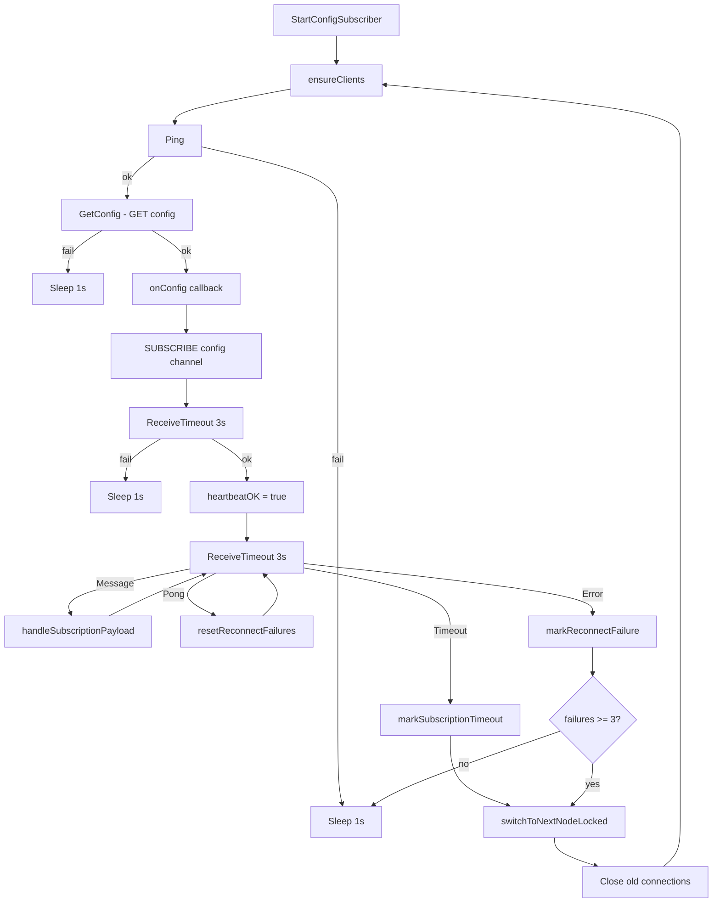
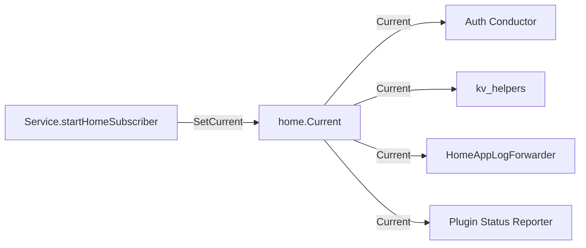

CLIProxyAPI includes an optional **Home Control Plane** — a centralized Redis-based orchestration layer that enables fleet-level management of proxy nodes. When enabled, each node connects to a shared Redis instance, surrenders local-only behaviors (file-based auth, filesystem config reload, cooldown scheduling), and instead receives configuration overlays, credential dispatches, plugin synchronizations, and usage telemetry from the Home server. This page documents the complete architecture of that integration, from connection establishment to data-plane flows.

## Architecture Overview

The Home integration transforms a standalone CLIProxyAPI node into a managed participant in a larger cluster. The diagram below shows the five major data flows between a node and the Home control center:



Sources: [client.go](internal/home/client.go#L88-L102), [service.go](sdk/cliproxy/service.go#L1581-L1626), [conductor.go](sdk/cliproxy/auth/conductor.go#L5259-L5266), [home_plugins.go](sdk/cliproxy/home_plugins.go#L24-L64)

## Home Configuration

The Home control plane is configured through the `home` section of the YAML configuration file. The structure is defined in `internal/config/home.go`:

```yaml
home:
  enabled: false
  host: "127.0.0.1"
  port: 6379
  password: ""
  disable-cluster-discovery: false
  tls:
    enable: false
    ca-cert: ""
    client-cert: ""
    client-key: ""
    server-name: ""
    insecure-skip-verify: false
    use-target-server-name: false
```

| Field | Type | Description |
|---|---|---|
| `enabled` | bool | Master switch. When `false`, all Home features are disabled and the node runs standalone. |
| `host` | string | Redis server hostname. Overridden at runtime by cluster discovery. |
| `port` | int | Redis server port (standard Redis: 6379). |
| `password` | string | Optional Redis AUTH password. |
| `disable-cluster-discovery` | bool | Disables automatic `CLUSTER NODES` discovery and failover. |
| `tls.enable` | bool | Enables mTLS for the Redis connection. |
| `tls.ca_cert` | string | Path to the CA certificate PEM file. |
| `tls.client_cert` / `tls.client_key` | string | Client certificate pair for mTLS. |
| `tls.insecure_skip_verify` | bool | Disables server certificate verification. |
| `tls.use_target_server_name` | bool | Uses the discovered cluster node address as the TLS ServerName. |

**Important security note**: When Home is enabled, the `HomeConfig` is never serialized to JSON (tagged `json:"-"`), so it is never exposed through the management API or config-over-HTTP endpoints. Additionally, `ParseConfigBytes` — used to parse remote Home config payloads — deliberately **ignores** the `home` section to prevent a Home server from overriding its own connection parameters through a config push.

Sources: [home.go](internal/config/home.go#L1-L24), [config.go](internal/config/config.go#L41-L42), [home_test.go](internal/config/home_test.go#L1-L30)

## Connection Lifecycle and Heartbeat

The `home.Client` manages two Redis connections: a **command client** for request/response operations and a **subscription client** for pub/sub channels. The connection lifecycle is driven by `StartConfigSubscriber`, which runs a persistent reconnection loop.

### Connection Sequence



Sources: [client.go](internal/home/client.go#L1199-L1315)

### Heartbeat Semantics

The heartbeat is **implicit** — it is derived from the health of the pub/sub subscription, not a dedicated ping/pong cycle. The `HeartbeatOK()` method returns `true` only after the initial `GET config` succeeds **and** the `SUBSCRIBE` connection is confirmed. When the subscription breaks (error or sustained timeout), `heartbeatOK` is set to `false` immediately and the reconnection loop begins.

This design means that **all downstream consumers** — usage forwarding, log forwarding, auth dispatch, plugin status reporting — can gate their operations on a single boolean check:

```go
if !client.HeartbeatOK() {
    // Home is not available; fall back to local behavior or skip.
    return
}
```

Sources: [client.go](internal/home/client.go#L121-L129), [client.go](internal/home/client.go#L1278-L1280)

### Cluster Discovery and Failover

When cluster discovery is enabled, the node periodically runs `CLUSTER NODES` against the current Redis server, which returns a JSON envelope of all known cluster members. Nodes are sorted by `client_count` (ascending) so the least-loaded node is preferred. Failover occurs in two scenarios:

1. **Repeated reconnect failures** — After 3 consecutive failures (`homeReconnectFailoverThreshold`), the node switches to the next candidate in the sorted list (or back to the seed address).
2. **Subscription timeout** — If the subscription receives no messages for 3 seconds (`homeSubscriptionReceiveTimeout`), the node immediately attempts a failover without waiting for the threshold.

The node maintains a list of cluster candidates plus the original seed host/port, and cycles through them in order, never returning to a previously failed node within the same discovery cycle.

Sources: [client.go](internal/home/client.go#L359-L536)

## mTLS Certificate Enrollment

When Home is enabled with TLS, nodes authenticate using mutual TLS. The enrollment process is JWT-initiated: an external system provides a JWT containing a `certificate_id`, `cluster_id`, `ca_fingerprint`, `enrollment_secret`, and the target Redis address. The node decodes this JWT locally (without signature verification — the JWT serves as an enrollment token, not an auth credential), generates an RSA 2048-bit key pair, creates a CSR, and sends it to the Home server over the RESP protocol:

```
*5\r\n
$11\r\nCERTIFICATE\r\n
$7\r\nREQUEST\r\n
$<id_len>\r\n<certificate_id>\r\n
$<secret_len>\r\n<enrollment_secret>\r\n
$<csr_len>\r\n<csr_pem>\r\n
```

The response contains the signed client certificate and the CA certificate. The node verifies the CA certificate's SHA-256 fingerprint matches the one in the JWT, then persists all three files (`client-crt.pem`, `client-key.pem`, `home-ca-crt.pem`) to `~/.cli-proxy-api/` with `0600` permissions. Subsequent startups skip enrollment if the files already exist (but still verify the CA fingerprint).

The resulting `HomeConfig` is populated with the JWT's IP/port and the local certificate paths, enabling the Redis client to connect with mTLS.

Sources: [certificate.go](internal/home/certificate.go#L54-L79), [certificate.go](internal/home/certificate.go#L284-L333)

## Runtime Behavioral Changes in Home Mode

When Home is enabled, the `Service.Run` path applies several behavioral overrides through `forceHomeRuntimeConfig`:

| Setting | Standalone Value | Home-Mode Override | Rationale |
|---|---|---|---|
| `APIKeys` | User-defined | `nil` (cleared) | API key auth is managed by Home, not locally |
| `UsageStatisticsEnabled` | Configurable | `true` | Usage must always flow to Home |
| `DisableCooling` | Configurable | `true` | Cooldown scheduling is centralized in Home |
| `SaveCooldownStatus` | Configurable | `false` | No local persistence needed |
| `WebsocketAuth` | `true` | `false` | WebSocket auth managed at fleet level |
| `RemoteManagement.AllowRemote` | Configurable | `false` | Local management only |
| `RemoteManagement.DisableControlPanel` | Configurable | `true` | No local control panel |
| `Plugins.StoreAuth` | Configurable | Preserved | Store auth is needed for plugin downloads |

Additionally, in Home mode:
- **File-based config watching is disabled** — configuration comes exclusively through the Redis pub/sub channel.
- **Token file loading is skipped** — credentials are dispatched from the Home server per-request.
- **Core auth auto-refresh is disabled** — credential refresh is managed centrally.
- **Redis queue is enabled** — usage records are buffered locally and forwarded asynchronously.

Sources: [service.go](sdk/cliproxy/service.go#L1433-L1445), [service.go](sdk/cliproxy/service.go#L1646-L1808)

## Data-Plane Flows

### Configuration Overlay

The Home server publishes configuration updates on the `config` Redis pub/sub channel. When a message arrives, the node parses it with `config.ParseConfigBytes` (which strips Home credentials), then calls `applyHomeOverlayContext`:

1. **Merge** — The remote config is merged with the local base config, preserving local `Host`, `Port`, `TLS`, and `Home` fields.
2. **Force overrides** — `forceHomeRuntimeConfig` is applied to the merged result.
3. **Diff logging** — In debug mode, specific changed fields are logged.
4. **Plugin sync** — If plugins are enabled, `syncHomePlugins` is called with the merged config.
5. **Apply** — The standard `applyConfigUpdate` path runs, reconciling auth providers, model registries, and executor registrations.

This means the local YAML file sets the **seed** configuration (particularly the Home connection parameters), while the Home server controls the **runtime** configuration overlay.

Sources: [service.go](sdk/cliproxy/service.go#L1453-L1499), [service.go](sdk/cliproxy/service.go#L1616-L1623)

### Credential Dispatch

In Home mode, the auth conductor does not use locally loaded credentials. Instead, for each request it calls `client.RPopAuth`, which issues a Redis `RPOP` against a dynamically-constructed key:

```json
{
  "type": "auth",
  "model": "gpt-4o",
  "count": 1,
  "session_id": "abc123",
  "headers": {"authorization": "Bearer ..."}
}
```

The Home server pops a credential from the appropriate queue and returns a `homeAuthDispatchResponse` containing the `Auth` object, upstream model mapping, and optional per-request API key. The conductor then uses this auth for the current request cycle.

Sources: [conductor.go](sdk/cliproxy/auth/conductor.go#L5467-L5520), [requests.go](internal/home/requests.go#L3-L9)

### Usage Telemetry

Usage records are enqueued locally by the `redisqueue` plugin (registered via `init()` in [internal/redisqueue/plugin.go](internal/redisqueue/plugin.go#L13-L15)) and forwarded to Home asynchronously by the `startHomeUsageForwarder` goroutine. The forwarder:

1. Pops up to 64 records from the local queue via `PopOldest`.
2. Pushes them to Home via `LPushUsage` (Redis `LPUSH usage`).
3. On failure, re-enqueues the unsent records and waits 1 second before retrying.
4. Sleeps 500ms between successful batches to avoid flooding.

This design provides **at-least-once delivery** semantics — records are never silently dropped, and the local queue retains them until successfully forwarded.

Sources: [service.go](sdk/cliproxy/service.go#L1521-L1579), [plugin.go](internal/redisqueue/plugin.go#L19-L102)

### Application Log Forwarding

The `HomeAppLogForwarder` is a logrus hook that captures all application log entries and forwards them to Home via `RPushAppLog`. It uses an internal buffered channel (default capacity 1024) as a back-pressure mechanism — if the channel is full, new entries are silently dropped to avoid blocking the logging pipeline.

The forwarder only activates when the Home heartbeat is healthy. If Home returns an "unsupported" error (e.g., a Home server that does not implement the `app-log` Redis key), the forwarder permanently disables itself to avoid wasted work.

Sources: [home_app_log_forwarder.go](internal/logging/home_app_log_forwarder.go#L34-L182)

### Plugin Synchronization

Plugin synchronization ensures that all nodes in a cluster run the same set of plugins at the same versions. On each config update received from Home, `syncHomePlugins` performs:

1. **Deduplication** — A SHA-256 sync key is computed from the plugin config section. If the key matches the last successful sync, the operation is skipped.
2. **Remote resolution** — The node sends a `PluginSyncRequest` (containing platform, installed versions, and auth revision) to Home via `GetPluginSync`.
3. **Fallback** — If Home does not support the `plugin-sync` Redis key (returns `ErrPluginSyncUnsupported`), the node falls back to its local plugin config for installation.
4. **Installation** — Each plugin manifest is downloaded, platform-normalized, and installed to the plugins directory.
5. **Status reporting** — After sync, the node pushes a `SyncReport` back to Home via `RPushPluginStatus`.

Home can also push **plugin delete tasks** via the `plugin-tasks` Redis key. The node polls these on each config update and processes any `delete` operations, removing the plugin artifact and reporting the result.

Sources: [home_plugins.go](sdk/cliproxy/home_plugins.go#L24-L170), [sync.go](internal/homeplugins/sync.go#L108-L193)

## Global Client Singleton

The active Home client is stored as an atomic global singleton via `home.SetCurrent` / `home.Current`. This allows subsystems throughout the codebase to access the Home client without direct dependency injection:



The global is cleared during shutdown (`home.ClearCurrent`) to ensure no goroutine accesses a closed client.

Sources: [global.go](internal/home/global.go#L1-L26)

## Key-Value Store Abstraction

The `kv_helpers.go` module provides a convenience layer over Redis key-value operations, with two usage patterns:

| Pattern | Methods | Behavior |
|---|---|---|
| **Required** | `KVGetJSONRequired`, `KVSetJSONRequired`, `KVSetNXRequired`, `KVDelRequired`, `KVExpireRequired` | Return `(homeMode bool, result, error)`. If Home is not connected, `homeMode=false` allows the caller to fall back to local storage. |
| **Best-effort** | `KVGetJSONBestEffort`, `KVSetJSONBestEffort`, `KVSetNXBestEffort`, `KVDelBestEffort`, `KVExpireBestEffort` | Log errors but never propagate them. Return booleans indicating success. |

The Client itself supports full Redis key-value operations including atomic compare-and-swap (`KVCompareAndSwap`) via a Lua script, multi-key get/set (`KVMGet`/`KVMSet`), increment (`KVIncrBy`), TTL management, and hash-based key hashing.

Sources: [kv_helpers.go](internal/home/kv_helpers.go#L20-L190), [client.go](internal/home/client.go#L638-L813)

## Shutdown Sequence

During service shutdown, the Home integration is cleaned up in order:

1. **Cancel subscription context** — `homeCancel()` signals the config subscriber goroutine to exit.
2. **Close Redis clients** — `homeClient.Close()` closes both command and subscription connections and sets `heartbeatOK` to `false`.
3. **Stop log forwarder** — `homeLogForwarder.Stop()` waits for the background log sender goroutine to drain.
4. **Clear global** — `home.ClearCurrent()` removes the singleton reference.

This sequence ensures that no background goroutine attempts to use a closed Redis connection after shutdown.

Sources: [service.go](sdk/cliproxy/service.go#L1838-L1850)

## Next Steps

- For understanding how credentials flow through the auth conductor in Home mode, see [Authentication System and Provider Login Flows](7-authentication-system-and-provider-login-flows).
- For the file-based watcher that replaces Home in standalone mode, see [Configuration Hot-Reload and File Watching](15-configuration-hot-reload-and-file-watching).
- For how plugins are loaded and managed after Home-driven synchronization, see [Plugin Store, Install, and Lifecycle](13-plugin-store-install-and-lifecycle).
- For the usage queue internals that buffer records before Home forwarding, see [Usage Tracking and Redis Queue](20-usage-tracking-and-redis-queue).