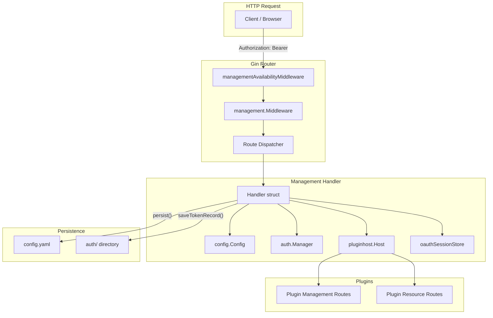
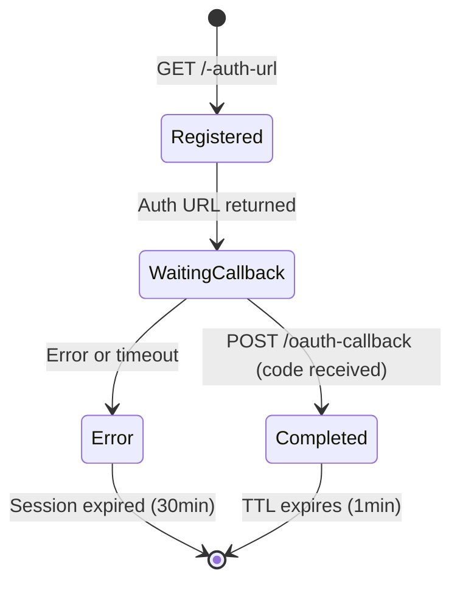

The Management API provides a RESTful interface for runtime configuration, credential management, OAuth authentication flows, plugin lifecycle control, and operational monitoring of CLIProxyAPIPlus — without requiring server restarts. It serves as the backend for the bundled web control panel (`management.html`) and for programmatic integrations via the SDK.

All management endpoints are protected by a shared secret and support both localhost and remote access modes. Changes made through the API are persisted to `config.yaml` (with comment preservation) and trigger hot-reloaded config propagation to the running server.

## Architecture Overview

The Management API is implemented as a dedicated Gin handler (`management.Handler`) registered under two base paths — `/v0/management` (canonical) and `/management` (legacy alias). The same route tree is mounted on both groups, each sharing the same middleware stack.



Sources: [handler.go](internal/api/handlers/management/handler.go#L40-L63), [server.go](internal/api/server.go#L861-L1008)

## Authentication and Security

Every Management API request must present a valid management key. The middleware evaluates credentials in a defined priority order and applies brute-force protection for all client IPs.

### Credential Priority

The authentication middleware checks the provided key against these sources in order:

1. **Runtime local password** — set via `WithLocalManagementPassword()` in TUI mode; only accepted for `127.0.0.1` / `::1` clients
2. **Environment variable** — `MANAGEMENT_PASSWORD` (plaintext, compared via constant-time comparison)
3. **Config secret key** — `remote-management.secret-key` in `config.yaml`; accepts both plaintext and bcrypt-hashed values

### Key Delivery Methods

Clients can provide the management key via either of two headers:

| Header | Format | Notes |
|---|---|---|
| `Authorization` | `Bearer <key>` | Standard OAuth-style header |
| `X-Management-Key` | `<key>` | Simplified alternative |

### Brute-Force Protection

The middleware tracks failed authentication attempts per client IP. After **15 consecutive failures**, the IP is banned for **30 minutes**. Stale entries are purged by a background goroutine every hour, and entries idle for more than 2 hours are removed regardless of ban status.

### Remote Access Control

Remote (non-localhost) access requires `remote-management.allow-remote: true` in the configuration. Without this flag, any request from a non-loopback address is rejected with `403 Forbidden`. The `MANAGEMENT_PASSWORD` environment variable implicitly enables remote access.

Sources: [handler.go](internal/api/handlers/management/handler.go#L262-L401), [config.go](internal/config/config.go#L328-L341)

## Route Registration and Lifecycle

Management routes are not registered at startup unconditionally. They are only attached when at least one management secret exists — either the config `secret-key`, the `MANAGEMENT_PASSWORD` env var, or a local password. This means if no secret is configured, all management endpoints return `404 Not Found`.

When the configuration hot-reloads and the secret key transitions between empty and non-empty, the server dynamically enables or disables the management routes at runtime:

- **Key added** → routes are registered and enabled
- **Key removed** → routes are disabled (return 404)
- **`MANAGEMENT_PASSWORD` present** → routes always enabled regardless of config

Sources: [server.go](internal/api/server.go#L391-L398), [server.go](internal/api/server.go#L851-L859), [server.go](internal/api/server.go#L1889-L1919)

## Endpoint Reference

The Management API organizes its endpoints into several functional groups. Each endpoint follows a consistent pattern: GET for reading, PUT for replacing, PATCH for partial updates, and DELETE for removal.

### Configuration Management

These endpoints read and modify the server's runtime configuration. All mutations are persisted to `config.yaml` (preserving comments and formatting) and trigger an async hot-reload.

| Endpoint | Methods | Description |
|---|---|---|
| `/config` | GET | Returns the full in-memory config as JSON |
| `/config.yaml` | GET, PUT | Read/write the raw YAML file (preserves comments) |
| `/latest-version` | GET | Fetches the latest release version from GitHub |
| `/debug` | GET, PUT, PATCH | Toggle debug logging |
| `/logging-to-file` | GET, PUT, PATCH | Toggle file-based logging |
| `/logs-max-total-size-mb` | GET, PUT, PATCH | Maximum total log size in MB |
| `/error-logs-max-files` | GET, PUT, PATCH | Maximum number of error log files |
| `/usage-statistics-enabled` | GET, PUT, PATCH | Toggle usage statistics collection |
| `/proxy-url` | GET, PUT, PATCH, DELETE | HTTP proxy URL for outbound requests |
| `/request-log` | GET, PUT, PATCH | Toggle request logging |
| `/ws-auth` | GET, PUT, PATCH | Toggle WebSocket authentication |
| `/request-retry` | GET, PUT, PATCH | Number of request retries |
| `/max-retry-interval` | GET, PUT, PATCH | Maximum retry interval in seconds |
| `/force-model-prefix` | GET, PUT, PATCH | Force model prefix on requests |
| `/routing/strategy` | GET, PUT, PATCH | Routing strategy (`round-robin` or `fill-first`) |

**Standard boolean field update pattern:**
```json
PUT /v0/management/debug
{"value": true}
```

**List field update pattern (PUT replaces entire list):**
```json
PUT /v0/management/api-keys
["key1", "key2"]
```

**Patch pattern (single item modification):**
```json
PATCH /v0/management/api-keys
{"old": "key1", "new": "key1-updated"}
```

Sources: [config_basic.go](internal/api/handlers/management/config_basic.go#L26-L329), [config_lists.go](internal/api/handlers/management/config_lists.go#L13-L119)

### Credential and API Key Management

The API provides both generic and provider-specific endpoints for managing credentials. Provider-specific endpoints enrich responses with `auth-index` fields that link configuration entries to their in-memory auth records.

| Endpoint | Methods | Description |
|---|---|---|
| `/api-keys` | GET, POST, PUT, PATCH, DELETE | OpenAI-compatible API keys |
| `/api-key-usage` | GET | Per-key success/failure statistics with recent request buckets |
| `/gemini-api-key` | GET, PUT, PATCH, DELETE | Gemini API key entries (supports prefix, base-url, headers, excluded-models) |
| `/claude-api-key` | GET, PUT, PATCH, DELETE | Claude API key entries |
| `/codex-api-key` | GET, PUT, PATCH, DELETE | Codex API key entries |
| `/vertex-api-key` | GET, PUT, PATCH, DELETE | Vertex AI compatible API keys |
| `/openai-compatibility` | GET, PUT, PATCH, DELETE | OpenAI-compatible provider configurations |

The PATCH operation for structured keys (Gemini, Claude, etc.) uses a match/index selector:

```json
PATCH /v0/management/gemini-api-key
{
  "match": "<current-api-key>",
  "value": {
    "prefix": "new-prefix",
    "excluded-models": ["model-to-skip"]
  }
}
```

Setting `api-key` to an empty string in a PATCH operation removes the entire entry.

Sources: [config_lists.go](internal/api/handlers/management/config_lists.go#L121-L200), [config_auth_index.go](internal/api/handlers/management/config_auth_index.go#L54-L113), [api_key_usage.go](internal/api/handlers/management/api_key_usage.go#L58-L117)

### Auth Files and OAuth Flows

Auth files represent provider authentication credentials (OAuth tokens, API keys, service accounts) stored in the `auth/` directory. The Management API supports both file-based management and interactive OAuth flows for multiple providers.

#### Auth File CRUD

| Endpoint | Methods | Description |
|---|---|---|
| `/auth-files` | GET, POST, DELETE | List, upload, delete auth files |
| `/auth-files/download` | GET | Download a specific auth file |
| `/auth-files/status` | PATCH | Enable/disable an auth file |
| `/auth-files/fields` | PATCH | Update specific fields of an auth file |
| `/auth-files/models` | GET | Get supported models for an auth file |
| `/vertex/import` | POST | Import a Vertex AI service account JSON |

#### OAuth Token Request Endpoints

Each supported provider has a dedicated endpoint that initiates an OAuth or device-code flow:

| Endpoint | Provider | Flow Type |
|---|---|---|
| `/anthropic-auth-url` | Anthropic (Claude) | OAuth 2.0 with PKCE |
| `/codex-auth-url` | OpenAI Codex | OAuth 2.0 with PKCE |
| `/gitlab-auth-url` | GitLab | OAuth 2.0 |
| `/gitlab-auth-url` (POST) | GitLab PAT | Personal Access Token |
| `/gemini-cli-auth-url` | Gemini CLI | Google OAuth |
| `/antigravity-auth-url` | Antigravity | Google OAuth |
| `/kilo-auth-url` | Kilo | OAuth |
| `/kimi-auth-url` | Kimi | OAuth |
| `/kiro-auth-url` | Kiro | Device code |
| `/cursor-auth-url` | Cursor | OAuth |
| `/github-auth-url` | GitHub | OAuth |

#### OAuth Session Lifecycle

The Management API maintains an in-memory session store (`oauthSessionStore`) that tracks active OAuth flows. Sessions have a **30-minute TTL** and are automatically purged when expired. The lifecycle follows this sequence:



Key operations on the session store:
- `Register(state, provider)` — records a new pending session
- `Complete(state)` — marks session as completed after token exchange
- `SetError(state, message)` — records an error status
- `Cancel(state)` — cancels a pending session so background waiters exit

Sources: [oauth_sessions.go](internal/api/handlers/management/oauth_sessions.go#L14-L475), [oauth_callback.go](internal/api/handlers/management/oauth_callback.go#L21-L149), [auth_files.go](internal/api/handlers/management/auth_files.go#L2088-L2200)

### OAuth Callback Flow

The OAuth callback can be delivered via two mechanisms:

1. **File-based** — The OAuth provider redirects to the server's callback endpoint, which writes a JSON file to the auth directory. A background goroutine (initiated by the token request endpoint) polls for this file and processes the code exchange.

2. **HTTP-based** — For web UI flows (`?is_webui=1`), a callback forwarder is started on a well-known port (e.g., 54545 for Anthropic, 1455 for Codex) that redirects to the main server's callback endpoint.

The generic `/oauth-callback` endpoint accepts both GET and POST requests with `provider`, `code`, `state`, and `error` fields.

Sources: [auth_files.go](internal/api/handlers/management/auth_files.go#L154-L245), [oauth_callback.go](internal/api/handlers/management/oauth_callback.go#L45-L149)

### Quota Management

| Endpoint | Methods | Description |
|---|---|---|
| `/quota-exceeded/switch-project` | GET, PUT, PATCH | Auto-switch project on quota exhaustion |
| `/quota-exceeded/switch-preview-model` | GET, PUT, PATCH | Auto-switch to preview model on quota exhaustion |
| `/copilot-quota` | GET | Current Copilot quota information |
| `/usage-queue` | GET | Pop queued usage records from Redis |

Sources: [quota.go](internal/api/handlers/management/quota.go#L1-L70), [usage.go](internal/api/handlers/management/usage.go#L1-L56)

### Logging and Diagnostics

| Endpoint | Methods | Description |
|---|---|---|
| `/logs` | GET, DELETE | Retrieve or clear application logs |
| `/request-error-logs` | GET | List error log files |
| `/request-error-logs/:name` | GET | Download a specific error log |
| `/request-log-by-id/:id` | GET | Retrieve a specific request log entry |
| `/get-auth-status` | GET | Poll OAuth session completion status |

The `/logs` endpoint supports incremental loading via cursor-based pagination. Clients can pass `?after=<timestamp>&limit=<n>` for timestamp-based loading or `?cursor=<encoded>&limit=<n>` for cursor-based continuation. The cursor encodes the latest timestamp and a fingerprint for log rotation detection.

Sources: [logs.go](internal/api/handlers/management/logs.go#L33-L132)

### Generic API Call Proxy

The `/api-call` endpoint acts as an authenticated HTTP proxy, making requests on behalf of the management caller using stored credentials:

```
POST /v0/management/api-call
{
  "auth_index": "<credential-auth-index>",
  "method": "GET",
  "url": "https://api.example.com/v1/ping",
  "header": {"Authorization": "Bearer $TOKEN$"},
  "data": ""
}
```

The `$TOKEN$` placeholder in headers is automatically resolved from the credential's metadata (access_token, api_key, or token fields). Proxy selection follows priority: credential-specific proxy → global config proxy → direct connect. The endpoint also supports `application/cbor` content type for binary-efficient payloads.

Sources: [api_tools.go](internal/api/handlers/management/api_tools.go#L48-L100)

## Plugin Management Integration

The Management API integrates with the plugin system to provide plugin discovery, configuration, store access, and route extension.

### Plugin List and Configuration

| Endpoint | Methods | Description |
|---|---|---|
| `/plugins` | GET | List discovered, configured, and registered plugins |
| `/plugins/:id/config` | GET, PUT, PATCH, DELETE | Manage plugin-specific configuration |
| `/plugin-store` | GET | List plugins available from registered stores |
| `/plugin-store/install` | POST | Install a plugin from the store |
| `/plugin-store/uninstall` | DELETE | Remove a store-installed plugin |
| `/plugin-store/sources` | GET, PUT, PATCH, DELETE | Manage plugin store source registries |

### Plugin Route Extension

Plugins can register their own management API routes through the `management.register` method. The plugin host calls each plugin's registration handler during startup and rebuilds routes when plugins are loaded or unloaded. Plugin routes are mounted under `/v0/management/` and follow these constraints:

- Route paths must not conflict with built-in endpoints (checked against a reserved routes map)
- Routes must not conflict with higher-priority plugins
- The host path is always `/v0/management`
- Legacy menu resources (GET routes with a `menu` field) are automatically converted to resource routes under `/v0/resource/plugins/<plugin-id>/`

Sources: [plugins.go](internal/api/handlers/management/plugins.go#L64-L156), [plugin_store.go](internal/api/handlers/management/plugin_store.go#L132-L200), [management.go](internal/pluginhost/management.go#L36-L97)

## Control Panel (management.html)

The Management API serves a web-based control panel at `/management.html`. This is a single-page application automatically fetched from the GitHub release of `Cli-Proxy-API-Management-Center` and cached locally.

### Auto-Update Behavior

The control panel asset is managed by `managementasset.Updater`, which:

1. **First access** — synchronously downloads the asset if missing
2. **Background** — periodically checks for updates every **3 hours**
3. **Skip conditions** — auto-update is disabled when:
   - Home (cluster) mode is enabled
   - `remote-management.disable-control-panel: true`
   - `remote-management.disable-auto-update-panel: true`

The asset path can be overridden via the `MANAGEMENT_STATIC_PATH` environment variable. The default storage location is `<config-dir>/static/management.html`.

Sources: [updater.go](internal/managementasset/updater.go#L50-L121), [server.go](internal/api/server.go#L1116-L1144)

## Config Persistence and Hot-Reload

Every mutation endpoint follows the same persistence pattern:

1. Acquire `Handler.mu` mutex
2. Update the in-memory `config.Config` struct
3. Call `config.SaveConfigPreserveComments()` to write YAML to disk (preserving comments and formatting)
4. Clone the config for a runtime snapshot with an incremented generation number
5. Asynchronously invoke the `configReloadHook` (or `pluginHost.ApplyConfig`) with the snapshot

The reload mechanism uses generation counters to prevent stale updates from overwriting newer configurations. If a management save triggers a reload while a previous reload is still in flight, only the snapshot with the higher generation number is applied.

Sources: [handler.go](internal/api/handlers/management/handler.go#L165-L234), [handler.go](internal/api/handlers/management/handler.go#L404-L427)

## SDK Embedding

The Management API is available to SDK consumers through the `sdk/api` package, which re-exports the internal handler types and provides a limited `ManagementTokenRequester` interface for projects that only need OAuth token request capabilities without the full management surface:

```go
import sdkapi "github.com/router-for-me/CLIProxyAPI/v7/sdk/api"

// Full handler for complete management access
handler := sdkapi.NewHandler(cfg, configPath, authManager)

// Limited interface for token requests only
tokenRequester := sdkapi.NewManagementTokenRequester(cfg, authManager)
```

The `ManagementTokenRequester` exposes only `RequestAnthropicToken`, `RequestCodexToken`, `RequestAntigravityToken`, `RequestKimiToken`, `GetAuthStatus`, and `PostOAuthCallback`. This minimal surface is suitable for embedding scenarios where the host application manages its own credentials.

Sources: [management.go](sdk/api/management.go#L1-L133), [options.go](sdk/api/options.go#L33-L36)

## Related Pages

- [Configuration Reference](3-configuration-reference) — full `remote-management` configuration options
- [Configuration Hot-Reload and File Watching](15-configuration-hot-reload-and-file-watching) — how config changes propagate at runtime
- [Plugin Host and C ABI Integration](12-plugin-host-and-c-abi-integration) — plugin management API extension mechanism
- [Plugin Store, Install, and Lifecycle](13-plugin-store-install-and-lifecycle) — store-based plugin installation
- [Usage Tracking and Redis Queue](20-usage-tracking-and-redis-queue) — the usage queue consumed by `/usage-queue`
- [Authentication System and Provider Login Flows](7-authentication-system-and-provider-login-flows) — provider-specific OAuth implementation details