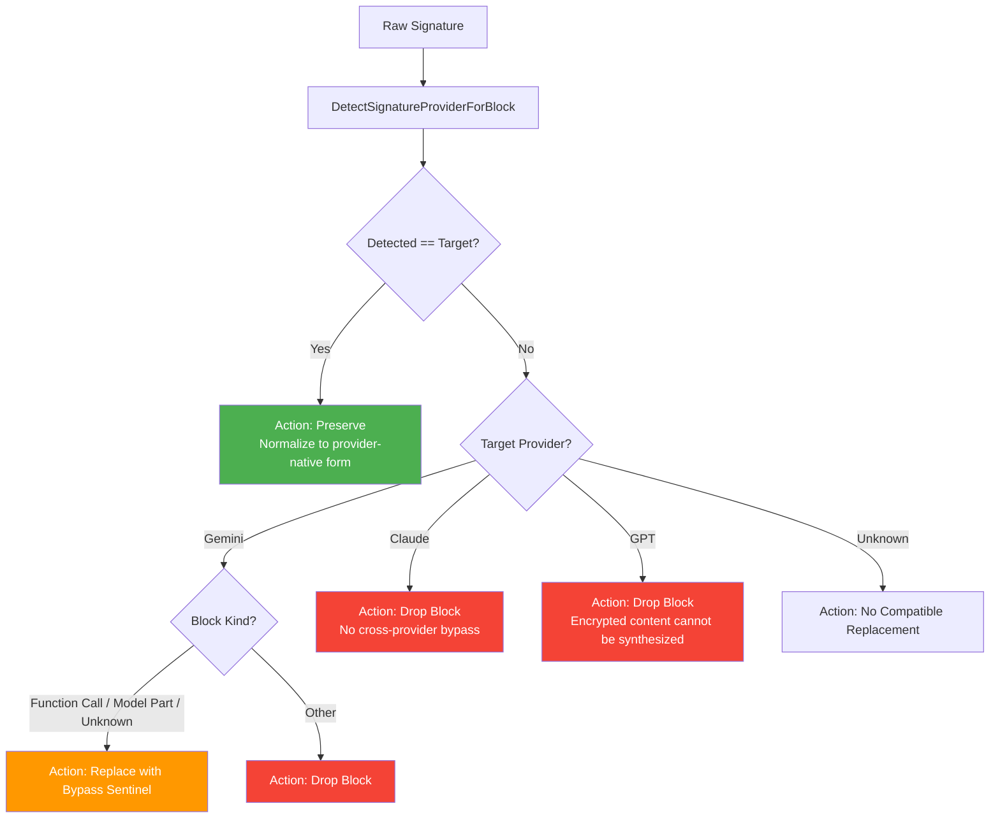

The signature validation and provider compatibility subsystem ensures that cryptographic thinking/reasoning signatures from one AI provider can be safely replayed when targeting a different provider. This enables transparent cross-provider conversation routing — a user can start a conversation with Claude, switch to Gemini, and continue without losing reasoning context. The system detects the provenance of each signature, determines whether it is compatible with the target provider, and either preserves, normalizes, replaces, or drops it according to provider-specific policies.

## Provider Signature Families

Each major AI provider uses a distinct opaque signature format for its reasoning or thinking blocks. The `signature` package classifies these into five provider families, defined in [provider_compatibility.go](internal/signature/provider_compatibility.go#L5-L13):

| Provider Family | Constant | Signature Shape | Encoding | Key Characteristics |
|---|---|---|---|---|
| **Claude** | `SignatureProviderClaude` | `E` or `R` prefix, protobuf tree | Double-base64 (E/R envelope) | First decoded byte `0x12`; R-form is double-layer base64 of E-form |
| **Gemini** | `SignatureProviderGemini` | Opaque base64, protobuf envelopes | Standard base64 (padded or raw) | Field-1 (2.5) or Field-2 (3.x) protobuf envelopes; `0x01` version byte in opaque payload |
| **Gemini Bypass** | `SignatureProviderGeminiBypass` | Documented sentinel strings | Plain ASCII | `"skip_thought_signature_validator"` or `"context_engineering_is_the_way_to_go"` |
| **GPT/Codex** | `SignatureProviderGPT` | `gAAAA` prefix, Fernet-like | base64url | Version byte `0x80`; AES-128 block-aligned ciphertext |
| **Grok (xAI)** | (validated via `InspectGrokEncryptedContent`) | Unpadded standard base64 | base64 (raw std) | Minimum decoded length 50; entropy ratio ≥ 0.85 |

Sources: [claude_validation.go](internal/signature/claude_validation.go#L1-L50), [gemini_validation.go](internal/signature/gemini_validation.go#L1-L65), [gpt_validation.go](internal/signature/gpt_validation.go#L1-L20), [grok_validation.go](internal/signature/grok_validation.go#L10-L19)

The detection order is deliberate. Claude strict validation runs **before** Gemini detection because Gemini 3.x signatures also decode from an E-prefixed base64 string and can appear Claude-like under shallow prefix checks. The system resolves this ambiguity by inspecting the decoded protobuf tree — Claude signatures contain a `0x12` marker byte and a specific routing-class channel block, while Gemini signatures use different protobuf envelope structures.

Sources: [provider_compatibility.go](internal/signature/provider_compatibility.go#L67-L73)

## Cache Provider Prefix Protocol

When signatures are cached for replay, the system prefixes them with a provider identifier separated by `#` (for example, `claude#<signature>`). This prefix is stripped before replay and serves as an explicit provenance tag that overrides ambiguous byte-level detection.

The prefix mapping in [SignatureProviderFromCachePrefix](internal/signature/provider_compatibility.go#L188-L203) accepts only a strict set of aliases:

| Prefix | Mapped Provider |
|---|---|
| `claude`, `anthropic` | Claude |
| `gemini`, `google` | Gemini |
| `openai`, `gpt`, `codex` | GPT |

This is intentionally stricter than model-name inference. A model name like `"claude-cache"` would **not** be accepted as a provider prefix — only the exact aliases above are trusted. This prevents accidental misclassification when arbitrary model names are stored in cache keys.

Sources: [provider_compatibility.go](internal/signature/provider_compatibility.go#L188-L203)

## Compatibility Decision Engine

The central decision function [`DecideSignatureCompatibility`](internal/signature/provider_compatibility.go#L129-L174) evaluates a raw signature against a target provider and block kind, returning a structured decision:

```go
type SignatureCompatibilityDecision struct {
    TargetProvider       SignatureProvider
    DetectedProvider     SignatureProvider
    BlockKind            SignatureBlockKind
    Compatible           bool
    Action               SignatureCompatibilityAction
    ReplacementSignature string
    NormalizedSignature  string
    Reason               string
}
```

Sources: [provider_compatibility.go](internal/signature/provider_compatibility.go#L35-L44)

### Decision Flow



Sources: [provider_compatibility.go](internal/signature/provider_compatibility.go#L129-L174)

### Action Summary

| Action | Constant | Meaning |
|---|---|---|
| **Preserve** | `SignatureActionPreserve` | Signature is compatible; normalize and replay |
| **Drop Block** | `SignatureActionDropBlock` | Remove the entire thinking/reasoning block |
| **Drop Signature** | `SignatureActionDropSignature` | Remove the signature field but keep the block content |
| **Replace with Bypass** | `SignatureActionReplaceWithGeminiBypass` | Substitute Gemini's documented bypass sentinel |
| **No Compatible Replacement** | `SignatureActionNoCompatibleReplacement` | Unknown target; cannot decide |

Sources: [provider_compatibility.go](internal/signature/provider_compatibility.go#L25-L33)

## Claude Signature Validation

Claude thinking signatures use a two-layer base64 envelope with a protobuf payload tree. The [Claude signature spec](internal/signature/claude_validation.go#L1-L50) defines encoding detection based on the first character:

- **E prefix** → Single-layer base64. Decoded bytes start with `0x12`.
- **R prefix** → Double-layer base64. First decode yields a string starting with `E`; second decode yields the `0x12`-prefixed protobuf payload.

### Protobuf Tree Structure

In strict mode, the system inspects the full protobuf tree:

```
Top-level protobuf
├─ Field 2 (bytes): container
│  ├─ Field 1 (bytes): channel block
│  │  ├─ Field 1 (varint): channel_id [11 or 12]
│  │  ├─ Field 2 (varint): infra [optional: 1=AWS, 2=Google]
│  │  ├─ Field 3 (varint): version=2
│  │  ├─ Field 5 (bytes): ECDSA signature
│  │  ├─ Field 6 (bytes): model_text [optional]
│  │  └─ Field 7 (varint): unknown [optional]
│  ├─ Field 2 (bytes): nonce 12B
│  ├─ Field 3 (bytes): session 12B
│  ├─ Field 4 (bytes): SHA-384 48B
│  └─ Field 5 (bytes): metadata
└─ Field 3 (varint): =1
```

Sources: [claude_validation.go](internal/signature/claude_validation.go#L19-L44)

### Validation Options

The [`ClaudeSignatureValidationOptions`](internal/signature/claude_validation.go#L65-L81) struct controls validation depth:

| Option | Scope |
|---|---|
| `PrefixOnly` | Check for E/R prefix only (shallow cleanup) |
| `Base64Only` | Validate base64 layers, skip protobuf inspection |
| `Strict` | Full protobuf tree validation with routing class, infrastructure, and schema feature classification |
| `AllowEmptySignatureWithEmptyText` | Preserve empty thinking placeholders during strip operations |

The output dimensions from strict inspection include `routing_class` (11 or 12), `infrastructure_class` (AWS, Google, or default), `schema_features` (compact vs. extended), and `legacy_route_hint` for ch=11 signatures.

Sources: [claude_validation.go](internal/signature/claude_validation.go#L332-L457)

### Normalization

Claude signatures are normalized to different forms depending on the target:

- **`NormalizeClaudeThinkingSignature`** → Returns double-layer **R-form** (for Antigravity backend replay)
- **`NormalizeClaudeProviderNativeThinkingSignature`** → Returns single-layer **E-form** (for native Claude providers)

Both functions strip the cache prefix, validate the signature, and convert between encoding layers as needed.

Sources: [claude_validation.go](internal/signature/claude_validation.go#L199-L261)

## Gemini Signature Validation

Gemini thought signatures are treated as **opaque** provider state. The validator does not decrypt or prove provenance — it only validates the transport-level protobuf envelope. This is a deliberate design choice documented in [gemini_validation.go](internal/signature/gemini_validation.go#L27-L31):

> Claude has a known E/R base64 envelope and a protobuf tree in this package. Gemini thought signatures are opaque provider state here, so local validation checks only the transport-level protobuf envelope and leaves the wrapped provider payload uninterpreted.

### Envelope Classification

The [`classifyGeminiThoughtSignatureEnvelope`](internal/signature/gemini_validation.go#L358-L373) function identifies two known protobuf envelope shapes:

| Envelope | Constant | Observed In | Structure |
|---|---|---|---|
| **Field-1** | `GeminiThoughtSignatureEnvelopeProtobufField1` | Gemini 2.5 | Repeated field-1 bytes records |
| **Field-2** | `GeminiThoughtSignatureEnvelopeProtobufField2` | Gemini 3.x | Field-2 containing field-1 bytes |
| **ASCII UUID** | `GeminiThoughtSignatureEnvelopeASCIIUUID` | Migrated/synthetic | 36-byte UUID pattern (not replay-safe) |

The opaque payload within each record starts with a `0x01` version byte, validated by [`isLikelyGeminiOpaquePayload`](internal/signature/gemini_validation.go#L466-L471).

Sources: [gemini_validation.go](internal/signature/gemini_validation.go#L358-L471)

### Bypass Sentinels

Gemini documents two bypass sentinels for synthetic or migrated function-call history:

```go
GeminiSkipThoughtSignatureValidator = "skip_thought_signature_validator"
GeminiContextEngineeringBypass      = "context_engineering_is_the_way_to_go"
```

These are used when a functionCall part was **not** produced by the Gemini API (e.g., migrated from another provider) and no real signature exists. The [`GeminiReplaySignatureOrBypass`](internal/signature/gemini_sanitize.go#L12-L24) function returns the compatible signature when one exists, or substitutes the bypass sentinel.

Sources: [gemini_validation.go](internal/signature/gemini_validation.go#L76-L81), [gemini_sanitize.go](internal/signature/gemini_sanitize.go#L12-L24)

### Function Call Pairing Validation

[`ValidateGeminiFunctionCallPairing`](internal/signature/gemini_validation.go#L250-L340) enforces the Gemini replay constraint that `functionCall` and `functionResponse` parts must not be interleaved in the same content. The valid shape is: all model functionCalls first, then their responses. It validates id/name matching between paired calls and responses.

Sources: [gemini_validation.go](internal/signature/gemini_validation.go#L250-L340)

## GPT/Codex Reasoning Signature Validation

GPT reasoning signatures use a Fernet-like encrypted format. The [`InspectGPTReasoningSignature`](internal/signature/gpt_validation.go#L21-L59) function validates the transport shape:

1. Must start with `gAAAA` prefix
2. Must contain only base64url characters (validated with Unicode-aware character scanning)
3. Decoded payload must be ≥ 73 bytes
4. First byte must be version `0x80`
5. Ciphertext length (decoded minus header/metadata) must be a positive multiple of 16 (AES block size)

The ciphertext is **encrypted content** that cannot be decrypted or synthesized by this system. Cross-provider replay always results in the block being dropped.

Sources: [gpt_validation.go](internal/signature/gpt_validation.go#L21-L59)

## Grok (xAI) Encrypted Content Validation

Grok encrypted content for reasoning and compaction uses unpadded standard base64. The [`InspectGrokEncryptedContent`](internal/signature/grok_validation.go#L26-L69) function applies cross-provider rejection guards:

1. Rejects `gAAAA` prefix (GPT overlap detection)
2. Rejects padded base64 (expects raw standard base64)
3. Rejects signatures that pass Claude strict validation
4. Rejects signatures that pass Gemini known-envelope validation
5. Requires decoded payload ≥ 50 bytes
6. Requires byte entropy ratio ≥ 0.85 (Shannon entropy / log₂ of symbol space)

This multi-provider rejection chain prevents false-positive classification when base64 shapes overlap between providers.

Sources: [grok_validation.go](internal/signature/grok_validation.go#L26-L69)

## Message Sanitization Pipeline

The sanitization pipeline applies provider-aware signature compatibility rules to conversation history. There are two primary entry points:

### Claude Messages Sanitization

[`SanitizeClaudeMessagesSignaturesForTarget`](internal/signature/claude_messages_sanitize.go#L53-L175) walks a Claude `/v1/messages` payload and processes each thinking block:

1. For each `thinking` content part, calls `DecideSignatureCompatibility` with the target provider
2. **Preserve**: Keeps the block, normalizes the signature to provider-native form
3. **Replace with Bypass**: Substitutes Gemini bypass sentinel
4. **Drop Signature**: Removes the signature field but keeps thinking content
5. **Drop Block**: Removes the entire thinking block (with empty message cleanup)
6. For `tool_use` blocks, either strips all signature fields (when targeting Claude upstream) or applies per-signature compatibility decisions

Sources: [claude_messages_sanitize.go](internal/signature/claude_messages_sanitize.go#L53-L175)

### Gemini Request Sanitization

[`SanitizeGeminiRequestThoughtSignatures`](internal/signature/gemini_sanitize.go#L26-L91) applies Gemini replay policy to Gemini-shaped requests:

- **Model-turn parts** (functionCall, thought, signed parts): Keep compatible Gemini signatures, replace with bypass sentinel otherwise
- **User-turn functionResponse parts**: Must not carry `thoughtSignature` fields (stripped and logged)

Sources: [gemini_sanitize.go](internal/signature/gemini_sanitize.go#L26-L91)

### Sanitize Report

Both pipelines return a [`SignatureSanitizeReport`](internal/signature/claude_messages_sanitize.go#L19-L26) containing counts of preserved, dropped, and replaced signatures, plus the full decision trace for observability.

Sources: [claude_messages_sanitize.go](internal/signature/claude_messages_sanitize.go#L19-L26)

## Signature Caching

The [signature cache](internal/cache/signature_cache.go#L1-L35) stores thinking signatures by model group and text content hash, enabling proxy-generated thinking blocks to be replayed on subsequent turns:

| Parameter | Value | Purpose |
|---|---|---|
| `SignatureCacheTTL` | 3 hours | Signature validity window |
| `SignatureTextHashLen` | 16 hex chars (64-bit key space) | Stable content-addressed key |
| `MinValidSignatureLen` | 50 bytes | Minimum threshold for storage |
| `CacheCleanupInterval` | 10 minutes | Background stale entry purge |

The cache supports both in-process `sync.Map` storage and distributed [Home KV](16-home-control-plane-integration) persistence when available. Reasoning replay caches for GPT/Codex and xAI/Grok maintain separate bounded structures with their own TTL and eviction policies.

Sources: [signature_cache.go](internal/cache/signature_cache.go#L23-L35), [codex_reasoning_replay_cache.go](internal/cache/codex_reasoning_replay_cache.go#L18-L39)

## Cross-Provider Compatibility Matrix

The following matrix summarizes how each source provider's signatures are handled when targeting a different provider:

| Source → Target | Claude | Gemini | GPT |
|---|---|---|---|
| **Claude** | ✅ Preserve + normalize (E-form) | ⚠️ Drop block (no bypass for thinking) | ⚠️ Drop block |
| **Gemini** | ⚠️ Drop block | ✅ Preserve + strip prefix | ⚠️ Drop block |
| **Gemini Bypass** | ⚠️ Drop block | ✅ Preserve sentinel | ⚠️ Drop block |
| **GPT** | ⚠️ Drop block | ⚠️ Drop block (not bypass-safe) | ✅ Preserve |
| **Grok** | ⚠️ Drop block | ⚠️ Drop block | ⚠️ Drop block |
| **Unknown** | ⚠️ No compatible replacement | ⚠️ No compatible replacement | ⚠️ No compatible replacement |

The one exception is **Gemini functionCall/modelPart blocks**: when the source signature is incompatible, Gemini targets receive a bypass sentinel replacement rather than a block drop. This is because Gemini explicitly documents bypass sentinels for synthetic history.

Sources: [provider_compatibility.go](internal/signature/provider_compatibility.go#L153-L173)

## Integration Points

The signature validation system is consumed by several subsystems across the codebase:

| Subsystem | Usage |
|---|---|
| **Gemini request translators** | `SanitizeGeminiRequestThoughtSignatures` for native and CLI paths |
| **Antigravity Claude translator** | `CompatibleAntigravityClaudeThinkingSignature` + block stripping |
| **Antigravity Gemini translator** | Claude-to-Gemini signature normalization with bypass replacement |
| **Codex/GPT executor** | `InspectGPTReasoningSignature` for encrypted content validation |
| **xAI/Grok executor** | `InspectGrokEncryptedContent` for transport shape validation |
| **Codex reasoning replay cache** | Signature validation before storing replay items |
| **xAI reasoning replay cache** | Grok encrypted content validation before storage |
| **Claude OpenAI Responses translator** | Signature extraction from reasoning content blocks |