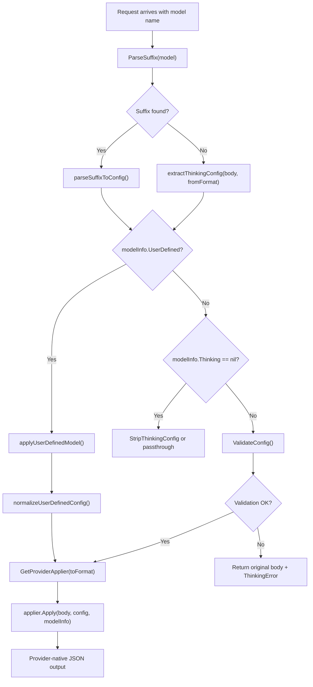

This page documents the unified thinking configuration system that enables cross-provider reasoning mode normalization across Claude, Gemini, OpenAI, Codex, Kimi, xAI, and Antigravity providers. The system translates between three distinct thinking paradigms—numeric token budgets, discrete effort levels, and automatic/dynamic modes—and enforces model-specific constraints through validation, clamping, and format-specific output generation.

## Architecture Overview

The thinking system operates as a standalone processing layer within the request translation pipeline. It intercepts requests before forwarding to upstream providers, normalizes thinking configuration to a unified internal representation, validates against model capabilities, and emits provider-native output format.



The flow follows the processing order defined in FR25: route check → model capability query → config extraction → validation → application. Suffix priority is enforced at extraction time: when a model name contains a thinking suffix like `gemini-2.5-pro(8192)`, the suffix configuration takes precedence over any thinking parameters in the request body.

Sources: [apply.go](internal/thinking/apply.go#L94-L190)

## Core Types and Configuration Model

The unified type system provides a common vocabulary for thinking configuration across all providers.

### Thinking Modes

| Mode | Constant | Budget Value | Description |
|------|----------|-------------|-------------|
| `ModeBudget` | `iota` | Positive integer | Numeric token budget (e.g., 8192, 16384) |
| `ModeLevel` | `iota + 1` | Ignored | Discrete effort level (e.g., low, medium, high) |
| `ModeNone` | `iota + 2` | `0` | Thinking disabled |
| `ModeAuto` | `iota + 3` | `-1` | Automatic/dynamic thinking |

### Thinking Levels

The system defines eight discrete thinking levels ordered by increasing effort:

| Level | Token Equivalent | Description |
|-------|-----------------|-------------|
| `none` | 0 | Thinking disabled |
| `auto` | -1 | Dynamic/automatic |
| `minimal` | 512 | Minimal reasoning effort |
| `low` | 1024 | Low reasoning effort |
| `medium` | 8192 | Medium reasoning effort |
| `high` | 24576 | High reasoning effort |
| `xhigh` | 32768 | Extra-high reasoning effort |
| `max` | 128000 | Maximum (Claude 4.6 adaptive) |

### ThinkingConfig Struct

The `ThinkingConfig` struct is the unified internal representation passed between components. Depending on `Mode`, either `Budget` or `Level` field is effective: `ModeNone` uses `Budget=0` with `Level` ignored; `ModeAuto` uses `Budget=-1` with `Level` ignored; `ModeBudget` uses a positive `Budget` integer with `Level` ignored; `ModeLevel` ignores `Budget` and uses a valid `Level`.

Sources: [types.go](internal/thinking/types.go#L1-L120), [convert.go](internal/thinking/convert.go#L26-L44)

## Provider Applier Registry

The system uses a registry pattern with `ProviderApplier` implementations for each provider. Appliers are registered at package init time via `init()` functions and looked up at runtime by normalized provider name.

| Provider | Registration | Output Format | Capability |
|----------|-------------|---------------|------------|
| Claude | `provider/claude/init()` | `thinking.type` + `thinking.budget_tokens` or `output_config.effort` | Hybrid (budget + adaptive levels) |
| Gemini | `provider/gemini/init()` | `generationConfig.thinkingConfig.thinkingBudget` or `thinkingLevel` | Hybrid (2.5 budget, 3.x levels) |
| OpenAI | `provider/openai/init()` | `reasoning_effort` (string) | Level-only |
| Codex | `provider/codex/init()` | `reasoning.effort` (string) | Level-only |
| Kimi | `provider/kimi/init()` | `thinking.type` + `thinking.effort` | Level-only |
| Antigravity | `provider/antigravity/init()` | `request.generationConfig.thinkingConfig.*` | Hybrid |
| xAI | `provider/xai/init()` | `reasoning.effort` (delegates to Codex) | Level-only |
| Interactions | `provider/interactions/init()` | `generation_config.thinking_level` or `thinking_budget` | Level-only |

Plugin-owned appliers can be registered via `RegisterPluginProvider()` with priority-based conflict resolution. When multiple plugins register the same provider name, the higher priority wins; on tie, lexicographic owner order determines the winner. Native appliers always take precedence over plugin appliers.

Sources: [apply.go](internal/thinking/apply.go#L27-L91)

## Model Capability Detection

The system classifies models into four capability categories based on their `ThinkingSupport` configuration. This classification drives validation behavior and format selection.

| Capability | Condition | Budget Support | Level Support | Example Models |
|-----------|-----------|---------------|---------------|----------------|
| `CapabilityBudgetOnly` | Has Min/Max, no Levels | ✓ | ✗ | Claude 3.5/4.0, Gemini 2.5 |
| `CapabilityLevelOnly` | Has Levels, no Min/Max | ✗ | ✓ | OpenAI o3, Codex, Kimi |
| `CapabilityHybrid` | Has both Min/Max and Levels | ✓ | ✓ | Gemini 3.x |
| `CapabilityNone` | `Thinking == nil` | ✗ | ✗ | Claude Haiku, GPT-4o |

The `ThinkingSupport` struct stored in the model registry defines the constraints:

```go
type ThinkingSupport struct {
    Min            int      // Minimum allowed budget (inclusive)
    Max            int      // Maximum allowed budget (inclusive)
    ZeroAllowed    bool     // Whether 0 disables thinking
    DynamicAllowed bool     // Whether -1 (auto) is valid
    Levels         []string // Discrete levels (e.g., ["low","medium","high"])
}
```

Sources: [convert.go](internal/thinking/convert.go#L152-L184), [model_registry.go](internal/registry/model_registry.go#L93-L104)

## Validation and Normalization Pipeline

`ValidateConfig()` is the central validation function that enforces model constraints and performs automatic format conversion. The validation pipeline applies the following transformations in order:

1. **Capability-based conversion**: Budget-only models receiving `ModeLevel` convert the level to a budget via `ConvertLevelToBudget()`. Level-only models receiving `ModeBudget` convert the budget to a level via `ConvertBudgetToLevel()`.
2. **Level normalization**: Special values `none` and `auto` are promoted to `ModeNone` and `ModeAuto` respectively.
3. **Level validation**: When `ModeLevel` is active and the model defines discrete `Levels`, the requested level must be in the supported set. Cross-provider-family requests (e.g., OpenAI→Gemini) use clamping instead of rejection; same-family requests use strict validation.
4. **Budget clamping**: When `ModeBudget` is active, the budget is clamped to the model's `[Min, Max]` range. When `ZeroAllowed` is false and budget is 0, it is clamped to `Min`.
5. **Auto fallback**: When `ModeAuto` is active and `DynamicAllowed` is false, the auto mode is silently converted to a mid-range fixed value—`ModeLevel` with `LevelMedium` for level-only models, or `ModeBudget` with `(Min+Max)/2` for budget models.
6. **Disable fallback**: When `ModeNone` is active for a model that cannot be disabled (no `ZeroAllowed`, no `none` in Levels), the config falls back to the lowest supported level.

### Cross-Family Clamping Rules

When `allowClampUnsupported` is true (cross-family or model-family-mismatch), unsupported levels are clamped to the nearest supported level using distance in the canonical ordering `[minimal, low, medium, high, xhigh, max]`. On tie, the lower level is preferred.

Sources: [validate.go](internal/thinking/validate.go#L14-L200), [validate.go](internal/thinking/validate.go#L229-L266)

## Model Name Suffix Parsing

The suffix mechanism allows users to override thinking settings via the model name without modifying their request payload. The format is `model-name(value)` where value is interpreted in priority order:

1. **Special values**: `"none"` → `ModeNone`, `"auto"` or `"-1"` → `ModeAuto`
2. **Level names**: `"minimal"`, `"low"`, `"medium"`, `"high"`, `"xhigh"`, `"max"` → `ModeLevel`
3. **Numeric values**: Positive integers → `ModeBudget`, `0` → `ModeNone`

| Input Model Name | ModelName | RawSuffix | Interpreted Config |
|-----------------|-----------|-----------|-------------------|
| `claude-sonnet-4-5(16384)` | `claude-sonnet-4-5` | `16384` | `ModeBudget, Budget=16384` |
| `gpt-5.2(high)` | `gpt-5.2` | `high` | `ModeLevel, Level=high` |
| `gemini-2.5-pro(none)` | `gemini-2.5-pro` | `none` | `ModeNone, Budget=0` |
| `gemini-2.5-flash(auto)` | `gemini-2.5-flash` | `auto` | `ModeAuto, Budget=-1` |
| `gemini-2.5-pro` | `gemini-2.5-pro` | *(none)* | No config (passthrough) |

Suffix configurations take priority over body parameters. This is implemented in `ApplyThinking()` by checking `suffixResult.HasSuffix` before falling back to `extractThinkingConfig()`.

Sources: [suffix.go](internal/thinking/suffix.go#L14-L149), [apply.go](internal/thinking/apply.go#L186-L218)

## Provider-Specific Output Formats

Each provider applier translates the unified `ThinkingConfig` into its native API format. The output format varies significantly across providers.

### Claude (Hybrid: Budget + Adaptive)

Claude supports two thinking control styles. Manual thinking uses `thinking.type="enabled"` with `thinking.budget_tokens` for numeric budget control. Adaptive thinking (Claude 4.6) uses `thinking.type="adaptive"` with `output_config.effort` for level-based control.

```json
// Manual thinking (budget mode)
{"thinking": {"type": "enabled", "budget_tokens": 16384}}

// Adaptive thinking (level mode, Claude 4.6)
{"thinking": {"type": "adaptive"}, "output_config": {"effort": "high"}}

// Disabled
{"thinking": {"type": "disabled"}}
```

The Claude applier also enforces the Anthropic API constraint that `max_tokens > budget_tokens`. When this constraint would be violated, `normalizeClaudeBudget()` reduces the budget or adjusts `max_tokens` accordingly.

Sources: [provider/claude/apply.go](internal/thinking/provider/claude/apply.go#L60-L267)

### Gemini (Hybrid: Budget + Levels)

Gemini uses two distinct formats depending on the model generation. Gemini 2.5 models use numeric `thinkingBudget`, while Gemini 3.x models use string `thinkingLevel`. The format is chosen based on whether `modelInfo.Thinking.Levels` is populated.

```json
// Gemini 2.5 (budget format)
{"generationConfig": {"thinkingConfig": {"thinkingBudget": 8192, "includeThoughts": true}}}

// Gemini 3.x (level format)
{"generationConfig": {"thinkingConfig": {"thinkingLevel": "high", "includeThoughts": true}}}

// Disabled (level model)
{"generationConfig": {"thinkingConfig": {"thinkingLevel": "none", "includeThoughts": false}}}
```

The `includeThoughts` field defaults to `true` for enabled thinking and `false` for disabled. Users can override this via the request body's existing `includeThoughts` or `include_thoughts` field.

Sources: [provider/gemini/apply.go](internal/thinking/provider/gemini/apply.go#L35-L205)

### OpenAI and Codex (Level-Only)

Both use discrete level strings, but differ in field path. OpenAI uses the top-level `reasoning_effort` field, while Codex (OpenAI Responses API) uses the nested `reasoning.effort` path.

```json
// OpenAI Chat Completions
{"reasoning_effort": "high"}

// Codex / OpenAI Responses API
{"reasoning": {"effort": "high"}}
```

Sources: [provider/openai/apply.go](internal/thinking/provider/openai/apply.go#L1-L118), [provider/codex/apply.go](internal/thinking/provider/codex/apply.go#L1-L121)

### Kimi (Level-Only)

Kimi uses a native `thinking` object with `type` and `effort` fields. The legacy `reasoning_effort` field is accepted as input but stripped from the output.

```json
// Enabled
{"thinking": {"type": "enabled", "effort": "high"}}

// Disabled
{"thinking": {"type": "disabled"}}
```

Sources: [provider/kimi/apply.go](internal/thinking/provider/kimi/apply.go#L1-L169)

## Request Body Extraction

The system extracts thinking configuration from provider-specific request body fields via `extractThinkingConfig()`. Each provider has its own extraction logic:

| Provider | Primary Field | Secondary Field | Notes |
|----------|--------------|----------------|-------|
| Claude | `thinking.type` + `thinking.budget_tokens` | `output_config.effort` (adaptive) | `type="disabled"` takes precedence |
| Gemini | `generationConfig.thinkingConfig.thinkingLevel` | `thinkingBudget` | Level checked first (Gemini 3 > 2.5) |
| Antigravity | `request.generationConfig.thinkingConfig.*` | Same as Gemini, prefixed | Prefix `request.` added |
| OpenAI | `reasoning_effort` | — | String level only |
| Codex | `reasoning.effort` | — | Nested path |
| Kimi | `thinking.type` + `thinking.effort` | `reasoning_effort` (legacy) | Native fields take precedence |
| Interactions | `generation_config.thinking_level` | `thinking_budget` | Multiple path variants checked |

The extraction functions handle both camelCase and snake_case field names to accommodate various SDK conventions (e.g., Google Python SDK sends snake_case).

Sources: [apply.go](internal/thinking/apply.go#L444-L744)

## User-Defined Model Handling

Models marked with `UserDefined=true` (configured via the config file's `models[]` array) bypass the standard validation pipeline. The system applies thinking configuration directly without `ThinkingSupport` validation, delegating upstream service responsibility for configuration validation.

User-defined models follow a simplified flow: extract config (suffix priority over body), normalize format for the target provider, and apply via the provider applier. Level-to-budget conversion is performed when crossing to budget-capable providers (Claude, Gemini) to ensure format compatibility.

Sources: [apply.go](internal/thinking/apply.go#L64-L80), [apply.go](internal/thinking/apply.go#L310-L390)

## Stripping Thinking Config

When a model does not support thinking but the request contains thinking configuration, `StripThinkingConfig()` silently removes the relevant fields to prevent upstream API errors. The field paths stripped vary by provider:

| Provider | Stripped Paths |
|----------|---------------|
| Claude | `thinking`, `output_config.effort` |
| Gemini | `generationConfig.thinkingConfig` |
| Antigravity | `request.generationConfig.thinkingConfig` |
| OpenAI | `reasoning_effort` |
| Kimi | `reasoning_effort`, `thinking` |
| Codex/xAI | `reasoning.effort` |
| Interactions | All `generation_config.thinking*` variants |

For Claude, empty `output_config` objects left after stripping are also cleaned up.

Sources: [strip.go](internal/thinking/strip.go#L1-L75)

## Error Handling

The `ThinkingError` type provides structured error information with machine-readable codes:

| Error Code | Condition | HTTP Status |
|-----------|-----------|-------------|
| `INVALID_SUFFIX` | Malformed suffix format | 400 |
| `UNKNOWN_LEVEL` | Level not in valid list | 400 |
| `THINKING_NOT_SUPPORTED` | Model has no thinking capability | 400 |
| `LEVEL_NOT_SUPPORTED` | Level not in model's supported levels | 400 |
| `BUDGET_OUT_OF_RANGE` | Budget outside model's Min/Max range | 400 |
| `PROVIDER_MISMATCH` | Provider doesn't match model | 400 |

On validation failure, `ApplyThinking()` returns the **original body unchanged** (not nil) to enable defensive programming. This ensures callers who ignore the error won't receive nil body; the upstream service decides how to handle the unmodified request.

Sources: [errors.go](internal/thinking/errors.go#L1-L83), [apply.go](internal/thinking/apply.go#L258-L270)

## Usage Tracking Integration

The thinking system provides `ExtractReasoningEffort()` and `ExtractTranslatedReasoningEffort()` functions that convert thinking configuration to canonical `reasoning_effort` labels for usage logging. These functions apply the same suffix-over-body priority as `ApplyThinking()` and convert budgets to levels using the threshold mapping.

| Input Config | Extracted Label |
|-------------|----------------|
| `ModeNone` | `"none"` |
| `ModeAuto` | `"auto"` |
| `ModeLevel, Level="high"` | `"high"` |
| `ModeBudget, Budget=8192` | `"medium"` |

Sources: [apply.go](internal/thinking/apply.go#L392-L440)

## Plugin Extension Points

The thinking system supports plugin-based provider extensions through the C ABI plugin host. Plugins can register custom `ProviderApplier` implementations via the `RegisterPluginProvider()` API with owner attribution and priority-based conflict resolution. Each plugin applier receives the same `Apply()` interface contract as native appliers.

The plugin example at `examples/plugin/thinking/` demonstrates a Go plugin that implements `thinking.apply` and `thinking.identifier` methods, enabling custom thinking configuration logic for non-native providers.

Sources: [apply.go](internal/thinking/apply.go#L48-L62), [examples/plugin/thinking/go/main.go](examples/plugin/thinking/go/main.go#L1-L176)

## Related Pages

- [Translator Registry and Format Conversion](8-translator-registry-and-format-conversion) — How thinking processing fits into the broader request translation pipeline
- [Provider-Specific Translator Implementations](9-provider-specific-translator-implementations) — Detailed translator logic that invokes `ApplyThinking()`
- [Signature Validation and Provider Compatibility](18-signature-validation-and-provider-compatibility) — How thinking block signatures are validated and replayed
- [Dynamic Model Registry and Discovery](14-dynamic-model-registry-and-discovery) — How `ThinkingSupport` metadata is loaded into the model registry