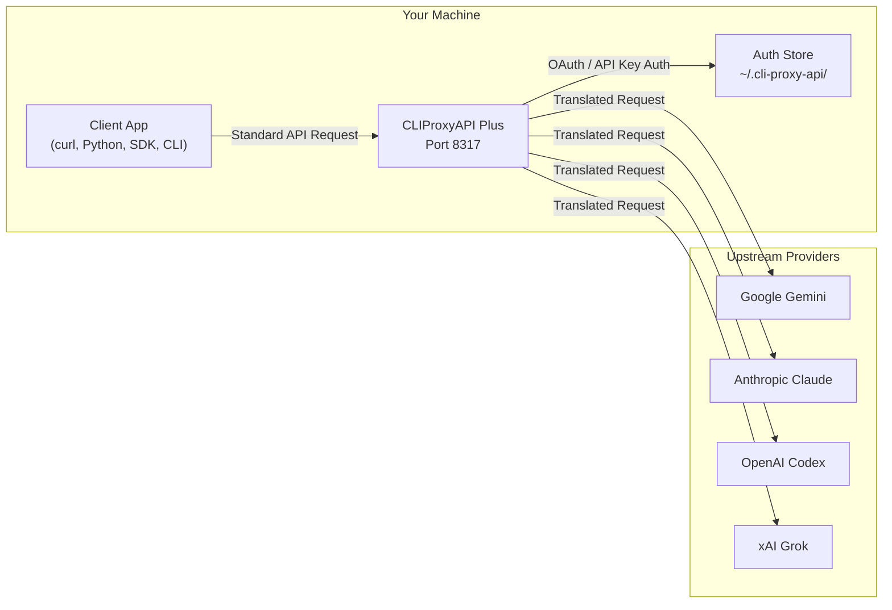
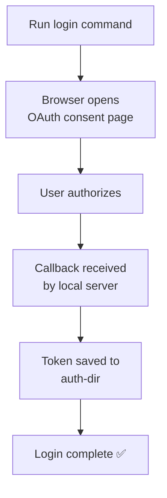

CLIProxyAPI Plus is a proxy server that provides **OpenAI/Gemini/Claude/Grok-compatible API endpoints**, allowing you to use CLI-based AI models (Gemini CLI, Claude Code, OpenAI Codex, xAI Grok, and more) with any tool, library, or client that speaks standard AI API protocols. This page walks you through installation, first-time authentication, configuration, and your first API request.

Sources: [README.md](README.md#L76-L93), [cmd/server/main.go](cmd/server/main.go#L1-L4)

## Architecture at a Glance

The following diagram illustrates the high-level data flow: your client application sends a standard API request to the CLIProxyAPI Plus server, which translates and forwards it to the upstream provider (Gemini, Claude, Codex, xAI, etc.) using the stored OAuth credentials or API keys.



Sources: [cmd/server/main.go](cmd/server/main.go#L88-L92), [internal/cmd/run.go](internal/cmd/run.go#L28-L30)

## Installation

You have three options: **prebuilt binary**, **Docker**, or **build from source**. Choose whichever matches your environment.

### Option A — Download a Prebuilt Binary

Grab the latest release binary for your platform from the [GitHub Releases](https://github.com/router-for-me/CLIProxyAPI/releases) page. Place the binary somewhere on your `PATH` and make it executable:

```bash
chmod +x CLIProxyAPIPlus
```

Sources: [README.md](README.md#L95-L97)

### Option B — Docker

The fastest way to get running without installing Go. The official image is `eceasy/cli-proxy-api-plus:latest`.

```bash
# Pull and run with a local config file
docker run -d \
  --name cliproxy \
  -p 8317:8317 \
  -v $(pwd)/config.yaml:/CLIProxyAPI/config.yaml \
  -v $(pwd)/auths:/root/.cli-proxy-api \
  eceasy/cli-proxy-api-plus:latest
```

Alternatively, use the provided `docker-compose.yml`:

```bash
# Copy the example config first
cp config.example.yaml config.yaml

# Start the service
docker compose up -d
```

The compose file exposes port **8317** (the API server) plus several optional ports. Mount your `config.yaml` and auth directory as volumes so credentials persist across restarts.

Sources: [Dockerfile](Dockerfile#L1-L37), [docker-compose.yml](docker-compose.yml#L1-L29)

### Option C — Build from Source

Requires **Go 1.26+**.

```bash
# Clone the repository
git clone https://github.com/router-for-me/CLIProxyAPI.git
cd CLIProxyAPI

# Build the server binary
go build -o CLIProxyAPIPlus ./cmd/server/
```

Sources: [go.mod](go.mod#L1-L3), [Dockerfile](Dockerfile#L17)

## Create Your Configuration File

Copy the example configuration and edit it to match your needs. The only **mandatory** section for a minimal setup is `port` and at least one credential (API key or OAuth login).

```bash
cp config.example.yaml config.yaml
```

Open `config.yaml` in your editor. Here is the smallest possible configuration — a server on port 8317 with a single Gemini API key:

```yaml
# Server port
port: 8317

# Authentication directory (stores OAuth tokens)
auth-dir: '~/.cli-proxy-api'

# API keys used by clients to authenticate WITH your proxy
api-keys:
  - 'my-secret-proxy-key'

# A Gemini API key for upstream access
gemini-api-key:
  - api-key: "AIzaSy...your-actual-key"
```

| Key Setting | Default | Purpose |
|---|---|---|
| `port` | `8317` | The port the proxy listens on. |
| `auth-dir` | `~/.cli-proxy-api` | Where OAuth tokens and login files are stored. |
| `api-keys` | *(empty)* | Keys clients must send in `Authorization: Bearer <key>`. Without this, anyone can use your proxy. |
| `host` | `""` (all interfaces) | Set to `"127.0.0.1"` to restrict access to localhost only. |

Sources: [config.example.yaml](config.example.yaml#L1-L49), [internal/config/config.go](internal/config/config.go#L30-L51)

## Authenticate with an AI Provider

CLIProxyAPI Plus supports two credential types: **direct API keys** (configured in `config.yaml`) and **OAuth logins** (stored in `auth-dir`). OAuth logins are the primary way to use your existing Claude, Gemini CLI, Codex, or Grok subscriptions.

### OAuth Login Flow

Each provider has a dedicated CLI flag that opens your browser for OAuth authorization. The token is saved to `auth-dir` and auto-refreshed thereafter.



Run **one** of the following commands (match the provider you subscribe to):

| Provider | Command | What Happens |
|---|---|---|
| **Gemini CLI** | `./CLIProxyAPIPlus --login` | Opens Google OAuth, optionally selects a GCP project. |
| **Claude Code** | `./CLIProxyAPIPlus --claude-login` | Opens Anthropic OAuth. |
| **OpenAI Codex** | `./CLIProxyAPIPlus --codex-login` | Opens OpenAI OAuth (browser-based). |
| **Codex (device)** | `./CLIProxyAPIPlus --codex-device-login` | Device code flow — paste a code in the browser. |
| **xAI Grok** | `./CLIProxyAPIPlus --xai-login` | (If supported; or use API key below.) |
| **Kilo AI** | `./CLIProxyAPIPlus --kilo-login` | Device flow for Kilo AI. |
| **Kimi** | `./CLIProxyAPIPlus --kimi-login` | Browser OAuth for Kimi. |
| **Cursor** | `./CLIProxyAPIPlus --cursor-login` | Browser OAuth for Cursor. |
| **Antigravity** | `./CLIProxyAPIPlus --antigravity-login` | Browser OAuth for Antigravity. |
| **Kiro (Google)** | `./CLIProxyAPIPlus --kiro-login` | Google OAuth for Kiro / AWS CodeWhisperer. |
| **Kiro (AWS)** | `./CLIProxyAPIPlus --kiro-aws-login` | AWS Builder ID device code flow. |
| **GitHub Copilot** | `./CLIProxyAPIPlus --github-copilot-login` | Device flow for GitHub Copilot. |
| **GitLab Duo** | `./CLIProxyAPIPlus --gitlab-login` | Browser OAuth for GitLab Duo. |
| **CodeBuddy** | `./CLIProxyAPIPlus --codebuddy-login` | Browser OAuth for CodeBuddy. |

> **Tip:** Use `--no-browser` if you want to manually open the URL, and `--incognito` to open the OAuth page in a private browser window (useful for multi-account setups).

After a successful login, you will see a confirmation message and the token file will be written under `~/.cli-proxy-api/` (or your configured `auth-dir`). You can repeat the login command with a different browser profile to add multiple accounts — the proxy will round-robin across them automatically.

Sources: [cmd/server/main.go](cmd/server/main.go#L130-L165), [internal/cmd/auth_manager.go](internal/cmd/auth_manager.go#L12-L27), [internal/cmd/login.go](internal/cmd/login.go#L49-L80)

### API Key Configuration (No Login Required)

If you already have API keys, you can add them directly in `config.yaml` without any OAuth flow. Supported key types:

```yaml
# Gemini API keys
gemini-api-key:
  - api-key: "AIzaSy...your-key"

# Claude API keys
claude-api-key:
  - api-key: "sk-ant-...your-key"

# Codex / OpenAI API keys
codex-api-key:
  - api-key: "sk-...your-key"

# xAI API keys
xai-api-key:
  - api-key: "xai-...your-key"
```

Each key entry supports optional fields like `prefix` (for model routing), `proxy-url`, `base-url`, `headers`, `models` (alias mapping), and `excluded-models`. See the [Configuration Reference](3-configuration-reference) for the full schema.

Sources: [config.example.yaml](config.example.yaml#L220-L300)

## Start the Server

With your configuration and credentials in place, start the proxy:

```bash
# Default mode — read config.yaml from the current directory
./CLIProxyAPIPlus

# Specify a custom config path
./CLIProxyAPIPlus --config /path/to/config.yaml

# Start with terminal management UI (TUI)
./CLIProxyAPIPlus --tui --standalone

# Enable debug logging
# Set debug: true in config.yaml, or check logs when troubleshooting
```

You should see output like:

```
CLIProxyAPI Version: v7.x.x, Commit: abc1234, BuiltAt: 2025-01-01T00:00:00Z
```

The server is now listening on `http://localhost:8317` (by default) and ready to accept API requests.

Sources: [cmd/server/main.go](cmd/server/main.go#L88-L90), [internal/cmd/run.go](internal/cmd/run.go#L28-L30)

## Make Your First API Request

The proxy exposes **OpenAI-compatible**, **Gemini-compatible**, and **Claude-compatible** endpoints. You can point any standard client at `http://localhost:8317` and authenticate with your proxy API key.

### Using `curl` (OpenAI Chat Completions format)

```bash
curl http://localhost:8317/v1/chat/completions \
  -H "Content-Type: application/json" \
  -H "Authorization: Bearer my-secret-proxy-key" \
  -d '{
    "model": "gemini-2.5-flash",
    "messages": [
      {"role": "user", "content": "Hello, what can you do?"}
    ],
    "stream": true
  }'
```

### Using Python (OpenAI SDK)

```python
from openai import OpenAI

client = OpenAI(
    base_url="http://localhost:8317/v1",
    api_key="my-secret-proxy-key",
)

response = client.chat.completions.create(
    model="gemini-2.5-flash",
    messages=[{"role": "user", "content": "Hello!"}],
    stream=True,
)

for chunk in response:
    if chunk.choices and chunk.choices[0].delta.content:
        print(chunk.choices[0].delta.content, end="")
```

### Available Model Names

The model name you send depends on which credentials you have configured:

| Credential Type | Example Model Names |
|---|---|
| Gemini (OAuth or API key) | `gemini-2.5-flash`, `gemini-2.5-pro`, `gemini-3-pro-preview` |
| Claude (OAuth or API key) | `claude-sonnet-4-5`, `claude-opus-4-5`, `claude-3-5-haiku` |
| Codex (OAuth or API key) | `gpt-5-codex`, `gpt-5`, `o4-mini` |
| xAI (API key) | `grok-3`, `grok-3-mini` |
| OpenAI-compatible | Any alias defined in your `openai-compatibility` entries |

> **Note:** The exact model names available depend on your subscription tier and the models listed by the upstream provider. Use the `/v1/models` endpoint to query the current list:

```bash
curl http://localhost:8317/v1/models \
  -H "Authorization: Bearer my-secret-proxy-key"
```

Sources: [README.md](README.md#L76-L93), [config.example.yaml](config.example.yaml#L220-L300)

## Key CLI Flags Reference

| Flag | Description |
|---|---|
| `--config <path>` | Path to the configuration file (default: `config.yaml` in the working directory). |
| `--login` | Start the Gemini OAuth login flow. |
| `--claude-login` | Start the Claude OAuth login flow. |
| `--codex-login` | Start the Codex OAuth login flow (browser-based). |
| `--codex-device-login` | Start the Codex device code login flow. |
| `--kilo-login` | Start the Kilo AI device code login flow. |
| `--gitlab-login` | Start the GitLab Duo OAuth login flow. |
| `--kimi-login` | Start the Kimi OAuth login flow. |
| `--cursor-login` | Start the Cursor OAuth login flow. |
| `--antigravity-login` | Start the Antigravity OAuth login flow. |
| `--kiro-login` | Start the Kiro (Google) OAuth login flow. |
| `--kiro-aws-login` | Start the Kiro (AWS Builder ID) device code login flow. |
| `--github-copilot-login` | Start the GitHub Copilot device code login flow. |
| `--codebuddy-login` | Start the CodeBuddy browser OAuth login flow. |
| `--no-browser` | Prevent the login flow from automatically opening a browser. |
| `--incognito` | Open the OAuth browser in incognito/private mode. |
| `--no-incognito` | Force disable incognito mode for OAuth. |
| `--tui` | Start the terminal management UI. |
| `--standalone` | In TUI mode, start an embedded local server. |
| `--vertex-import <path>` | Import a Vertex AI service account key JSON file. |
| `--home <host:port>` | Connect to a Home control plane (Redis-based config). |
| `--password <key>` | Set a local management password. |
| `--local-model` | Use only embedded model catalogs, skip remote updates. |

Sources: [cmd/server/main.go](cmd/server/main.go#L130-L165)

## Where to Go Next

Now that you have the server running and can make API requests, here are suggested next steps based on what you want to learn more about:

- **Understand all configuration options** — Read the [Configuration Reference](3-configuration-reference) for the full YAML schema, including TLS, proxy, routing, payload rules, and per-provider settings.
- **Deploy with Docker in production** — Follow the [Docker Deployment](4-docker-deployment) guide for production-ready container setups with volume management and cluster mode.
- **Deep-dive into the server internals** — Explore [Application Entry Point and CLI Flags](5-application-entry-point-and-cli-flags) to understand the full startup sequence and flag resolution.
- **Set up multiple accounts with load balancing** — See [Authentication System and Provider Login Flows](7-authentication-system-and-provider-login-flows) for multi-account OAuth management and round-robin routing.
- **Extend the proxy with custom providers** — Check the [Custom Provider Example Walkthrough](22-custom-provider-example-walkthrough) for a step-by-step guide to building your own provider integration.
- **Embed the proxy in your own Go application** — Read [SDK Architecture for Embedding](21-sdk-architecture-for-embedding) to learn how to use the reusable Go SDK.