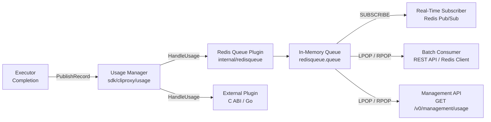
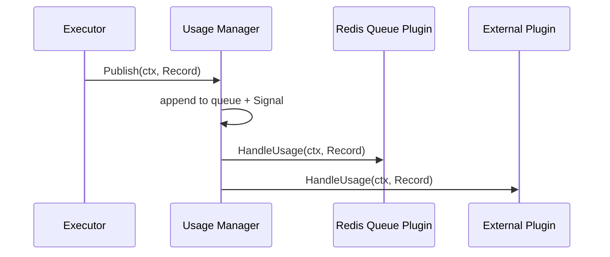
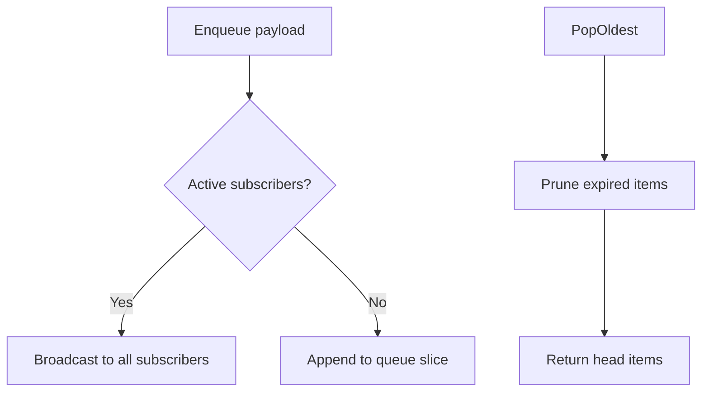
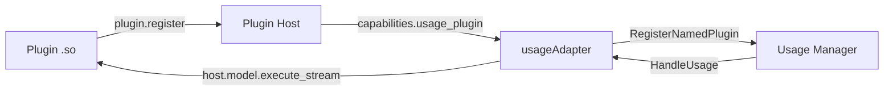

CLIProxyAPIPlus captures per-request usage telemetry (token counts, latency, failure details) through an in-process plugin manager, and exposes that data to external consumers via an in-memory queue with a Redis-compatible RESP protocol interface. This page explains how usage records flow from executor to consumer, how the queue manages retention and subscriber fan-out, and how to configure the feature.

## Architectural Overview

The usage system is composed of three layers that cooperate through clean interfaces:

1. **Usage Manager** — a generic publish/subscribe dispatcher that fans out `Record` objects to registered plugins.
2. **Redis Queue Plugin** — the built-in plugin that serializes records into JSON payloads and pushes them into the in-memory queue.
3. **Redis RESP Protocol Handler** — a wire-level interface that exposes the queue contents through standard Redis commands (`SUBSCRIBE`, `LPOP`, `RPOP`).



Sources: [manager.go](sdk/cliproxy/usage/manager.go#L1-L386), [plugin.go](internal/redisqueue/plugin.go#L1-L171), [redis_queue_protocol.go](internal/api/redis_queue_protocol.go#L1-L607)

## Usage Manager: The Central Dispatcher

The `Manager` in `sdk/cliproxy/usage` is a generic, production-grade fan-out engine. It maintains a buffered queue of `queueItem` structs (each wrapping a `context.Context` and a `Record`) and dispatches them to registered plugins sequentially on a single background goroutine.



Key design properties:

- **Lazy start**: `Start(ctx)` is called automatically on first `Publish`, so callers never need explicit lifecycle management.
- **Panic isolation**: Each plugin invocation is wrapped in `safeInvoke`, catching panics to prevent one broken plugin from crashing the dispatcher.
- **Named registration**: `RegisterNamed(name, plugin)` allows replacing a specific plugin by ID, which is essential for plugin hot-reload.

The `Record` struct carries comprehensive telemetry fields including provider, model, alias, auth metadata, token breakdowns, latency, TTFT (time-to-first-token), failure details, and response headers.

Sources: [manager.go](sdk/cliproxy/usage/manager.go#L160-L280)

## Redis Queue: In-Memory Buffer with Dual Access Patterns

The `internal/redisqueue` package implements two distinct access patterns on a single in-memory queue:

### Subscriber Mode (Real-Time)

When clients call `SubscribeUsage()` or `SubscribeErrors()`, the queue creates a buffered channel (capacity 256) and delivers payloads in real time. If a subscriber's buffer is full and cannot accept a new message, the subscriber is silently evicted — a backpressure-safe design that prevents slow consumers from blocking the pipeline.

```go
// Subscribe real-time
messages, unsubscribe := redisqueue.SubscribeUsage()
for msg := range messages {
    // Process usage payload
}
```

A subscriber receives an initial `{"support_refresh":true}` payload upon connection, signaling that the upstream data is ready.

Sources: [queue.go](internal/redisqueue/queue.go#L78-L100)

### Polling Mode (Batch)

When no subscribers are active, `Enqueue()` falls through to the persistent queue. Consumers retrieve items via `PopOldest(count)`, which returns up to `count` items from the head of the queue. This is the path used by the Management API and the Redis RESP `LPOP`/`RPOP` commands.



Sources: [queue.go](internal/redisqueue/queue.go#L52-L76), [queue.go](internal/redisqueue/queue.go#L196-L220)

### Retention and Compaction

Queue items carry an `enqueuedAt` timestamp. On every `enqueue` and `popOldest` call, `pruneLocked` discards items older than the configured retention window (default 60 seconds, max 3600 seconds). After pruning, `maybeCompactLocked` re-slices the underlying array when the head pointer exceeds 1024 or exceeds half the array length, preventing unbounded memory growth from a long-lived queue.

Sources: [queue.go](internal/redisqueue/queue.go#L228-L258)

## Redis Queue Plugin: Bridging Manager to Queue

The `usageQueuePlugin` is registered via `init()` into the default usage manager. When `HandleUsage` is invoked:

1. It checks both `Enabled()` (queue system active) and `UsageStatisticsEnabled()` (user toggle) gates.
2. It enriches the record with context-derived values (request ID, endpoint, HTTP status).
3. It computes a fallback total token count when the upstream value is zero.
4. It serializes a `queuedUsageDetail` JSON payload and calls `Enqueue()`.

```go
type queuedUsageDetail struct {
    requestDetail
    Provider  string `json:"provider"`
    Model     string `json:"model"`
    Alias     string `json:"alias"`
    Endpoint  string `json:"endpoint"`
    AuthType  string `json:"auth_type"`
    APIKey    string `json:"api_key"`
    RequestID string `json:"request_id"`
}
```

The plugin also handles **Gin context recycling safety**: when usage is published asynchronously, the Gin request context may have already been recycled by the connection pool. The implementation copies necessary values (request ID, endpoint, status) into plain `context.Context` values during synchronous publish, so the asynchronous handler never accesses recycled Gin state.

Sources: [plugin.go](internal/redisqueue/plugin.go#L1-L171)

## UsageReporter: Executor-Level Telemetry Capture

Each executor creates a `UsageReporter` at request time via `NewExecutorUsageReporter`. This struct accumulates metadata (provider, model, auth, API key, source) and provides:

- `Publish(ctx, detail)` — sends a successful usage record.
- `PublishFailure(ctx, errs...)` — sends a failed usage record with error details.
- `TrackHTTPClient(client)` — wraps an `http.Client` with a TTFT-tracking transport.
- `ObserveResponse(resp)` — wraps the response body to mark the first byte timestamp.
- `PublishAdditionalModel(ctx, model, detail)` — for multi-model requests.

The reporter computes the `generate` flag (whether the client requested actual generation), the `alias` (client-requested model name vs. resolved model), and the `source` (user identity from auth metadata).

Sources: [usage_helpers.go](internal/runtime/executor/helps/usage_helpers.go#L1-L200)

## Redis RESP Protocol Interface

CLIProxyAPIPlus implements a subset of the Redis RESP protocol on the same TCP port as the HTTP server. The protocol multiplexer at [protocol_multiplexer.go](internal/api/protocol_multiplexer.go) inspects the first byte of each new connection: if it matches a Redis RESP prefix (`*`, `$`, `+`, `-`, `:`), the connection is routed to the Redis handler instead of the HTTP server.

### Authentication

Connections must authenticate via `AUTH <password>` before issuing other commands. The password is validated against the management API key system. Local connections (127.0.0.1/::1) may bypass authentication if management allows it.

### Supported Commands

| Command | Description | Parameters |
|---------|-------------|------------|
| `AUTH` | Authenticate with management key | `AUTH <password>` |
| `SUBSCRIBE` | Real-time streaming via Pub/Sub | `SUBSCRIBE usage` or `SUBSCRIBE errors` |
| `LPOP` / `RPOP` | Pop oldest items from queue | `LPOP usage [count]` |
| `PING` | Keep-alive during subscription | `PING [payload]` |
| `UNSUBSCRIBE` | End subscription | `UNSUBSCRIBE` |
| `QUIT` | Close connection | `QUIT` |

### Channel Map

| Channel | Data | Subscribe | Pop |
|---------|------|-----------|-----|
| `usage` | Usage telemetry JSON | ✅ | ✅ |
| `errors` | Error event JSON | ✅ | ❌ |

Sources: [redis_queue_protocol.go](internal/api/redis_queue_protocol.go#L56-L200), [protocol_multiplexer.go](internal/api/protocol_multiplexer.go#L66-L138)

### Streaming Subscription Flow

When a client issues `SUBSCRIBE usage`, the server:

1. Creates a channel via `redisqueue.SubscribeUsage()`.
2. Sends a Redis Pub/Sub subscribe acknowledgement (`*3\r\n$9\r\nsubscribe\r\n$5\r\nusage\r\n:1\r\n`).
3. Enters `streamRedisSubscription`, which multiplexes between the message channel and incoming client commands (PING, UNSUBSCRIBE, QUIT) using a `select` loop.
4. On disconnect or UNSUBSCRIBE, the unsubscribe function is called to clean up.

Sources: [redis_queue_protocol.go](internal/api/redis_queue_protocol.go#L246-L290)

### Connection Routing

The multiplexer handles protocol detection with a 10-second read deadline to prevent idle connection leaks. For TLS connections, it checks the negotiated protocol (h2/http/1.1 for HTTP, otherwise falls through to RESP inspection). This allows a single port to serve both HTTP API clients and Redis-protocol usage consumers simultaneously.

Sources: [protocol_multiplexer.go](internal/api/protocol_multiplexer.go#L54-L100)

## Configuration

Two configuration fields control the usage system:

| Field | Type | Default | Description |
|-------|------|---------|-------------|
| `usage-statistics-enabled` | bool | `false` | Master toggle for usage record publishing. When false, the queue plugin discards all records. |
| `redis-usage-queue-retention-seconds` | int | `60` | How long queue items are retained in memory for LPOP/RPOP consumers. Range: 1–3600. |

Additionally, the queue system is automatically **enabled** when either a management secret key is configured or `home.enabled` is true. Without management routes, the Redis RESP interface is unreachable, so the queue serves no external purpose.

Sources: [config.go](internal/config/config.go#L76-L82), [config.example.yaml](config.example.yaml#L135-L140), [server.go](internal/api/server.go#L395-L395)

### Hot-Reload Behavior

When configuration changes at runtime (via file watcher or management API):

- `usage-statistics-enabled` changes immediately toggle the global `usageStatisticsEnabled` flag.
- `redis-usage-queue-retention-seconds` changes take effect on the next `pruneLocked` call.
- Management secret key additions/removals re-evaluate the queue's enabled state.

Sources: [server.go](internal/api/server.go#L1854-L1858), [server.go](internal/api/server.go#L1920-L1920)

## Plugin System Integration

External plugins can register as usage consumers through the C ABI plugin host. The plugin host's `RegisterUsagePlugins` method iterates active plugins and registers any that declare `usage_plugin: true` in their capabilities.



The `usageAdapter` bridges the SDK's `usage.Record` to the plugin API's `pluginapi.UsageRecord`, performing field-by-field translation. If a plugin panics during `HandleUsage`, the adapter calls `fusePlugin` to permanently disable that plugin's usage capability, preventing repeated failures.

Each registered plugin is named `plugin:<pluginID>`, and `RegisterNamed` replaces any previous adapter for the same plugin, ensuring hot-reload works correctly.

Sources: [adapters.go](internal/pluginhost/adapters.go#L1163-L1178), [adapters.go](internal/pluginhost/adapters.go#L1807-L1824)

## Management API Endpoint

The REST management API exposes a `GetUsageQueue` endpoint that pops items from the queue:

```
GET /v0/management/usage?count=10
```

This returns a JSON array of raw usage payloads. Each item is a valid JSON object containing the `queuedUsageDetail` fields. The endpoint uses `redisqueue.PopOldest(count)` and wraps results in `usageQueueRecord` for safe JSON serialization (raw JSON is passed through, non-JSON is string-escaped).

Sources: [usage.go](internal/api/handlers/management/usage.go#L1-L56)

## Usage Refresh Notifications

When the file watcher detects auth file changes (add, update, or remove), it calls `redisqueue.NotifyUsageRefresh()`, which publishes a `{"refresh":true}` payload to all active usage subscribers. This allows external consumers to know that the credential pool has changed and they should re-evaluate their data.

The notification only reaches usage subscribers — error subscribers and the persistent queue are unaffected.

Sources: [queue.go](internal/redisqueue/queue.go#L104-L106), [clients.go](internal/watcher/clients.go#L147-L147), [clients.go](internal/watcher/clients.go#L266-L266), [clients.go](internal/watcher/clients.go#L292-L292)

## Queue Lifecycle: Enable and Disable

`SetEnabled(false)` performs a clean shutdown of the queue system: it drains all items from both the usage and error queues, and closes all active subscriber channels. This ensures subscribers detect the shutdown immediately via channel closure rather than hanging indefinitely.

When the queue is re-enabled (e.g., management secret added), the queue starts empty and begins accepting new items. There is no persistence across disable/enable cycles — this is a deliberate design choice for an in-memory system.

Sources: [queue.go](internal/redisqueue/queue.go#L37-L50)

## Next Steps

- For the protocol multiplexing architecture that routes connections to the Redis handler, see [HTTP Server and Protocol Multiplexing](6-http-server-and-protocol-multiplexing).
- For the plugin host that bridges external usage plugins, see [Plugin Host and C ABI Integration](12-plugin-host-and-c-abi-integration).
- For how the file watcher triggers usage refresh notifications, see [Configuration Hot-Reload and File Watching](15-configuration-hot-reload-and-file-watching).
- For the full configuration schema including usage-related fields, see [Configuration Reference](3-configuration-reference).