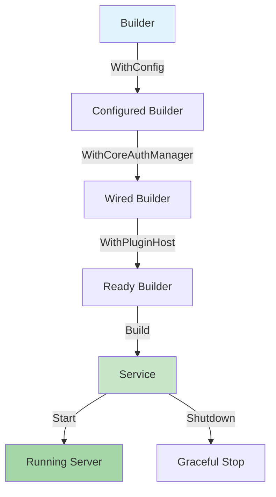
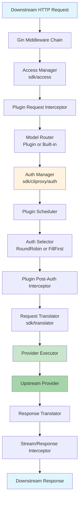

CLIProxyAPI exposes a **public Go SDK** that allows external projects to embed its proxy server, authentication, translation pipeline, plugin system, and HTTP API as a library — without importing any internal packages. This page dissects the layered architecture that makes this possible, identifies the key extension points available to embedders, and maps the data flows that connect them.

## Layered Package Structure

The SDK is organized into a strict **internal-external boundary**. All implementation details live under `internal/`, while every public surface is re-exported through a thin facade in the `sdk/` tree. This is not merely an organizational convenience — it enforces a **compilation contract**: any type that appears in a public SDK signature must be defined or re-exported from a `sdk/` package. Internal packages never leak into an embedder's import graph.

The SDK tree contains twelve top-level packages, each owning a single architectural concern:

| Package | Responsibility | Key Public Types |
|---------|---------------|------------------|
| `sdk/config` | Configuration loading and persistence | `Config`, `SDKConfig`, `StreamingConfig` |
| `sdk/api` | HTTP server options, management handlers | `ServerOption`, `WithMiddleware()`, `Handler` |
| `sdk/auth` | Provider-specific login and refresh flows | `Manager`, `Authenticator`, `LoginOptions` |
| `sdk/cliproxy` | Service lifecycle orchestrator | `Service`, `Builder`, `Hooks` |
| `sdk/cliproxy/auth` | Core auth runtime: selection, execution, cooldown | `Manager`, `Auth`, `ProviderExecutor`, `Store` |
| `sdk/cliproxy/executor` | Request/response execution contracts | `Request`, `Response`, `Options`, `StreamResult` |
| `sdk/translator` | Format-aware translation pipeline | `Registry`, `Pipeline`, `Format` |
| `sdk/access` | Downstream request authentication | `Manager`, `Provider`, `AccessConfig` |
| `sdk/pluginhost` | Dynamic plugin lifecycle and adapters | `Host`, `RuntimeConfig` |
| `sdk/pluginapi` | Plugin capability schemas | `Plugin`, `Capabilities`, `ModelInfo` |
| `sdk/pluginstore` | Plugin registry, download, installation | `Client`, `Manifest`, `Plugin` |
| `sdk/proxyutil` | HTTP/SOCKS5 proxy transport construction | `Parse()`, `BuildHTTPTransport()` |

Sources: [sdk/config/config.go](sdk/config/config.go#L1-L58), [sdk/api/options.go](sdk/api/options.go#L1-L47), [sdk/cliproxy/builder.go](sdk/cliproxy/builder.go#L1-L61)

## The Builder-Service Lifecycle

Every embedding begins with the **Builder pattern**, which constructs a fully wired `Service` instance. The `Builder` exposes a fluent API that replaces default dependencies — authentication managers, plugin hosts, server options — before producing an immutable, ready-to-run service.

The lifecycle progresses through four stages:

1. **Configuration Loading** — The embedder provides a `*config.Config` and a file path. The config carries all operational parameters: proxy URLs, API keys, streaming settings, and plugin configuration.
2. **Dependency Wiring** — Through `With*` methods, the builder accepts optional overrides for `TokenClientProvider`, `APIKeyClientProvider`, `WatcherFactory`, `Manager` (auth), `Manager` (access), and the plugin `Host`.
3. **Build and Validation** — `Build()` normalizes plugin config, resolves directories, and returns a `*Service` or an error.
4. **Start and Lifecycle Hooks** — `Start()` boots the file watcher, HTTP server, plugin host, and auto-refresh loops. The `Hooks` struct provides `OnBeforeStart` and `OnAfterStart` callbacks.



Sources: [sdk/cliproxy/builder.go](sdk/cliproxy/builder.go#L76-L200), [sdk/cliproxy/service.go](sdk/cliproxy/service.go#L44-L117)

## The Core Auth Manager

The `auth.Manager` is the central orchestrator for credential lifecycle and request execution. It is the single most important type in the SDK — nearly every outbound call passes through it. Its responsibilities span five domains:

**Credential Storage and Selection.** The manager holds a map of `*Auth` records keyed by ID. A pluggable `Selector` interface (defaulting to `RoundRobinSelector`) chooses which credential handles each request. A `FillFirstSelector` is also provided for staggered quota exhaustion strategies.

**Executor Registration.** Provider-specific executors — implementing the `ProviderExecutor` interface — register via `RegisterExecutor()`. The manager dispatches to the correct executor based on the auth's `Provider` field.

**Model Routing and Alias Resolution.** OAuth and API-key model alias tables map client-requested model names to upstream identifiers. The manager applies these mappings during request translation.

**Quota and Cooldown Management.** Per-auth and per-model `QuotaState` and `CooldownState` track rate-limit backoff, preventing repeated requests to exhausted credentials. The `authScheduler` consults cooldown windows before selecting credentials.

**Auto-Refresh.** A background `authAutoRefreshLoop` renews tokens before expiry, updating in-memory `Auth` records and notifying the file watcher of changes.

The `ProviderExecutor` interface that embedders implement to add custom upstreams requires six methods:

```go
type ProviderExecutor interface {
    Identifier() string
    Execute(ctx, auth, req, opts) (Response, error)
    ExecuteStream(ctx, auth, req, opts) (*StreamResult, error)
    Refresh(ctx, auth) (*Auth, error)
    CountTokens(ctx, auth, req, opts) (Response, error)
    HttpRequest(ctx, auth, httpReq) (*http.Response, error)
}
```

Sources: [sdk/cliproxy/auth/conductor.go](sdk/cliproxy/auth/conductor.go#L36-L51), [sdk/cliproxy/auth/conductor.go](sdk/cliproxy/auth/conductor.go#L217-L289), [sdk/cliproxy/auth/types.go](sdk/cliproxy/auth/types.go#L46-L101)

## Request Translation Pipeline

The translation pipeline converts payloads between protocol formats — OpenAI Chat, Claude Messages, Gemini, Codex, Antigravity — using a **Registry + Pipeline** architecture. This separation allows the SDK to support multiple inbound and outbound schemas simultaneously.

The `Registry` maintains two lookup tables: one for request transforms and one for response transforms, each indexed by `(source Format, target Format)` pair. Registering a bidirectional translator is a single call:

```go
sdktr.Register(FormatOpenAI, fMyProv,
    requestTransform,
    sdktr.ResponseTransform{Stream: streamFn, NonStream: nonStreamFn},
)
```

The `Pipeline` wraps the registry with **middleware chains** for both request and response paths. Middleware functions follow the classic `next` pattern — each layer can inspect, modify, or short-circuit the envelope before calling the next handler.

The `RequestEnvelope` and `ResponseEnvelope` types carry the raw JSON body along with the resolved model name, streaming flag, and current format identifier. This design means translators operate on opaque byte slices, avoiding unnecessary serialization overhead.

Plugin systems extend translation through the `PluginHooks` interface, which adds normalization and translation callbacks at four points: before request translation, before response normalization, after response normalization, and during chunk interception.

| Pipeline Phase | Hook Point | Direction |
|---------------|-----------|-----------|
| Request normalization | `NormalizeRequest` | Inbound |
| Request translation | `TranslateRequest` | Inbound |
| Response normalization | `NormalizeResponseBefore` | Outbound |
| Response translation | `TranslateResponse` | Outbound |
| Post-normalization | `NormalizeResponseAfter` | Outbound |

Sources: [sdk/translator/pipeline.go](sdk/translator/pipeline.go#L34-L107), [sdk/translator/registry.go](sdk/translator/registry.go#L13-L89), [sdk/translator/plugin_hooks.go](sdk/translator/plugin_hooks.go#L6-L12)

## Request Execution Flow

When a downstream client sends a request to the embedded server, it traverses a sequence of architectural layers before reaching an upstream provider. Understanding this flow is essential for knowing where to inject custom behavior.



Each numbered checkpoint maps to an extension point:

1. **Gin Middleware** — Injected via `api.WithMiddleware()`. Used for CORS, logging, or rate limiting before any SDK logic runs.
2. **Access Manager** — Validates downstream API keys. Embedders implement `sdk/access.Provider` for custom auth schemes.
3. **Plugin Request Interceptor** — Plugins can rewrite or reject requests before model routing.
4. **Model Router** — A plugin `ModelRouter` can redirect matching requests to a plugin executor, bypassing built-in resolution entirely.
5. **Auth Scheduler** — Plugins implementing the `Scheduler` capability can override credential selection.
6. **Request/Response Translators** — The `sdk/translator` pipeline converts between formats.
7. **Provider Executor** — The `ProviderExecutor` interface sends the translated payload upstream.
8. **Stream/Response Interceptors** — Plugins can rewrite responses and stream chunks before downstream delivery.

Sources: [sdk/api/handlers/handlers.go](sdk/api/handlers/handlers.go#L70-L104), [sdk/cliproxy/auth/conductor.go](sdk/cliproxy/auth/conductor.go#L36-L51)

## The Plugin Host and C ABI

The plugin system allows third-party `.so`/`.dylib` binaries to extend the SDK at runtime without recompilation. The `pluginhost.Host` manages the lifecycle of these dynamic libraries, while `sdk/pluginapi` defines the capability schemas that plugins declare.

Each plugin binary exports C ABI functions that conform to the `pluginabi` contract (currently ABI version 1, Schema version 1). Communication between host and plugin uses JSON-RPC over `plugin.register`, `executor.execute`, `model.register`, and dozens of other method signatures defined in [sdk/pluginabi/types.go](sdk/pluginabi/types.go#L14-L80).

The `Capabilities` struct is the central registry of what a plugin can do. A single plugin may implement any combination of the following extension points:

| Capability | Interface | Purpose |
|-----------|-----------|---------|
| `Executor` | `ProviderExecutor` | Sends requests to an upstream or local backend |
| `ModelRegistrar` | — | Contributes model metadata at startup |
| `ModelProvider` | — | Discovers per-auth models at runtime |
| `AuthProvider` | — | Handles login, poll, and refresh for a custom provider |
| `FrontendAuthProvider` | — | Authenticates downstream API requests |
| `Scheduler` | — | Selects credentials before built-in scheduling |
| `ModelRouter` | — | Routes requests to a plugin executor |
| `RequestTranslator` | — | Converts canonical requests to provider payloads |
| `ResponseTranslator` | — | Converts upstream responses to canonical payloads |
| `RequestInterceptor` | — | Rewrites requests before and after credential selection |
| `ResponseInterceptor` | — | Rewrites non-streaming responses |
| `StreamChunkInterceptor` | — | Rewrites individual streaming chunks |
| `ThinkingApplier` | — | Applies reasoning budget configuration |
| `UsagePlugin` | — | Receives completed usage records |
| `CommandLinePlugin` | — | Declares custom CLI flags |
| `ManagementAPI` | — | Registers diagnostic endpoints |

The `Host` coordinates hot-loading, configuration propagation, and graceful shutdown of all active plugins. Its `ApplyConfig` method reconfigures running plugins when the YAML configuration changes, while `UnloadPlugin` and `ShutdownAll` handle teardown.

Sources: [sdk/pluginapi/types.go](sdk/pluginapi/types.go#L68-L118), [sdk/pluginabi/types.go](sdk/pluginabi/types.go#L14-L80), [sdk/pluginhost/host.go](sdk/pluginhost/host.go#L62-L86)

## Access Management

The `sdk/access` package provides a pluggable downstream request authentication layer. The `access.Manager` holds a prioritized list of `Provider` instances, each of which attempts to authenticate an inbound HTTP request.

Providers are registered declaratively through `AccessConfig`, which maps to the YAML configuration:

```yaml
access:
  providers:
    - name: my-key-provider
      type: config-api-key
      api-keys:
        - sk-my-key-123
```

For custom authentication schemes, embedders implement the `Provider` interface:

```go
type Provider interface {
    Authenticate(ctx context.Context, r *http.Request) (*Result, *AuthError)
}
```

The manager evaluates providers in order, returning the first successful `Result`. Error classification distinguishes between "not handled" (skip to next provider), "no credentials" (missing key), and "invalid credential" (wrong key), enabling nuanced error responses.

Sources: [sdk/access/types.go](sdk/access/types.go#L1-L47), [sdk/access/manager.go](sdk/access/manager.go#L10-L88), [sdk/access/errors.go](sdk/access/errors.go#L1-L91)

## HTTP Server Customization

The `sdk/api` package exposes `ServerOption` functions that configure the underlying Gin HTTP server without requiring direct access to internal types. Embedders use these to inject middleware, modify the engine, or add custom endpoints.

Key extension points:

| Option | Purpose |
|--------|---------|
| `WithMiddleware(mw...)` | Appends Gin middleware after SDK defaults |
| `WithEngineConfigurator(fn)` | Mutates the `*gin.Engine` before middleware setup |
| `WithRouterConfigurator(fn)` | Adds routes after default SDK routes are registered |
| `WithLocalManagementPassword(pw)` | Adds a localhost-only management password |
| `WithKeepAliveEndpoint(timeout, onTimeout)` | Adds a health-check keep-alive endpoint |
| `WithRequestLoggerFactory(fn)` | Replaces the default request logger |

The `WithRouterConfigurator` callback receives the base handler, the config, and the engine — giving embedders full access to register custom API endpoints alongside the SDK's built-in OpenAI-compatible routes.

The `ManagementHandler` wraps the SDK's built-in management endpoints for operations like OAuth callback processing, token requests, and configuration persistence. Embedders can use it to add management capabilities to their embedded servers.

Sources: [sdk/api/options.go](sdk/api/options.go#L1-L47), [sdk/api/management.go](sdk/api/management.go#L34-L48)

## Proxy Transport Layer

The `sdk/proxyutil` package provides transport construction that handles the full spectrum of proxy configurations: SOCKS5, HTTP CONNECT, HTTPS tunneling, and direct connections. It normalizes proxy settings into three modes:

| Mode | Behavior |
|------|----------|
| `ModeInherit` | No explicit proxy — use environment defaults |
| `ModeDirect` | Bypass all proxies explicitly |
| `ModeProxy` | Route through a concrete proxy URL |

`BuildHTTPTransport()` returns a configured `*http.Transport` suitable for injection into provider HTTP clients. The SOCKS5 path uses the `golang.org/x/net/proxy` dialer, while HTTP/HTTPS proxies implement CONNECT tunneling with TLS handshake support for `https://` proxy endpoints.

The per-auth `ProxyURL` field on `Auth` records allows different credentials to route through different proxies, enabling geo-distributed proxy topologies.

Sources: [sdk/proxyutil/proxy.go](sdk/proxyutil/proxy.go#L1-L125)

## Model Registry Integration

The global model registry tracks which models are available through which credentials. Plugins register models through `ModelRegistrar` and `ModelProvider` capabilities, while the SDK registers models for built-in providers during startup.

The `ModelRegistry` interface provides the operations needed for model lifecycle management:

```go
type ModelRegistry interface {
    RegisterClient(clientID, provider string, models []*ModelInfo)
    UnregisterClient(clientID string)
    SetModelQuotaExceeded(clientID, modelID string)
    ClearModelQuotaExceeded(clientID, modelID string)
    ClientSupportsModel(clientID, modelID string) bool
    GetAvailableModels(handlerType string) []map[string]any
    GetAvailableModelsByProvider(provider string) []*ModelInfo
}
```

Embedders access the global registry via `cliproxy.GlobalModelRegistry()` and can hook into model discovery through `SetGlobalModelRegistryHook()`.

Sources: [sdk/cliproxy/model_registry.go](sdk/cliproxy/model_registry.go#L1-L31)

## Embedding Summary

The SDK is designed for **progressive disclosure** — a minimal embedding requires only a `Builder` with config, while advanced use cases can override nearly every architectural component:

```go
// Minimal embedding
svc, _ := cliproxy.NewBuilder().
    WithConfig(cfg).
    WithConfigPath("config.yaml").
    Build()
svc.Start()

// Advanced embedding with custom auth, plugins, and middleware
svc, _ := cliproxy.NewBuilder().
    WithConfig(cfg).
    WithConfigPath("config.yaml").
    WithCoreAuthManager(customManager).
    WithPluginHost(pluginhost.New()).
    WithServerOptions(api.WithMiddleware(corsMiddleware)).
    WithHooks(cliproxy.Hooks{
        OnAfterStart: func(s *cliproxy.Service) {
            s.RegisterUsagePlugin(myUsagePlugin)
        },
    }).
    Build()
```

The key interfaces to implement for full customization are summarized in this table:

| Interface | Package | Purpose |
|-----------|---------|---------|
| `ProviderExecutor` | `sdk/cliproxy/auth` | Custom upstream execution |
| `Provider` | `sdk/access` | Downstream request authentication |
| `Authenticator` | `sdk/auth` | Login/refresh flows for custom providers |
| `Store` | `sdk/cliproxy/auth` | Alternative auth persistence backends |
| `PluginHooks` | `sdk/translator` | Request/response translation extension |
| `TokenClientProvider` | `sdk/cliproxy` | Custom token-based credential loading |
| `APIKeyClientProvider` | `sdk/cliproxy` | Custom API key credential loading |
| `RequestLogger` | `sdk/logging` | Custom request logging implementation |

Sources: [examples/custom-provider/main.go](examples/custom-provider/main.go#L1-L226)

## Next Steps

- For a hands-on walkthrough of implementing a custom provider executor, see [Custom Provider Example Walkthrough](22-custom-provider-example-wrth)
- To understand the plugin system's C ABI and capability registration in depth, see [Plugin Host and C ABI Integration](12-plugin-host-and-c-abi-integration)
- To learn how the translator pipeline converts between OpenAI, Claude, Gemini, and other schemas, see [Translator Registry and Format Conversion](8-translator-registry-and-format-conversion)
- To explore how credentials are selected, refreshed, and managed at runtime, see [Authentication System and Provider Login Flows](7-authentication-system-and-provider-login-flows)