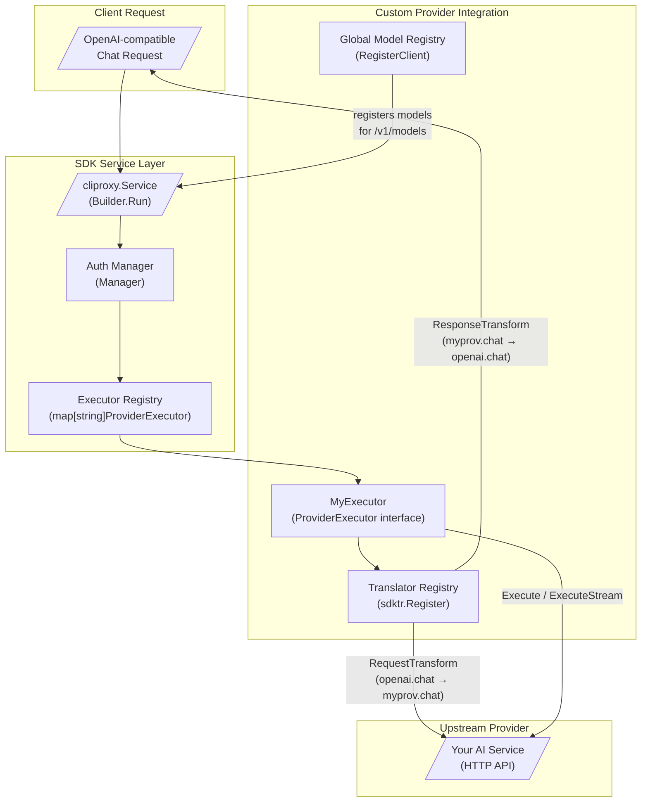

This page provides an end-to-end walkthrough of integrating a custom AI provider into the CLIProxyAPIPlus SDK. It dissects the `examples/custom-provider/main.go` reference implementation — a self-contained binary that registers a custom executor, wires up request/response translators, populates the model registry, and launches the full proxy service. This is the authoritative guide for advanced developers building provider integrations that fall outside the built-in OAuth and API-key providers.

Sources: [examples/custom-provider/main.go](examples/custom-provider/main.go#L1-L10)

## Architecture Overview

The custom provider integration sits within the SDK's layered architecture. A custom provider plugs into three distinct subsystems: the **Executor** layer (which forwards requests to your upstream API), the **Translator** layer (which converts between protocol formats), and the **Model Registry** (which makes your models discoverable via `/v1/models`). The diagram below shows how these components interact during a typical request lifecycle.



Sources: [sdk/cliproxy/auth/conductor.go#L36-L51](sdk/cliproxy/auth/conductor.go#L36-L51), [sdk/translator/registry.go#L29-L44](sdk/translator/registry.go#L29-L44), [sdk/cliproxy/model_registry.go#L12-L20](sdk/cliproxy/model_registry.go#L12-L20)

## The ProviderExecutor Interface

Every custom provider must implement the `ProviderExecutor` interface defined in the SDK's auth conductor. This interface is the contract that the `Manager` uses to dispatch requests to the correct provider backend. The interface has six methods, each serving a distinct role in the request lifecycle:

```go
type ProviderExecutor interface {
    Identifier() string
    Execute(ctx context.Context, auth *Auth, req Request, opts Options) (Response, error)
    ExecuteStream(ctx context.Context, auth *Auth, req Request, opts Options) (*StreamResult, error)
    Refresh(ctx context.Context, auth *Auth) (*Auth, error)
    CountTokens(ctx context.Context, auth *Auth, req Request, opts Options) (Response, error)
    HttpRequest(ctx context.Context, auth *Auth, req *http.Request) (*http.Response, error)
}
```

| Method | Purpose | Required? |
|--------|---------|-----------|
| `Identifier()` | Returns the unique provider key (e.g., `"myprov"`) used for executor lookup and model routing | **Yes** |
| `Execute()` | Handles non-streaming requests; receives translated payload and returns full response | **Yes** |
| `ExecuteStream()` | Handles streaming requests; returns a `StreamResult` containing a `Chunks` channel and upstream headers | **Yes** |
| `Refresh()` | Attempts credential refresh; returns updated or original auth if not applicable | **Yes** |
| `CountTokens()` | Returns token count for the request; can return error if not supported | **Yes** |
| `HttpRequest()` | Injects credentials into an arbitrary `*http.Request` and executes it; used by the `Manager.HttpRequest` API | **Yes** |

Sources: [sdk/cliproxy/auth/conductor.go#L36-L51](sdk/cliproxy/auth/conductor.go#L36-L51)

The example executor implements all six methods. For methods your provider does not support (such as `CountTokens`), returning an error is the correct behavior — the SDK handles the error at the caller level.

Sources: [examples/custom-provider/main.go#L158-L160](examples/custom-provider/main.go#L158-L160)

## Step 1: Define the Provider Key and Format Constants

The first structural decision is choosing a unique provider key and the wire format identifiers. The provider key must be globally unique across all registered executors — it serves as the map key in the executor registry and the `Type` field in model registration.

```go
const (
    providerKey = "myprov"
    fOpenAI     = sdktr.Format("openai.chat")
    fMyProv     = sdktr.Format("myprov.chat")
)
```

The format constants define the two protocol schemas your translator will bridge. The `sdktr.Format` type is a string alias that the translator registry uses as a map key for dispatching request and response transforms. You can choose any naming convention, but using dotted identifiers (e.g., `"openai.chat"`, `"myprov.chat"`) is the established convention within the codebase.

Sources: [examples/custom-provider/main.go#L37-L46](examples/custom-provider/main.go#L37-L46), [sdk/translator/format.go#L4-L14](sdk/translator/format.go#L4-L14)

## Step 2: Register Translators

The translator subsystem converts request and response payloads between protocol formats. The example registers a passthrough (identity) transform for demonstration purposes. In a production implementation, you would convert between OpenAI's chat completion format and your provider's native schema.

```go
func init() {
    sdktr.Register(fOpenAI, fMyProv,
        func(model string, raw []byte, stream bool) []byte { return raw },
        sdktr.ResponseTransform{
            Stream: func(ctx context.Context, model string, originalReq,
                translatedReq, raw []byte, param *any) [][]byte {
                return [][]byte{raw}
            },
            NonStream: func(ctx context.Context, model string, originalReq,
                translatedReq, raw []byte, param *any) []byte {
                return raw
            },
        },
    )
}
```

The `sdktr.Register` function operates on the package-level default registry. It accepts four arguments: a source format, a target format, a `RequestTransform` function, and a `ResponseTransform` struct containing both `Stream` and `NonStream` handlers. The `RequestTransform` signature receives the resolved model name, the raw JSON payload, and a streaming flag. The `ResponseStreamTransform` returns `[][]byte` because a single upstream chunk may produce zero, one, or multiple downstream SSE frames. The `param *any` argument carries translator-scoped state across chunks within a single streaming session.

Sources: [sdk/translator/types.go#L9-L34](sdk/translator/types.go#L9-L34), [sdk/translator/registry.go#L227-L229](sdk/translator/registry.go#L227-L229)

### Available Built-in Formats

For reference, the SDK ships with several pre-defined format constants that you can use as translation sources or targets:

| Constant | Value | Description |
|----------|-------|-------------|
| `FormatOpenAI` | `"openai"` | OpenAI Chat Completions format |
| `FormatClaude` | `"claude"` | Anthropic Messages format |
| `FormatGemini` | `"gemini"` | Google Gemini format |
| `FormatCodex` | `"codex"` | Codex format |
| `FormatAntigravity` | `"antigravity"` | Antigravity format |
| `FormatInteractions` | `"interactions"` | Interactions format |

Sources: [sdk/translator/formats.go#L4-L12](sdk/translator/formats.go#L4-L12)

## Step 3: Implement the Executor

The executor struct must satisfy all six methods of `ProviderExecutor`. The example implementation demonstrates the core patterns for each method.

### Identifier

The `Identifier()` method returns the provider key. This must match the key passed to `RegisterExecutor` and the `Provider` field on `Auth` records:

```go
func (MyExecutor) Identifier() string { return providerKey }
```

### PrepareRequest

While not part of the `ProviderExecutor` interface, `PrepareRequest` is a common helper pattern for injecting credentials. The executor calls this internally before each upstream HTTP call:

```go
func (MyExecutor) PrepareRequest(req *http.Request, a *coreauth.Auth) error {
    if req == nil || a == nil { return nil }
    if a.Attributes != nil {
        if ak := strings.TrimSpace(a.Attributes["api_key"]); ak != "" {
            req.Header.Set("Authorization", "Bearer "+ak)
        }
    }
    return nil
}
```

The `Attributes` map on the `Auth` struct stores immutable provider-specific configuration. For API-key providers, the convention is to use `"api_key"` as the attribute key. For endpoint overrides, `"endpoint"` is the established convention.

Sources: [examples/custom-provider/main.go#L82-L92](examples/custom-provider/main.go#L82-L92), [sdk/cliproxy/auth/types.go#L72-L73](sdk/cliproxy/auth/types.go#L72-L73)

### Execute

The `Execute` method handles non-streaming requests. It constructs an HTTP request from the translated payload, injects credentials, and returns the full response body:

```go
func (MyExecutor) Execute(ctx context.Context, a *coreauth.Auth,
    req clipexec.Request, opts clipexec.Options) (clipexec.Response, error) {
    client := buildHTTPClient(a)
    endpoint := upstreamEndpoint(a)
    httpReq, errNew := http.NewRequestWithContext(ctx, http.MethodPost,
        endpoint, bytes.NewReader(req.Payload))
    // ... inject credentials, execute, return Response{Payload: body}
}
```

The `clipexec.Request` struct contains the already-translated payload (`req.Payload`) in your provider's format, along with the resolved model name (`req.Model`) and format (`req.Format`). The `clipexec.Options` struct carries streaming flags, original request bytes, and metadata.

Sources: [examples/custom-provider/main.go#L115-L141](examples/custom-provider/main.go#L115-L141), [sdk/cliproxy/executor/types.go#L46-L55](sdk/cliproxy/executor/types.go#L46-L55)

### ExecuteStream

The streaming method returns a `StreamResult` containing a read-only channel of `StreamChunk` values. Each chunk wraps a raw payload and an optional error:

```go
func (MyExecutor) ExecuteStream(ctx context.Context, a *coreauth.Auth,
    req clipexec.Request, opts clipexec.Options) (*clipexec.StreamResult, error) {
    ch := make(chan clipexec.StreamChunk, 1)
    go func() {
        defer close(ch)
        ch <- clipexec.StreamChunk{Payload: []byte("data: {\"ok\":true}\n\n")}
    }()
    return &clipexec.StreamResult{Chunks: ch}, nil
}
```

In a production implementation, you would typically open an HTTP connection to your upstream with `Accept: text/event-stream`, read the response body in a goroutine, parse SSE frames, and send them through the channel. Closing the channel signals stream completion. The `StreamResult.Headers` field allows you to forward upstream HTTP headers to the client.

Sources: [examples/custom-provider/main.go#L162-L169](examples/custom-provider/main.go#L162-L169), [sdk/cliproxy/executor/types.go#L131-L146](sdk/cliproxy/executor/types.go#L131-L146)

### HttpRequest

The `HttpRequest` method provides a lower-level interface for executing arbitrary HTTP requests with credential injection. It is used by the `Manager.HttpRequest` API to let external callers make authenticated requests through your provider:

```go
func (MyExecutor) HttpRequest(ctx context.Context, a *coreauth.Auth,
    req *http.Request) (*http.Response, error) {
    httpReq := req.WithContext(ctx)
    if errPrep := (MyExecutor{}).PrepareRequest(httpReq, a); errPrep != nil {
        return nil, errPrep
    }
    client := buildHTTPClient(a)
    return client.Do(httpReq)
}
```

Sources: [examples/custom-provider/main.go#L143-L156](examples/custom-provider/main.go#L143-L156), [examples/http-request/main.go#L1-L141](examples/http-request/main.go#L1-L141)

## Step 4: Initialize the Auth Manager and Register the Executor

The `Manager` is the central orchestrator for credential lifecycle, executor dispatch, and auth selection. The example creates a manager with a token store, then registers the custom executor:

```go
tokenStore := sdkAuth.GetTokenStore()
if dirSetter, ok := tokenStore.(interface{ SetBaseDir(string) }); ok {
    dirSetter.SetBaseDir(cfg.AuthDir)
}
core := coreauth.NewManager(tokenStore, nil, nil)
core.RegisterExecutor(MyExecutor{})
```

`NewManager` accepts three arguments: a `Store` for token persistence (which can be `nil` for stateless providers), an optional `Selector` for auth selection strategy (defaults to round-robin), and an optional `Hook` for lifecycle observation. The `RegisterExecutor` method stores the executor in an internal map keyed by `executor.Identifier()`.

Sources: [examples/custom-provider/main.go#L181-L186](examples/custom-provider/main.go#L181-L186), [sdk/cliproxy/auth/conductor.go#L267-L289](sdk/cliproxy/auth/conductor.go#L267-L289), [sdk/cliproxy/auth/conductor.go#L2122-L2143](sdk/cliproxy/auth/conductor.go#L2122-L2143)

## Step 5: Register Models in the Global Registry

For your custom models to appear in the `/v1/models` endpoint, they must be registered in the global model registry. The example does this inside the `OnAfterStart` hook, which fires after the service has started and all auth records are loaded:

```go
hooks := cliproxy.Hooks{
    OnAfterStart: func(s *cliproxy.Service) {
        models := []*cliproxy.ModelInfo{
            {ID: "myprov-pro-1", Object: "model", Type: providerKey, DisplayName: "MyProv Pro 1"},
        }
        for _, a := range core.List() {
            if strings.EqualFold(a.Provider, providerKey) {
                cliproxy.GlobalModelRegistry().RegisterClient(a.ID, providerKey, models)
            }
        }
    },
}
```

The `RegisterClient` method binds a set of models to a specific auth record. The `a.ID` parameter is the auth record's unique identifier, and `providerKey` is the provider type. Models registered this way are only available when the associated auth record is active and healthy.

Sources: [examples/custom-provider/main.go#L188-L198](examples/custom-provider/main.go#L188-L198), [sdk/cliproxy/model_registry.go#L12-L25](sdk/cliproxy/model_registry.go#L12-L25)

## Step 6: Build and Run the Service

The final step assembles the service using the fluent `Builder` API. The builder accepts configuration, auth manager, server options, and lifecycle hooks:

```go
svc, err := cliproxy.NewBuilder().
    WithConfig(cfg).
    WithConfigPath("config.yaml").
    WithCoreAuthManager(core).
    WithServerOptions(
        api.WithMiddleware(func(c *gin.Context) {
            c.Header("X-Example", "custom-provider")
            c.Next()
        }),
        api.WithRequestLoggerFactory(func(cfg *config.Config, cfgPath string) logging.RequestLogger {
            return logging.NewFileRequestLoggerWithOptions(true, "logs",
                filepath.Dir(cfgPath), cfg.ErrorLogsMaxFiles)
        }),
    ).
    WithHooks(hooks).
    Build()

ctx, cancel := context.WithCancel(context.Background())
defer cancel()

if errRun := svc.Run(ctx); errRun != nil && !errors.Is(errRun, context.Canceled) {
    panic(errRun)
}
```

The `Build()` method validates all required fields (config and config path are mandatory), applies defaults, normalizes plugin configuration, and returns a `*Service`. The `Run(ctx)` method starts the usage tracker, loads auth records, starts the HTTP server, and blocks until the context is cancelled.

Sources: [examples/custom-provider/main.go#L200-L225](examples/custom-provider/main.go#L200-L225), [sdk/cliproxy/builder.go#L76-L83](sdk/cliproxy/builder.go#L76-L83), [sdk/cliproxy/builder.go#L183-L301](sdk/cliproxy/builder.go#L183-L301), [sdk/cliproxy/service.go#L1637-L1750](sdk/cliproxy/service.go#L1637-L1750)

### Builder Options Reference

| Builder Method | Purpose | Required |
|----------------|---------|----------|
| `WithConfig(cfg)` | Sets the application configuration | **Yes** |
| `WithConfigPath(path)` | Sets the config file path (used for hot-reload watching) | **Yes** |
| `WithCoreAuthManager(mgr)` | Overrides the auth manager (defaults to built-in with round-robin selector) | No |
| `WithServerOptions(opts...)` | Appends Gin middleware, logger factories, and other server options | No |
| `WithHooks(hooks)` | Registers `OnBeforeStart` and `OnAfterStart` lifecycle callbacks | No |
| `WithTokenClientProvider(p)` | Overrides the token-backed client loader | No |
| `WithAPIKeyClientProvider(p)` | Overrides the API-key client loader | No |
| `WithWatcherFactory(f)` | Overrides the file watcher for config hot-reload | No |
| `WithPostAuthHook(hook)` | Registers a callback invoked after auth record creation | No |

Sources: [sdk/cliproxy/builder.go#L82-L180](sdk/cliproxy/builder.go#L82-L180)

## Auth Record Structure

The `Auth` struct is the runtime representation of a credential. Understanding its fields is essential for custom providers because the executor receives it on every call and uses it to inject credentials and resolve upstream endpoints:

| Field | Type | Purpose |
|-------|------|---------|
| `ID` | `string` | Unique identifier across restarts |
| `Provider` | `string` | Upstream provider key (must match `Executor.Identifier()`) |
| `Attributes` | `map[string]string` | Immutable provider-specific configuration (API keys, endpoints) |
| `Metadata` | `map[string]any` | Mutable runtime state (tokens, cookies, session data) |
| `ProxyURL` | `string` | Per-auth proxy override |
| `Status` | `Status` | Lifecycle status managed by the auth manager |
| `Quota` | `QuotaState` | Rate limit tracking for load balancers |
| `Runtime` | `any` | Non-serializable in-memory data for executor use |

Sources: [sdk/cliproxy/auth/types.go#L47-L101](sdk/cliproxy/auth/types.go#L47-L101)

## Common Patterns for Production Providers

### Proxy and Transport Configuration

The example includes a helper that builds an `http.Client` respecting the auth's `ProxyURL`. This pattern is essential for providers that require routing through corporate proxies or VPNs:

```go
func buildHTTPClient(a *coreauth.Auth) *http.Client {
    if a == nil || strings.TrimSpace(a.ProxyURL) == "" {
        return http.DefaultClient
    }
    u, err := url.Parse(a.ProxyURL)
    if err != nil || (u.Scheme != "http" && u.Scheme != "https") {
        return http.DefaultClient
    }
    return &http.Client{Transport: &http.Transport{Proxy: http.ProxyURL(u)}}
}
```

Sources: [examples/custom-provider/main.go#L94-L103](examples/custom-provider/main.go#L94-L103)

### Endpoint Resolution from Auth Attributes

A common pattern is resolving the upstream endpoint from auth attributes, allowing per-credential endpoint overrides:

```go
func upstreamEndpoint(a *coreauth.Auth) string {
    if a != nil && a.Attributes != nil {
        if ep := strings.TrimSpace(a.Attributes["endpoint"]); ep != "" {
            return ep
        }
    }
    return "https://your-default-upstream.example.com/v1/chat/completions"
}
```

Sources: [examples/custom-provider/main.go#L105-L113](examples/custom-provider/main.go#L105-L113)

### Error Handling with StatusError

For production executors, the SDK supports the `StatusError` interface for communicating HTTP-like error codes back to the auth manager. This enables automatic cooldown scheduling for 401, 402, and 429 responses:

```go
type StatusError interface {
    error
    StatusCode() int
}
```

When an executor returns a `StatusError`, the auth manager updates the credential's `Quota` and `Status` fields, applies exponential backoff for rate limits, and marks credentials as unavailable on authentication failures.

Sources: [sdk/cliproxy/executor/types.go#L148-L162](sdk/cliproxy/executor/types.go#L148-L162)

## Integration with the SDK Translator Example

The SDK includes a separate translator example demonstrating how to use the translator API programmatically without a full service. This is useful for testing transforms in isolation:

```go
translatedRequest := translator.TranslateRequestByFormatName(
    translator.FormatOpenAI,
    translator.FormatGemini,
    "gemini-2.5-pro",
    rawRequest,
    false,
)

convertedResponse := translator.TranslateNonStreamByFormatName(
    context.Background(),
    translator.FormatGemini,
    translator.FormatOpenAI,
    "gemini-2.5-pro",
    rawRequest,
    translatedRequest,
    geminiResponse,
    nil,
)
```

Sources: [examples/translator/main.go#L11-L42](examples/translator/main.go#L11-L42)

## Next Steps

After completing a custom provider implementation, consider the following paths:

- For understanding how the executor dispatch integrates with the full request pipeline, read [Executor Architecture and Provider Dispatch](10-executor-architecture-and-provider-dispatch)
- For deeper translator pipeline mechanics including plugin hooks, see [Translator Registry and Format Conversion](8-translator-registry-and-format-conversion)
- For the plugin-based alternative to in-process executor registration, see [Plugin Host and C ABI Integration](12-plugin-host-and-c-abi-integration)
- For understanding the auth selection strategies that determine which credential handles each request, see [Authentication System and Provider Login Flows](7-authentication-system-and-provider-login-flows)