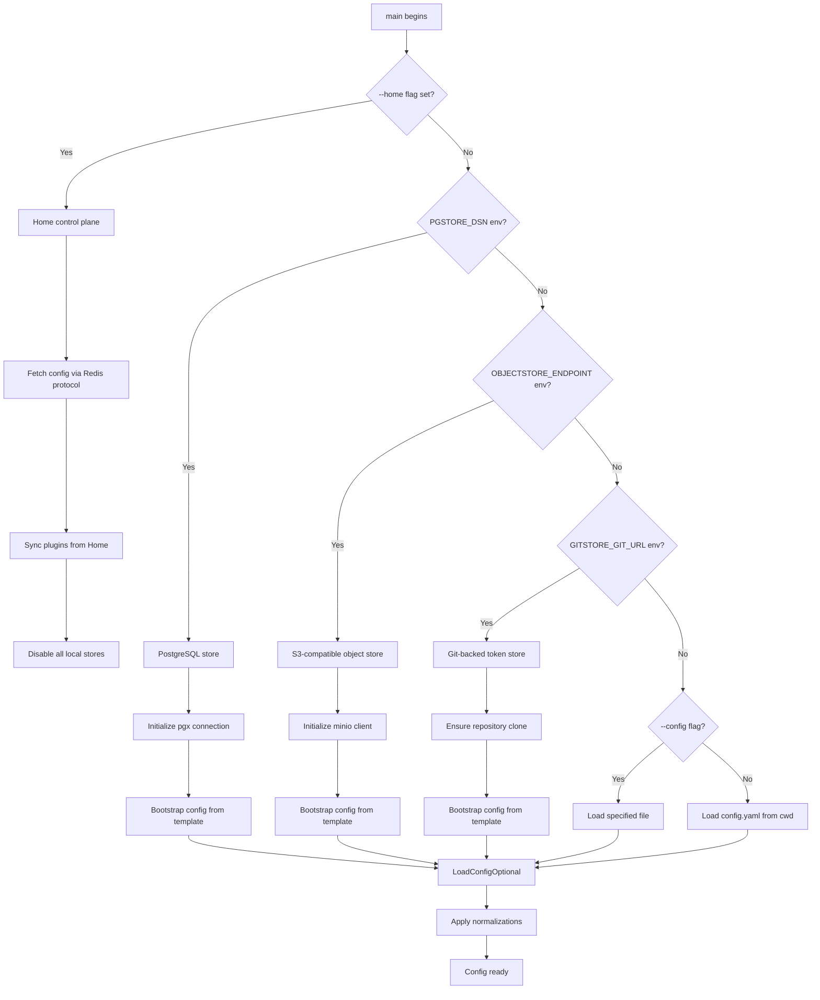
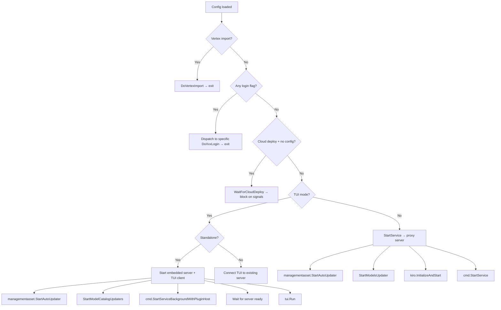

This page documents the application bootstrap sequence, command-line flag definitions, configuration loading strategy, and the branching logic that selects between login flows, TUI modes, and the main proxy service. Understanding these internals is essential for anyone building from source, embedding the SDK, or troubleshooting startup failures.

## Build-Time Metadata

CLIProxyAPI injects three compile-time variables via Go linker flags (`-ldflags`) that are displayed immediately on startup. The `internal/buildinfo` package exposes these as package-level variables, set from `main.go` declarations that the linker overrides:

```text
var (
    Version   = "dev"       // overridden to git describe output at release
    Commit    = "none"      // overridden to short SHA
    BuildDate = "unknown"   // overridden to UTC timestamp
)
```

The Dockerfile confirms the injection pattern:

```dockerfile
RUN CGO_ENABLED=0 GOOS=linux go build \
  -ldflags="-s -w \
    -X 'main.Version=${VERSION}-plus' \
    -X 'main.Commit=${COMMIT}' \
    -X 'main.BuildDate=${BUILD_DATE}'" \
  -o ./CLIProxyAPIPlus ./cmd/server/
```

The shell build script (`docker-build.sh`) sources `git describe` and `git rev-parse --short HEAD` for reproducible builds. The first line printed by `main()` is a formatted version banner — this is the single source of truth for deployed versions.

Sources: [buildinfo.go](internal/buildinfo/buildinfo.go#L1-L16) · [Dockerfile](Dockerfile#L27-L30) · [main.go](cmd/server/main.go#L55-L59)

## CLI Flag Definitions

All flags are declared using Go's standard `flag` package directly in the `main()` function. The flags divide into four functional categories: **authentication flows**, **configuration overrides**, **TUI control**, and **remote model policy**.

### Authentication Flow Flags

Each login flag triggers a one-shot credential acquisition flow. The application exits immediately after completing the flow — it never starts the proxy server in these modes. A shared `cmd.LoginOptions` struct carries browser behavior (`NoBrowser`, `CallbackPort`) into every flow.

| Flag | Provider | Flow Type | Implementation |
|---|---|---|---|
| `--login` | Gemini | OAuth (Google) | `cmd.DoLogin` → `sdkAuth.GeminiAuthenticator` |
| `--codex-login` | Codex (OpenAI) | OAuth | `cmd.DoCodexLogin` → `manager.Login("codex")` |
| `--codex-device-login` | Codex | Device code | `cmd.DoCodexDeviceLogin` |
| `--claude-login` | Claude (Anthropic) | OAuth | `cmd.DoClaudeLogin` |
| `--antigravity-login` | Antigravity | OAuth | `cmd.DoAntigravityLogin` |
| `--kimi-login` | Kimi | OAuth | `cmd.DoKimiLogin` |
| `--cursor-login` | Cursor | OAuth | `cmd.DoCursorLogin` |
| `--github-copilot-login` | GitHub Copilot | Device flow | `cmd.DoGitHubCopilotLogin` |
| `--codebuddy-login` | CodeBuddy | Browser OAuth | `cmd.DoCodeBuddyLogin` |
| `--kilo-login` | Kilo AI | Device flow | `cmd.DoKiloLogin` |
| `--gitlab-login` | GitLab Duo | OAuth | `cmd.DoGitLabLogin` |
| `--gitlab-token-login` | GitLab Duo | PAT | `cmd.DoGitLabTokenLogin` |
| `--kiro-login` | Kiro (AWS) | Google OAuth | `cmd.DoKiroLogin` (alias for `--kiro-google-login`) |
| `--kiro-google-login` | Kiro | Google OAuth | `cmd.DoKiroGoogleLogin` |
| `--kiro-aws-login` | Kiro | Device code | `cmd.DoKiroAWSLogin` |
| `--kiro-aws-authcode` | Kiro | Auth code | `cmd.DoKiroAWSAuthCodeLogin` |
| `--kiro-import` | Kiro | Import from IDE | `cmd.DoKiroImport` (reads `~/.aws/sso/cache/`) |
| `--kiro-idc-login` | Kiro | IAM Identity Center | `cmd.DoKiroIDCLogin` |

Sources: [main.go](cmd/server/main.go#L136-L182) · [main.go](cmd/server/main.go#L710-L785)

### Kiro-Specific Sub-Parameters

Kiro authentication has additional parameters because it supports multiple login mechanisms and IDE token import:

| Flag | Required With | Default | Purpose |
|---|---|---|---|
| `--kiro-idc-start-url` | `--kiro-idc-login` | `""` | IAM Identity Center start URL |
| `--kiro-idc-region` | `--kiro-idc-login` | `us-east-1` | IDC AWS region |
| `--kiro-idc-flow` | `--kiro-idc-login` | `""` | Flow type: `authcode` or `device` |

All Kiro login paths call `kiro.InitFingerprintConfig(cfg)` and `setKiroIncognitoMode()` before authentication. The incognito mode defaults to `true` for Kiro (unlike other providers), supporting multi-account usage.

Sources: [main.go](cmd/server/main.go#L168-L176) · [kiro_login.go](internal/cmd/kiro_login.go#L1-L50)

### Configuration and Server Flags

| Flag | Type | Default | Purpose |
|---|---|---|---|
| `--config` | string | `""` (cwd) | Path to YAML configuration file |
| `--password` | string | `""` | Management API password (hidden from help output) |
| `--project_id` | string | `""` | Google Cloud project ID (Gemini login) |
| `--vertex-import` | string | `""` | Path to Vertex AI service account JSON |
| `--vertex-import-prefix` | string | `""` | Model namespace prefix for imported Vertex credentials |
| `--no-browser` | bool | `false` | Suppress automatic browser opening during OAuth |
| `--oauth-callback-port` | int | `0` | Override OAuth callback listener port |
| `--incognito` | bool | `false` | Force incognito/private browser mode |
| `--no-incognito` | bool | `false` | Force disable incognito mode |

The `--password` flag is deliberately excluded from the help output through a custom `flag.CommandLine.Usage` function that filters it out.

Sources: [main.go](cmd/server/main.go#L177-L189) · [main.go](cmd/server/main.go#L191-L210)

### Home Control Plane Flags

| Flag | Type | Default | Purpose |
|---|---|---|---|
| `--home` | string | `""` | Home control plane address (`host:port`) |
| `--home-password` | string | `""` | Home Redis AUTH password |
| `--home-jwt` | string | `""` | JWT for mTLS certificate bootstrap |

When `--home` is set, the entire configuration is fetched remotely via the Home control plane's Redis-based protocol. Local config files are ignored, and all local token stores (Postgres, Git, Object) are explicitly disabled.

Sources: [main.go](cmd/server/main.go#L179-L181) · [main.go](cmd/server/main.go#L325-L398)

### TUI and Operational Flags

| Flag | Type | Default | Purpose |
|---|---|---|---|
| `--tui` | bool | `false` | Start terminal management UI |
| `--standalone` | bool | `false` | In TUI mode, start an embedded local server |
| `--local-model` | bool | `false` | Use embedded model catalogs, skip remote fetching |

Sources: [main.go](cmd/server/main.go#L185-L188)

## Configuration Loading Strategy

The `main()` function implements a cascading configuration resolution with five distinct backends, checked in a strict priority order:



The `.env` file is loaded via `godotenv` before any configuration processing, so environment variables from `.env` are available for all store backends. The `WRITABLE_PATH` environment variable provides an override for storage directories when the working directory is not writable (e.g., in Docker containers).

### Home Control Plane Mode

When `-home host:port` is provided, the application connects to a Redis-based control plane that supplies the entire configuration payload. This mode:
- Fetches config via `homeClient.GetConfig()` with a 30-second timeout
- Performs plugin synchronization with the Home server
- Reports plugin sync status back to Home
- Sets `cfg.Port = 8317` as a default (overridable by Home config)
- Disables all local token stores (`usePostgresStore`, `useObjectStore`, `useGitStore` all set to `false`)

Sources: [main.go](cmd/server/main.go#L325-L398) · [config/home.go](internal/config/home.go#L1-L24)

### Store Backend Selection

Each store backend follows the same pattern: initialize a store instance, call `Bootstrap()` to ensure the config file exists (copying from `config.example.yaml` if needed), and then call `config.LoadConfigOptional()` with the store-provided config path. The store instance is registered via `sdkAuth.RegisterTokenStore()` so all downstream components share the same persistence layer.

| Backend | Init Trigger | Store Instance | Config Bootstrap |
|---|---|---|---|
| PostgreSQL | `PGSTORE_DSN` env | `store.NewPostgresStore()` | `pgStoreInst.Bootstrap()` |
| Object Store | `OBJECTSTORE_ENDPOINT` env | `store.NewObjectTokenStore()` | `objectStoreInst.Bootstrap()` |
| Git | `GITSTORE_GIT_URL` env | `store.NewGitTokenStore()` | `misc.CopyConfigTemplate()` |
| File (default) | No env triggers | `sdkAuth.NewFileTokenStore()` | Implicit via `config.LoadConfigOptional()` |

Sources: [main.go](cmd/server/main.go#L217-L290) · [main.go](cmd/server/main.go#L430-L443)

## Execution Mode Selection

After configuration loading, the `main()` function evaluates flags in a mutually exclusive priority chain. The first matching flag wins — no combinations of login flags are supported in a single invocation.



### Standalone TUI Mode

The `--tui --standalone` combination is the most complex path. It:
1. Starts the management asset auto-updater and model catalog updaters in the background
2. Captures `stdout`/`stderr` and redirects them to `/dev/null` to prevent the embedded server from polluting the TUI rendering surface
3. Generates a local management password (`tui-{pid}-{nanotime}`) if none was provided
4. Starts the server in a background goroutine via `cmd.StartServiceBackgroundWithPluginHost()`
5. Polls the server readiness with exponential backoff (100ms → 1s, up to 30 attempts)
6. Launches the bubbletea-based TUI, which renders a tabbed interface (Dashboard, Config, Auth, Keys, OAuth, Logs)

Sources: [main.go](cmd/server/main.go#L757-L823) · [run.go](internal/cmd/run.go#L54-L100)

### Main Proxy Service

The default execution path (no flags) starts the full proxy service:

```go
cmd.StartService(cfg, configFilePath, password)
```

This delegates to `cliproxy.NewBuilder()` (the SDK entry point), which wires up the complete service:
- Configuration and config path
- Plugin host with C ABI integration
- Server options (keep-alive endpoint when password is set)
- Signal handling (`SIGINT`, `SIGTERM`, `SIGHUP`) for graceful shutdown

The `StartService` function creates a `context.NotifyContext` for OS signals, builds the service via the builder pattern, and calls `service.Run()` which blocks until shutdown.

Sources: [run.go](internal/cmd/run.go#L1-L42) · [builder.go](sdk/cliproxy/builder.go#L1-L100)

## Environment Variables

Beyond configuration file settings, the application reads several environment variables directly during bootstrap:

| Variable | Priority | Purpose |
|---|---|---|
| `DEPLOY` | First check | Set to `"cloud"` for cloud deploy mode (optional config) |
| `HOME_JWT` / `home_jwt` | After flag parsing | Fallback for `--home-jwt` flag |
| `PGSTORE_DSN` / `pgstore_dsn` | Before config | Activates PostgreSQL store backend |
| `PGSTORE_SCHEMA` / `pgstore_schema` | After DSN | PostgreSQL schema name |
| `PGSTORE_LOCAL_PATH` / `pgstore_local_path` | After DSN | Local spool directory |
| `GITSTORE_GIT_URL` / `gitstore_git_url` | Before config | Activates Git store backend |
| `GITSTORE_GIT_USERNAME` / `gitstore_git_username` | After URL | Git authentication username |
| `GITSTORE_GIT_TOKEN` / `gitstore_git_token` | After URL | Git authentication token |
| `GITSTORE_LOCAL_PATH` / `gitstore_local_path` | After URL | Local clone directory |
| `GITSTORE_GIT_BRANCH` / `gitstore_git_branch` | After URL | Git branch (default: main) |
| `OBJECTSTORE_ENDPOINT` / `objectstore_endpoint` | Before config | Activates S3-compatible store backend |
| `OBJECTSTORE_ACCESS_KEY` / `objectstore_access_key` | After endpoint | S3 access key |
| `OBJECTSTORE_SECRET_KEY` / `objectstore_secret_key` | After endpoint | S3 secret key |
| `OBJECTSTORE_BUCKET` / `objectstore_bucket` | After endpoint | S3 bucket name |
| `OBJECTSTORE_LOCAL_PATH` / `objectstore_local_path` | After endpoint | Local cache directory |
| `WRITABLE_PATH` / `writable_path` | Any time | Override writable base directory |

The `.env` file (loaded via `godotenv`) is read before any of these checks, so `.env` entries are visible to the `lookupEnv` closure.

Sources: [main.go](cmd/server/main.go#L217-L295) · [util.go](internal/util/util.go#L118-L129)

## Safe Mode: Example API Key Detection

Before starting the proxy server, the application checks whether any configured API key still matches the example values (`your-api-key-1`, `your-api-key-2`, `your-api-key-3`) from `config.example.yaml`. If detected:

1. A warning is logged with the offending key values
2. `api.WithExampleAPIKeySafeMode()` is appended to server options
3. Proxy API endpoints return a warning HTML page instead of proxying requests
4. The management API remains accessible for configuration updates

This safety check is bypassed in several scenarios: command mode (login flows), TUI non-standalone mode, cloud deploy without config, and Home mode.

The `safemode.ExampleAPIKeys()` function performs an exact string match against a hardcoded map — it does not check for partial matches or similar patterns.

Sources: [main.go](cmd/server/main.go#L63-L72) · [example_api_keys.go](internal/safemode/example_api_keys.go#L1-L66)

## Plugin Bootstrap Phase

Before `flag.Parse()` is called, the application performs a **plugin bootstrap phase** that loads a minimal configuration to discover and register plugin command-line flags. This is necessary because plugins can contribute additional flags that must be present during the main `flag.Parse()`.

```go
pluginHost := pluginhost.New()
if bootstrapCfg := loadPluginBootstrapConfig(
    pluginBootstrapConfigPath(os.Args[1:], DefaultConfigPath),
); bootstrapCfg != nil {
    pluginHost.ApplyConfig(context.Background(), bootstrapCfg)
    pluginHost.RegisterCommandLineFlags(context.Background(), flag.CommandLine)
}
```

The bootstrap config is parsed from the same `-config` path (or default `config.yaml`) using `config.ParseConfigBytes()`, but only the plugin-relevant sections are used. After the main flag parsing and configuration loading, `pluginHost.ExecuteCommandLine()` is called to handle any plugin-specific subcommands.

Sources: [main.go](cmd/server/main.go#L212-L218) · [main.go](cmd/server/main.go#L849-L907)

## Flag Registration Customization

The application overrides the default `flag.CommandLine.Usage` function to produce a cleaner help output. The custom formatter:
- Hides the `--password` flag entirely from help text
- Formats flag names with consistent indentation
- Appends default values only when non-zero and non-false

Sources: [main.go](cmd/server/main.go#L191-L210)

## Next Steps

With the entry point and flag mechanics understood, continue to [HTTP Server and Protocol Multiplexing](6-http-server-and-protocol-multiplexing) to see how the configured server starts listening and handles the wire protocol. For the authentication flows triggered by the login flags, see [Authentication System and Provider Login Flows](7-authentication-system-and-provider-login-flows). For the underlying configuration structure, refer back to [Configuration Reference](3-configuration-reference).