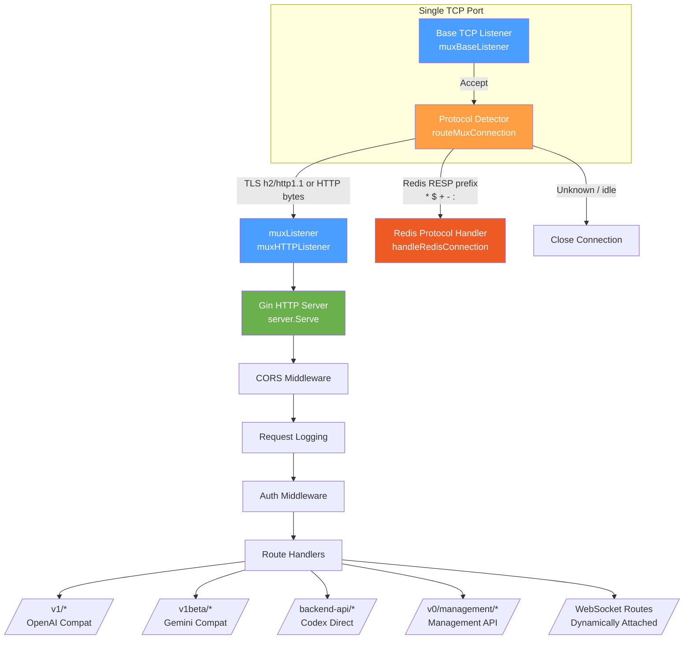
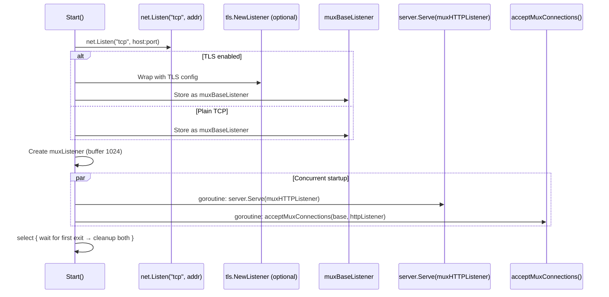
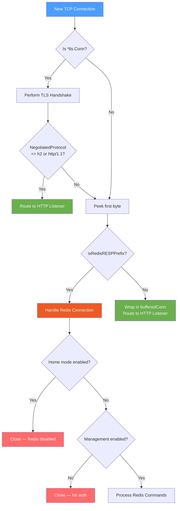

The HTTP server in CLIProxyAPIPlus is the central networking layer that receives all client traffic — from AI API requests to management commands — on a **single TCP port**. What makes this server architecturally distinctive is its built-in **protocol multiplexer**: a shared listener that inspects incoming bytes and dynamically routes each connection to the correct protocol handler (HTTP, Redis RESP, or dropped). This eliminates the need for separate ports and simplifies deployment topology.

## Architecture Overview

The server is built on the Gin web framework and uses a two-tier listener design: a base TCP listener accepts raw connections, then a protocol-detection goroutine classifies each connection by peeking at the first bytes and dispatching it to the appropriate handler — either a virtual HTTP listener or the Redis queue protocol handler.

This diagram represents the full connection lifecycle: raw TCP bytes arrive at the base listener, get classified by the protocol detector, then flow into either the HTTP pipeline or the Redis queue handler. The design ensures that **a single port handles all traffic types** without protocol conflicts.

## Server Construction and Lifecycle

### Server Struct and Options Pattern

The `Server` struct encapsulates the Gin engine, the underlying `http.Server`, the protocol multiplexer listeners, all API handlers, and runtime state like WebSocket route tracking and management enablement. Construction follows the functional options pattern, allowing callers to inject middleware, configurators, hooks, and plugin hosts without modifying the core struct definition.

Sources: [server.go](internal/api/server.go#L196-L255)

Key server fields worth understanding:

| Field | Type | Purpose |
|-------|------|---------|
| `engine` | `*gin.Engine` | Gin web framework instance with all middleware and routes |
| `muxBaseListener` | `net.Listener` | The real TCP listener — shared entry point for all protocols |
| `muxHTTPListener` | `*muxListener` | Virtual channel-based listener fed by the protocol detector |
| `accessManager` | `*sdkaccess.Manager` | Authentication provider registry for request validation |
| `wsRoutes` | `map[string]struct{]` | Tracks dynamically registered WebSocket upgrade paths |
| `managementRoutesEnabled` | `atomic.Bool` | Gate for management endpoints — only active when a secret key exists |
| `pluginHost` | `*pluginhost.Host` | Dynamic plugin Management API route dispatch owner |

Sources: [server.go](internal/api/server.go#L276-L418)

The `NewServer` constructor accepts a variadic set of `ServerOption` functions, each of which mutates a `serverOptionConfig` before the engine is built. This pattern supports extensibility without constructor overloads.

### Options Interface

| Option | Effect |
|--------|--------|
| `WithMiddleware(mw...)` | Appends additional Gin handlers after core middleware |
| `WithEngineConfigurator(fn)` | Pre-route engine mutation (e.g., custom logger) |
| `WithRouterConfigurator(fn)` | Post-route registration hook for custom endpoints |
| `WithKeepAliveEndpoint(timeout, onTimeout)` | Adds a `/v0/management/keep-alive` endpoint for TUI liveness detection |
| `WithPluginHost(host)` | Connects dynamic plugin HTTP adapters |
| `WithLocalManagementPassword(pw)` | Enables localhost-only management access without a configured secret |
| `WithConfigReloadHook(fn)` | Callback after management config saves trigger hot-reload |
| `WithExampleAPIKeySafeMode()` | Blocks proxy endpoints while template API keys are configured |

Sources: [server.go](internal/api/server.go#L114-L194)

### Start Method — Connecting the Pipeline

The `Start` method is where the two-tier listener architecture comes to life. It performs four critical operations in sequence:

1. **Opens a raw TCP listener** on the configured host:port.
2. **Optionally wraps it in TLS** (with HTTP/2 negotiation via `NextProtos: ["h2", "http/1.1"]`).
3. **Creates the virtual `muxListener`** (buffered channel of 1024 connections).
4. **Launches two concurrent goroutines**: one running `server.Serve(httpListener)` and one running `acceptMuxConnections(listener, httpListener)`.

The select block then waits for either goroutine to exit and ensures both listeners are cleaned up.

Sources: [server.go](internal/api/server.go#L1649-L1746)

Sources: [server.go](internal/api/server.go#L1649-L1746)

### Graceful Shutdown

The `Stop` method orchestrates a graceful shutdown sequence: it closes the virtual HTTP listener (which unblocks `server.Serve`), closes the base TCP listener (which unblocks the accept loop), then calls `server.Shutdown(ctx)` to drain active HTTP connections with context-based timeout.

Sources: [server.go](internal/api/server.go#L1756-L1782)

## Protocol Multiplexing Deep Dive

### The Core Detection Logic

The protocol multiplexer is implemented in `routeMuxConnection`, which runs as a goroutine per accepted connection. Its detection strategy follows a clear priority chain:

1. **TLS connections**: If the connection is a `*tls.Conn`, perform the TLS handshake first, then check `ConnectionState().NegotiatedProtocol`. If it is `"h2"` or `"http/1.1"`, route to the HTTP listener. Other ALPN protocols (like Redis over TLS) would fall through to byte-level inspection.

2. **Byte-level peek**: For non-TLS or non-HTTP TLS connections, use a `bufio.Reader` to `Peek(1)` the first byte and check it against Redis RESP prefix characters (`*`, `$`, `+`, `-`, `:`).

3. **Fallback**: If the prefix matches Redis, route to `handleRedisConnection`. Otherwise, wrap the connection in a `bufferedConn` (preserving the already-peeked byte) and forward it to the HTTP listener.

4. **Idle connection protection**: A 10-second read deadline prevents connections that never send data from blocking the protocol detector indefinitely. This was added to fix issue #3267, where idle TCP connections caused accept-loop starvation.

Sources: [protocol_multiplexer.go](internal/api/protocol_multiplexer.go#L61-L137)

### The muxListener — Channel-Based Virtual Listener

The `muxListener` is a lightweight adapter that implements `net.Listener` using a buffered Go channel instead of a real socket. When the protocol detector determines a connection is HTTP, it calls `Put(conn)`, which pushes the connection into the channel. The Gin HTTP server calls `Accept()` on this virtual listener, which blocks on the channel until a connection is available.

This design achieves several things:
- **Decoupling**: The HTTP server and the accept loop run independently.
- **Buffering**: The 1024-connection buffer absorbs burst traffic without blocking the accept loop.
- **Clean shutdown**: Closing the `closeCh` channel unblocks both `Accept` and `Put`, allowing orderly teardown.

Sources: [mux_listener.go](internal/api/mux_listener.go#L8-L68)

### bufferedConn — Preserving Peeked Bytes

When a connection's first byte is peeked (but not consumed) during protocol detection, it must be wrapped in a `bufferedConn` before being handed to the HTTP server. This adapter delegates `Read` to the `bufio.Reader` that already holds the peeked data, ensuring no bytes are lost. It also preserves `tls.ConnectionState()` passthrough for TLS connections that were detected after byte-level inspection.

Sources: [buffered_conn.go](internal/api/buffered_conn.go#L9-L33)

### Redis Queue Protocol Handler

The Redis protocol handler implements a subset of the Redis RESP protocol to expose the in-memory usage and error queues. It supports:

| Command | Behavior |
|---------|----------|
| `AUTH <password>` | Validates against the management secret key (with IP-based brute-force protection) |
| `SUBSCRIBE usage` | Streams real-time usage records via Redis pub/sub protocol |
| `SUBSCRIBE errors` | Streams real-time error records |
| `LPOP/RPOP usage [count]` | Pops oldest usage records from the queue |
| `PING` | Responds with PONG (within subscription mode) |
| `UNSUBSCRIBE` / `QUIT` | Closes the subscription/connection |

The handler is gated by two runtime checks: home mode must be disabled, and management routes must be enabled (which requires a configured secret key or Home integration).

Sources: [redis_queue_protocol.go](internal/api/redis_queue_protocol.go#L27-L224)

## Middleware Pipeline

The middleware stack is assembled in `NewServer` and applied in a specific order that determines how each request flows through the system:

Sources: [server.go](internal/api/server.go#L294-L318)

### Middleware Descriptions

| Middleware | Scope | Purpose |
|------------|-------|---------|
| `GinLogrusRecovery()` | Global | Catches panics, logs stack traces, returns 500 |
| `CPATraceIDMiddleware()` | Global | Injects a unique request trace ID into context and response header |
| `RequestLoggingMiddleware` | Global | Captures request/response bodies, headers, latency; writes to rotating log files |
| `corsMiddleware()` | Global | Adds `Access-Control-*` headers for cross-origin access |
| `homeHeartbeatMiddleware()` | Global | Returns 503 until Home control plane heartbeat is healthy |
| `exampleAPIKeySafeModeMiddleware()` | Global | Blocks proxy endpoints when template/placeholder API keys are configured |
| `AuthMiddleware(manager)` | Per-route group | Validates API key via the access manager, sets `userApiKey` and `accessProvider` in context |

Sources: [server.go](internal/api/server.go#L1784-L1803), [server.go](internal/api/server.go#L2003-L2029)

## HTTP Route Architecture

The server registers routes organized by protocol compatibility group, each protected by the `AuthMiddleware`:

| Route Group | Prefix | Handler Source | Purpose |
|-------------|--------|---------------|---------|
| OpenAI Compatible | `/v1/` | `openai.OpenAIAPIHandler` | Chat completions, completions, images, models |
| Claude Messages | `/v1/messages` | `claude.ClaudeCodeAPIHandler` | Claude Messages API compatibility |
| OpenAI Responses | `/v1/responses` | `openai.OpenAIResponsesAPIHandler` | New Responses API (HTTP + WebSocket) |
| Gemini Compatible | `/v1beta/` | `gemini.GeminiAPIHandler` | Interactions, model routing |
| Gemini CLI | `/v1internal:method` | `gemini.GeminiCLIAPIHandler` | Gemini CLI protocol |
| Codex Direct | `/backend-api/codex/` | Same as Responses | ChatGPT base URL compatibility |
| Video (OpenAI) | `/openai/v1/videos` | `openai.OpenAIVideosHandler` | Video generation and retrieval |
| Management | `/v0/management/` and `/management/` | `managementHandlers.Handler` | Full management API |
| Health Check | `/healthz` | Inline | Returns `{"status": "ok"}` |
| OAuth Callbacks | `/{provider}/callback` | Inline | Receives OAuth redirects for all providers |

Sources: [server.go](internal/api/server.go#L509-L680)

### OAuth Callback Endpoints

The server registers OAuth callback routes for six providers — Anthropic, Codex, GitLab, Google, Antigravity, and Kiro — all sharing the same port as the API server. Each callback writes the received code/state to a pending session file for the waiting authentication goroutine. This eliminates the need for a separate callback server during login flows.

Sources: [server.go](internal/api/server.go#L592-L677)

### WebSocket Route Attachment

WebSocket routes are not registered during initial server construction. Instead, they are attached dynamically via `AttachWebsocketRoute`, which registers a Gin GET handler with conditional authentication (gated by `wsAuthEnabled`). This supports runtime toggle of WebSocket authentication without server restart. Routes are tracked in `wsRoutes` to prevent duplicate registration.

Sources: [server.go](internal/api/server.go#L816-L849)

## Management API Registration

Management routes are registered lazily via `registerManagementRoutes` — they only become available when a secret key is configured (via YAML, environment variable, or TUI local password). The method uses `CompareAndSwap` on `managementRoutesRegistered` to ensure single-execution semantics.

Both `/v0/management/` and `/management/` prefixes are registered with identical handlers, each protected by the `managementAvailabilityMiddleware` (which returns 404 when management is disabled) and the management auth middleware.

Sources: [server.go](internal/api/server.go#L851-L1008)

## Configuration Parameters

The HTTP server's behavior is driven by the YAML configuration file:

| Parameter | Type | Default | Description |
|-----------|------|---------|-------------|
| `host` | string | `""` (all interfaces) | Network interface to bind. Use `127.0.0.1` for local-only. |
| `port` | int | `8317` | TCP port for all traffic (HTTP, Redis, WebSocket) |
| `tls.enable` | bool | `false` | Enables HTTPS with TLS certificate |
| `tls.cert` | string | `""` | Path to TLS certificate file |
| `tls.key` | string | `""` | Path to TLS private key file |
| `home.enabled` | bool | `false` | Enables Home control plane (changes Redis protocol behavior) |
| `remote-management.secret-key` | string | `""` | Management authentication key (plaintext or bcrypt) |
| `remote-management.allow-remote` | bool | `false` | Allow non-localhost management access |
| `ws-auth` | bool | `false` | Enable authentication for WebSocket endpoints |
| `commercial-mode` | bool | `false` | Disables request logging and overhead middleware |

Sources: [config.example.yaml](config.example.yaml#L1-L96), [config.go](internal/config/config.go#L30-L110)

## Key Design Decisions

**Single-port multiplexing over separate ports**: By inspecting the first byte of each connection, the server avoids requiring users to configure multiple ports for different protocol types. This simplifies firewall rules, Docker port mappings, and reverse proxy configurations.

**Goroutine-per-connection routing with deadline**: Each connection is dispatched to its own goroutine for protocol detection, with a 10-second read deadline. This prevents idle or malicious connections from blocking the accept loop — a lesson learned from production issue #3267.

**Channel-based virtual listener**: Using a Go channel as the interface between the protocol detector and the HTTP server provides natural backpressure and clean shutdown semantics without custom synchronization primitives.

**Lazy management route registration**: Management endpoints are only registered when a secret key exists, reducing attack surface in deployments that don't use remote management.

## Next Steps

- For the request authentication system that gates access to all API routes, see [Authentication System and Provider Login Flows](7-authentication-system-and-provider-login-flows).
- To understand how incoming requests are translated between OpenAI/Claude/Gemini formats, see [Translator Registry and Format Conversion](8-translator-registry-and-format-conversion).
- For how the application is bootstrapped with CLI flags, see [Application Entry Point and CLI Flags](5-application-entry-point-and-cli-flags).
- To learn about the Redis queue system that feeds the protocol multiplexer's Redis handler, see [Usage Tracking and Redis Queue](20-usage-tracking-and-redis-queue).