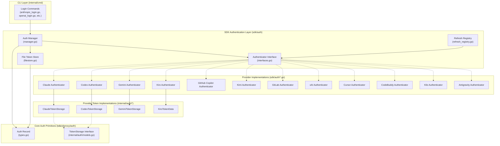
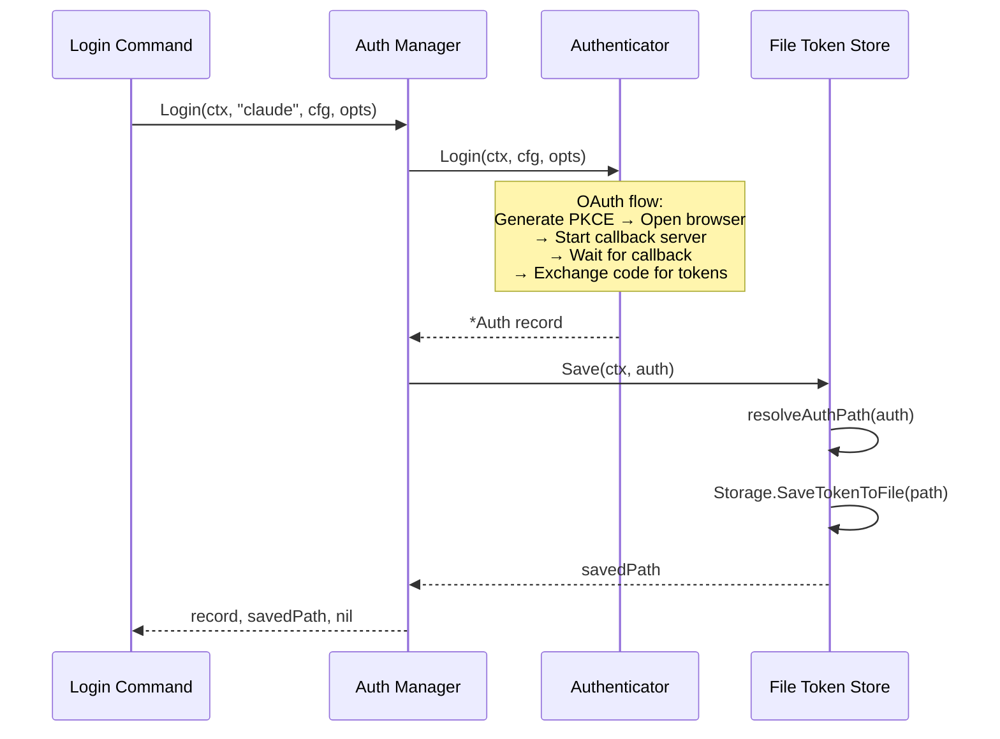
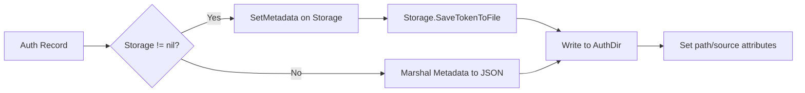
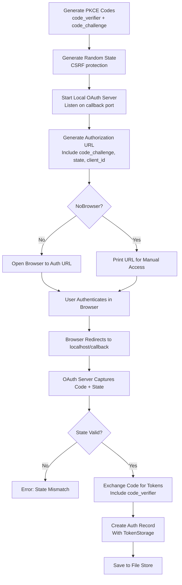
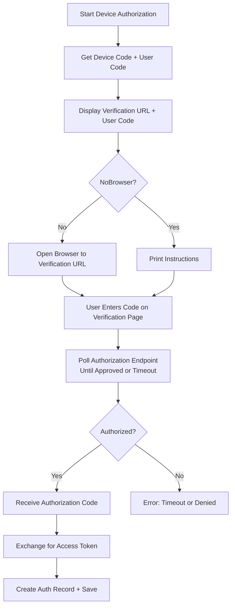
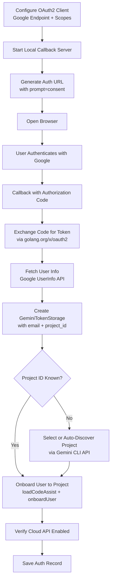

CLIProxyAPI Plus implements a multi-provider credential management system that handles authentication flows for 14 distinct AI service providers. The system is built on a plugin-like `Authenticator` interface, a unified `Auth` record model, and a pluggable `TokenStore` — enabling new providers to be onboarded without modifying core login orchestration or credential persistence logic.

This page explains the authentication architecture, the provider-specific OAuth and device flow implementations, the credential persistence lifecycle, and how runtime token refresh is coordinated.

## Core Architecture Overview

The authentication system follows a layered design that cleanly separates login orchestration, credential representation, and persistence. The diagram below shows the primary component relationships.



Sources: [interfaces.go](sdk/auth/interfaces.go#L1-L30), [manager.go](sdk/auth/manager.go#L1-L90), [filestore.go](sdk/auth/filestore.go#L1-L100), [models.go](internal/auth/models.go#L1-L18), [types.go](sdk/cliproxy/auth/types.go#L1-L200)

## The Authenticator Interface

Every provider login flow implements the `Authenticator` interface defined in `sdk/auth`. This three-method contract governs provider identity, login execution, and proactive refresh scheduling.

```go
type Authenticator interface {
    Provider() string
    Login(ctx context.Context, cfg *config.Config, opts *LoginOptions) (*coreauth.Auth, error)
    RefreshLead() *time.Duration
}
```

The `Provider()` method returns a unique string identifier (e.g., `"claude"`, `"codex"`, `"gemini"`) used for routing within the `Manager`. The `Login()` method orchestrates the full interactive authentication flow — generating authorization URLs, handling callbacks, exchanging codes for tokens, and returning an `Auth` record. The `RefreshLead()` method returns a duration specifying how far before token expiry a proactive refresh should be attempted. Providers that don't support traditional OAuth refresh (e.g., GitHub Copilot) return `nil`.

The `LoginOptions` struct provides cross-cutting configuration for all flows:

| Option | Type | Purpose |
|--------|------|---------|
| `NoBrowser` | `bool` | Skip automatic browser opening; display URL for manual access |
| `CallbackPort` | `int` | Override the local OAuth callback port |
| `ProjectID` | `string` | Google Cloud project ID (Gemini-specific) |
| `Metadata` | `map[string]string` | Provider-specific parameters (e.g., `"codex_login_mode"`, `"start-url"`) |
| `Prompt` | `func(string) (string, error)` | Interactive input function for headless/SSH environments |

Sources: [interfaces.go](sdk/auth/interfaces.go#L14-L30), [auth_manager.go](internal/cmd/auth_manager.go#L1-L28)

## Auth Manager and Token Store Registry

The `Manager` struct aggregates all registered authenticators and coordinates login execution with credential persistence. A singleton `FileTokenStore` handles all file-based persistence, managed through a global store registry.



The `newAuthManager()` function constructs the manager with all 12 registered authenticators:

Sources: [auth_manager.go](internal/cmd/auth_manager.go#L1-L28), [manager.go](sdk/auth/manager.go#L37-L90), [store_registry.go](sdk/auth/store_registry.go#L1-L36)

## The Auth Record Model

Every credential in the system is represented by the `Auth` struct defined in `sdk/cliproxy/auth/types.go`. This is the universal credential container that flows through the entire system — from login through runtime request routing and refresh scheduling.

Key fields of the `Auth` record:

| Field | Type | Purpose |
|-------|------|---------|
| `ID` | `string` | Unique identifier across restarts, derived from filename |
| `Index` | `string` | Stable runtime hash for routing deduplication |
| `Provider` | `string` | Upstream provider key (e.g., `"gemini"`, `"claude"`, `"codex"`) |
| `FileName` | `string` | Relative or absolute path of the backing auth JSON file |
| `Storage` | `TokenStorage` | Token persistence implementation (used during login) |
| `Status` | `Status` | Lifecycle status (`Active`, `Disabled`, etc.) |
| `Metadata` | `map[string]any` | Runtime mutable provider state (tokens, email, expiry, etc.) |
| `Attributes` | `map[string]string` | Immutable configuration (path, source, auth_kind, etc.) |
| `NextRefreshAfter` | `time.Time` | Earliest time a refresh should retrigger |
| `Quota` | `QuotaState` | Rate limit tracking with backoff level |

The `AccountInfo()` method provides a provider-aware way to extract the logged-in user identity, returning both the authentication kind (`"oauth"`, `"api_key"`, `"personal_access_token"`) and the user identifier.

Sources: [types.go](sdk/cliproxy/auth/types.go#L66-L130), [types.go](sdk/cliproxy/auth/types.go#L469-L530)

## File-Based Token Storage

The `FileTokenStore` persists `Auth` records as JSON files in the configured `AuthDir` (default: `~/.cli-proxy-api`). Each provider saves its own JSON format through the `TokenStorage` interface, while the store handles directory management, path resolution, and plugin auth expansion.

The persistence flow for a typical OAuth login:

1. The authenticator returns an `Auth` with `Storage` set to a provider-specific `TokenStorage` implementation (e.g., `ClaudeTokenStorage`).
2. `FileTokenStore.Save()` resolves the output path from the auth's `FileName` or `ID` attributes.
3. If `Storage` implements the private `metadataSetter` interface, runtime metadata is injected into the storage before writing.
4. `Storage.SaveTokenToFile(path)` serializes the token data and writes it to disk.
5. Path attributes (`path`, `source`, `source_backend`) are set on the auth record.

For providers without a `Storage` implementation (e.g., those using `Metadata`-only persistence), the store directly marshals the `Metadata` map to JSON.



Sources: [filestore.go](sdk/auth/filestore.go#L95-L170), [filestore.go](sdk/auth/filestore.go#L200-L280)

## Provider Login Flows

### Authentication Flow Categories

The supported providers use four distinct authentication flow patterns:

| Flow Pattern | Providers | Mechanism |
|-------------|-----------|-----------|
| **OAuth2 + PKCE** | Claude, Codex, GitLab, Cursor | Local callback server captures authorization code; PKCE verifies code exchange |
| **OAuth Device Code** | GitHub Copilot, Kimi, xAI | Display user code + verification URL; poll until user authorizes |
| **Google OAuth2** | Gemini, Antigravity | Standard Google OAuth2 with `golang.org/x/oauth2`; local callback server |
| **AWS SSO OIDC** | Kiro | Register OIDC client → Device code flow or Authorization code flow via AWS SSO |

### OAuth2 with PKCE Flow

The PKCE (Proof Key for Code Exchange) flow is used by Claude, Codex, GitLab, and Cursor. This flow provides the highest security for public clients by binding the authorization code exchange to the original request.



Each provider configures its own OAuth endpoints and client identifiers:

| Provider | Auth URL | Token URL | Client ID | Callback Port |
|----------|----------|-----------|-----------|---------------|
| Claude | `claude.ai/oauth/authorize` | `api.anthropic.com/v1/oauth/token` | `9d1c250a-...` | 54545 |
| Codex | `auth.openai.com/oauth/authorize` | `auth.openai.com/oauth/token` | `app_EMoamEEZ73f0CkXaXp7hrann` | 1455 |
| Gemini | `accounts.google.com/o/oauth2/v2/auth` | `oauth2.googleapis.com/token` | `681255809395-...` | 8085 |
| GitLab | User-configured | User-configured | User-provided | 54545 |

Sources: [anthropic_auth.go](internal/auth/claude/anthropic_auth.go#L36-L50), [openai_auth.go](internal/auth/codex/openai_auth.go#L26-L34), [gemini_auth.go](internal/auth/gemini/gemini_auth.go#L28-L36), [pkce.go](internal/auth/claude/pkce.go#L1-L57)

### Device Code Flow

GitHub Copilot, Kimi, and xAI use the OAuth 2.0 device authorization grant (RFC 8628). This flow is simpler for the server since it only requires polling, but requires the user to visit a separate verification URL and enter a code.



Sources: [github_copilot.go](sdk/auth/github_copilot.go#L40-L80), [xai.go](sdk/auth/xai.go#L36-L70), [codex_device.go](sdk/auth/codex_device.go#L72-L120)

### Google OAuth2 Flow (Gemini & Antigravity)

Gemini and Antigravity use Google's standard OAuth2 flow via the `golang.org/x/oauth2` library. After initial OAuth, Gemini performs additional Cloud Code Assist onboarding (`loadCodeAssist` → `onboardUser`) to associate the user with a Google Cloud project.



Sources: [gemini_auth.go](internal/auth/gemini/gemini_auth.go#L80-L120), [login.go](internal/cmd/login.go#L200-L380)

### Kiro (AWS SSO OIDC) Flow

Kiro supports two authentication methods: **AWS Builder ID** (public OAuth for individual developers) and **AWS IAM Identity Center** (enterprise SSO). The `LoginWithMethodSelection()` method presents a choice to the user.

Sources: [kiro.go](sdk/auth/kiro.go#L90-L120), [sso_oidc.go](internal/auth/kiro/sso_oidc.go#L1-L100)

## Token Refresh and Expiry Management

The system implements proactive token refresh through the `RefreshLead()` mechanism and the `RefreshRegistry`. Each authenticator declares a lead time — the duration before token expiry when refresh should be attempted.

| Provider | Refresh Lead | Refresh Strategy |
|----------|-------------|-----------------|
| Claude | 4 hours | OAuth2 refresh token exchange with rate-limit backoff |
| Codex | 5 days | OAuth2 refresh token exchange |
| Kimi | Provider-specific | Token exchange |
| Kiro | 20 minutes | AWS token refresh with cooldown management |
| GitLab | 5 minutes | OAuth2 refresh token exchange |
| Cursor | 10 minutes | OAuth2 refresh token exchange |
| Antigravity | Provider-specific | Google token refresh |
| GitHub Copilot | `nil` (no refresh) | Validates existing token on use |

The `RefreshRegistry` in `sdk/auth/refresh_registry.go` maps provider keys to their authenticator factories, enabling the runtime to determine the appropriate refresh behavior for any credential:

Sources: [refresh_registry.go](sdk/auth/refresh_registry.go#L1-L33), [types.go](sdk/cliproxy/auth/types.go#L730-L780)

## Error Handling and Resilience

Authentication errors are structured into two types: `AuthenticationError` (flow-level failures like port conflicts and timeouts) and `OAuthError` (provider-level OAuth protocol errors). Both implement `Error()` and provide user-friendly messages through `GetUserFriendlyMessage()`.

Claude's token refresh includes a `singleflight.Group` to deduplicate concurrent refresh requests for the same refresh token, plus a backoff mechanism that blocks repeated failed refresh attempts:

| Error Type | Code | User Message |
|-----------|------|-------------|
| `port_in_use` | 13 | "The required port is already in use." |
| `callback_timeout` | 408 | "Authentication timed out." |
| `code_exchange_failed` | 400 | "Failed to exchange authorization code." |
| `invalid_state` | 400 | "OAuth state parameter is invalid." |
| `server_start_failed` | 500 | "Failed to start OAuth callback server." |

Sources: [errors.go](internal/auth/claude/errors.go#L1-L168), [anthropic_auth.go](internal/auth/claude/anthropic_auth.go#L55-L100)

## Runtime Access Control

Beyond credential login, the system includes a separate request-level access control layer via `sdk/access`. The `config_access` provider validates incoming API requests against statically configured API keys (from `config.yaml`), checking multiple header formats (`Authorization: Bearer`, `X-Goog-Api-Key`, `X-Api-Key`) and query parameters (`key`, `auth_token`). This is distinct from the provider OAuth authentication — it gates who can use the proxy, while OAuth credentials determine which upstream providers are available.

Sources: [provider.go](internal/access/config_access/provider.go#L1-L142), [reconcile.go](internal/access/reconcile.go#L1-L128)

## Adding a New Provider

To add a new provider login flow:

1. Create the internal auth implementation in `internal/auth/<provider>/` (token types, OAuth logic).
2. Implement the `Authenticator` interface in `sdk/auth/<provider>.go`.
3. Register the authenticator in `newAuthManager()` in [auth_manager.go](internal/cmd/auth_manager.go#L13-L26).
4. Register refresh lead in [refresh_registry.go](sdk/auth/refresh_registry.go#L1-L33).
5. Create a login command entry point in `internal/cmd/<provider>_login.go`.
6. Add the provider to the TUI OAuth tab in [oauth_tab.go](internal/tui/oauth_tab.go#L32-L40).

Sources: [auth_manager.go](internal/cmd/auth_manager.go#L13-L26), [refresh_registry.go](sdk/auth/refresh_registry.go#L1-L33)

## Next Steps

- [Request Translation Pipeline](8-translator-registry-and-format-conversion) — Understand how authenticated credentials feed into request translation
- [Dynamic Model Registry and Discovery](14-dynamic-model-registry-and-discovery) — How provider models are discovered from authenticated sessions
- [Configuration Reference](3-configuration-reference) — Full auth directory and credential configuration options