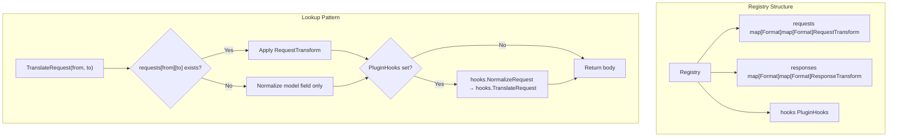
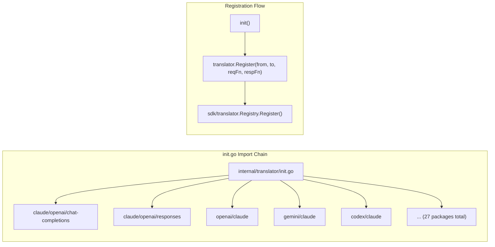
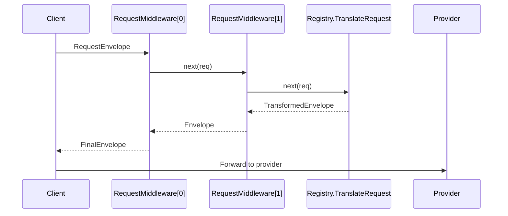

The translator registry is the **central nervous system** of CLIProxyAPIPlus's multi-provider architecture. It provides a type-safe, concurrent-safe mechanism for converting request and response payloads between incompatible AI API schemas — enabling any client speaking one protocol to seamlessly communicate with any provider speaking another. This page covers the SDK-level registry design, the format abstraction, the transform function signatures, the pipeline middleware system, and the plugin hook extension points.

## Format Abstraction

Every AI provider exposes a distinct request/response schema. The system models these schemas as string-typed **format identifiers**, each representing a complete API contract. The `Format` type is a simple string wrapper that provides type safety while remaining interoperable with plain string constants.

Sources: [sdk/translator/format.go](sdk/translator/format.go#L1-L15)

Seven built-in formats are defined as package-level constants in the SDK, each corresponding to a distinct API surface:

| Format Constant | Value | Description |
|---|---|---|
| `FormatOpenAI` | `"openai"` | OpenAI Chat Completions API (`/v1/chat/completions`) |
| `FormatOpenAIResponse` | `"openai-response"` | OpenAI Responses API (`/v1/responses`) |
| `FormatClaude` | `"claude"` | Anthropic Claude Messages API |
| `FormatGemini` | `"gemini"` | Google Gemini GenerateContent API |
| `FormatCodex` | `"codex"` | OpenAI Codex CLI wire format |
| `FormatAntigravity` | `"antigravity"` | Antigravity provider format |
| `FormatInteractions` | `"interactions"` | Google Gemini Interactions API |

Sources: [sdk/translator/formats.go](sdk/translator/formats.go#L1-L13)

The internal constant package mirrors these values plus additional provider identifiers like `"gemini-cli"`, `"kiro"`, and `"kilo"`, which are used during authentication routing but may share the same wire format as an existing translator path.

Sources: [internal/constant/constant.go](internal/constant/constant.go#L1-L40)

## Transform Function Signatures

The registry operates on three categories of transform functions, each designed for a specific point in the request/response lifecycle. All transforms operate on raw JSON byte slices, avoiding intermediate struct allocations and enabling zero-copy passthrough when no transformation is needed.

**RequestTransform** converts an incoming client request from one format to the target provider's format. It receives the resolved model name, the raw JSON payload, and a stream flag, returning the transformed payload as a byte slice.

**ResponseStreamTransform** processes individual streaming chunks. It receives the full context, model name, both the original and translated request payloads (for reference), the current response chunk, and a mutable parameter pointer for accumulating state across chunks. It returns a slice of byte arrays because a single input chunk may produce multiple output chunks (e.g., splitting reasoning content from main output).

**ResponseNonStreamTransform** handles complete non-streaming responses with the same reference payloads, returning a single transformed byte slice.

**ResponseTokenCountTransform** normalizes token count values between provider-specific representations.

Sources: [sdk/translator/types.go](sdk/translator/types.go#L1-L35)

These are grouped into a `ResponseTransform` struct that bundles stream, non-stream, and token count transforms into a single registration unit.

## Registry Core Architecture

The `Registry` struct is the heart of the translation system. It maintains two thread-safe maps — one for request transforms and one for response transforms — keyed by `(from, to)` format pairs. A `sync.RWMutex` protects concurrent access, allowing multiple goroutines to read transforms simultaneously while serializing registrations.



Sources: [sdk/translator/registry.go](sdk/translator/registry.go#L1-L50)

### Registration and Lookup

Registration associates a `(from, to)` format pair with request and response transforms. When looking up a transform, the registry uses a **nested map pattern**: the outer key is the source format, and the inner key is the target format. This yields O(1) lookup for any format pair.

A critical design decision: when no registered transform exists for a `(from, to)` pair, the registry does **not** simply return the original payload. Instead, it still normalizes the `"model"` field to strip client-side prefixes (e.g., `"copilot/gpt-5-mini"` becomes `"gpt-5-mini"`), preventing provider-internal identifiers from leaking upstream.

Sources: [sdk/translator/registry.go](sdk/translator/registry.go#L55-L85)

### Response Translation Flow

Response translation applies transforms in the opposite direction from requests: the **source** is the provider's response format and the **target** is what the client expects. The registry's `TranslateStream` method demonstrates the layered approach:

1. **Normalization Before**: `hooks.NormalizeResponseBefore` preprocesses the raw provider response
2. **Native Transform**: The registered `ResponseStreamTransform` converts the chunk
3. **Plugin Fallback**: If no native transform exists, `hooks.TranslateResponse` provides an alternative
4. **Normalization After**: `hooks.NormalizeResponseAfter` post-processes each output chunk

This four-stage pipeline ensures that plugin hooks can augment or replace built-in translators without modifying them.

Sources: [sdk/translator/registry.go](sdk/translator/registry.go#L120-L160)

### Default Singleton

A package-level `defaultRegistry` singleton provides shared access across the application. Package-level helper functions (`TranslateRequest`, `TranslateStream`, etc.) delegate to this singleton, simplifying call sites throughout the codebase.

Sources: [sdk/translator/registry.go](sdk/translator/registry.go#L220-L279)

## Built-in Translator Registration

All built-in translators self-register using Go's `init()` mechanism. The `internal/translator/init.go` file imports every translator package as a blank import, triggering their `init()` functions at program startup. This creates a **declarative registration pattern** — adding a new translator requires only creating the package and adding one import line.



Sources: [internal/translator/init.go](internal/translator/init.go#L1-L39)

Each translator package follows a consistent structure. The `init.go` file imports constants via dot-import and calls `translator.Register` with:

- **Source format** (the client's API format)
- **Target format** (the provider's API format)  
- **Request transform function** (conversion logic)
- **Response transform struct** (containing stream, non-stream, and optionally token count transforms)

For example, the OpenAI → Claude translator registers:

```go
translator.Register(
    OpenAI,   // source: client sends OpenAI format
    Claude,   // target: provider expects Claude format
    ConvertOpenAIRequestToClaude,          // request transform
    interfaces.TranslateResponse{
        Stream:    ConvertClaudeResponseToOpenAI,      // streaming response
        NonStream: ConvertClaudeResponseToOpenAINonStream, // non-streaming response
    },
)
```

Sources: [internal/translator/openai/claude/init.go](internal/translator/openai/claude/init.go#L1-L21)

### Bidirectional Registration

Some init files register transforms in **both directions** within a single package. The `openai/interactions/chat-completions` package registers both OpenAI → Interactions and Interactions → OpenAI transforms in its `init()` function, co-locating related bidirectional logic.

Sources: [internal/translator/openai/interactions/chat-completions/init.go](internal/translator/openai/interactions/chat-completions/init.go#L1-L29)

### Format Pair Coverage

The benchmark test reveals the full matrix of registered `(source, target)` pairs, demonstrating the system's comprehensive coverage:

| Source Format | Target Formats |
|---|---|
| `claude` | `openai`, `gemini`, `codex`, `interactions`, `antigravity` |
| `gemini` | `openai`, `claude`, `codex`, `interactions`, `antigravity`, `gemini` |
| `openai` | `claude`, `gemini`, `codex`, `interactions`, `antigravity` |
| `openai-response` | `claude`, `gemini`, `codex`, `interactions`, `openai` |
| `interactions` | `claude`, `gemini`, `codex`, `openai`, `openai-response`, `antigravity` |

Note that `gemini → gemini` is a registered pair with passthrough transforms — it normalizes the request without altering the schema, serving as a request sanitization layer.

Sources: [internal/translator/request_benchmark_test.go](internal/translator/request_benchmark_test.go#L30-L50)

## Pipeline Middleware System

The `Pipeline` struct wraps a `Registry` and adds middleware support for both request and response translation. Middleware follows the classic **onion model** — each middleware wraps the next, forming a chain that executes in registration order for requests and in reverse for responses.



Sources: [sdk/translator/pipeline.go](sdk/translator/pipeline.go#L1-L107)

### Request and Response Envelopes

The pipeline uses `RequestEnvelope` and `ResponseEnvelope` structs that carry the format identifier, model name, stream flag, and body bytes. This envelope pattern allows middleware to inspect and modify not just the payload but also the metadata that controls translation behavior.

Sources: [sdk/translator/pipeline.go](sdk/translator/pipeline.go#L8-L23)

### Terminal Handler

The pipeline's terminal handler is the registry's own translate function. Middleware can short-circuit the chain by not calling `next`, or they can modify the envelope before or after the terminal handler executes. This design enables cross-cutting concerns like logging, metrics, caching, and request normalization to be applied uniformly across all format translations.

## Plugin Hook Extension Points

The `PluginHooks` interface provides five extension points that plugins can implement to customize translation behavior without modifying built-in translators. This is the primary mechanism for **third-party extensibility**.

| Hook Method | When Called | Purpose |
|---|---|---|
| `NormalizeRequest` | Before any request transform | Preprocess request payload |
| `TranslateRequest` | When no built-in request transform exists | Provide custom request translation |
| `NormalizeResponseBefore` | Before response transform | Preprocess provider response |
| `TranslateResponse` | When no built-in response transform exists | Provide custom response translation |
| `NormalizeResponseAfter` | After response transform | Post-process translated response |

Sources: [sdk/translator/plugin_hooks.go](sdk/translator/plugin_hooks.go#L1-L13)

The hook execution order in `TranslateRequest` is:

1. Built-in `RequestTransform` executes (if registered)
2. `hooks.NormalizeRequest` always runs, regardless of whether a built-in transform was applied
3. `hooks.TranslateRequest` runs only when **no** built-in transform was found, serving as a fallback

This ensures that plugins can **augment** built-in translators (via normalization hooks) or **replace** them (via translation hooks), but cannot accidentally double-translate when both a built-in and plugin translator exist.

## SDK Bridge and Internal Wrapper

The `internal/translator/translator` package provides a thin wrapper around the SDK's default registry, translating between string-based format identifiers and the SDK's `Format` type. This bridge allows internal code to use simple string constants while maintaining type safety at the SDK boundary.

The wrapper exposes `Register`, `Request`, `Response`, `ResponseNonStream`, and `NeedConvert` functions that accept string format identifiers and delegate to the underlying SDK registry.

Sources: [internal/translator/translator/translator.go](internal/translator/translator/translator.go#L1-L90)

The `interfaces` package provides backward-compatible type aliases that map internal function signatures to SDK types, ensuring that existing translator implementations continue to work without modification during SDK evolution.

Sources: [internal/interfaces/types.go](internal/interfaces/types.go#L1-L16)

## Built-in SDK Entry Point

The `sdk/translator/builtin` package provides a convenience entry point for SDK consumers. By importing `_ "github.com/router-for-me/CLIProxyAPI/v7/sdk/translator/builtin"`, users trigger all built-in translator registrations and gain access to a fully populated registry and pipeline through the `Registry()` and `Pipeline()` helper functions.

Sources: [sdk/translator/builtin/builtin.go](sdk/translator/builtin/builtin.go#L1-L19)

## Common Translation Utilities

The `internal/translator/common` package provides shared utilities used across translator implementations:

- **Cache Control**: `AttachCacheControl` and `AttachMessageCacheControl` copy Claude-compatible `cache_control` objects between message structures, ensuring prompt caching metadata survives format conversion
- **File Data Normalization**: `NormalizeOpenAIFileData` extracts MIME types and base64 payloads from OpenAI's `data:` URL format, enabling image and file content to be translated to provider-specific representations
- **Interactions Usage**: `InteractionsUsage` probes multiple JSON paths to locate usage metadata in the Google Interactions API's nested response structure

Sources: [internal/translator/common/cache_control.go](internal/translator/common/cache_control.go#L1-L68), [internal/translator/common/file_data.go](internal/translator/common/file_data.go#L1-L44), [internal/translator/common/interactions_usage.go](internal/translator/common/interactions_usage.go#L1-L20)

## Next Steps

Understanding the registry's architecture provides the foundation for examining how individual providers implement their specific transformation logic. Each translator package contains detailed message structure conversion, tool call mapping, and streaming event handling tailored to the nuances of its source and target formats.

For provider-specific translator implementations, see [Provider-Specific Translator Implementations](9-provider-specific-translator-implementations). For understanding how the registry integrates with the broader request lifecycle, see [HTTP Server and Protocol Multiplexing](6-http-server-and-protocol-multiplexing). To explore how plugins can extend the translation system, see [Plugin Host and C ABI Integration](12-plugin-host-and-c-abi-integration).