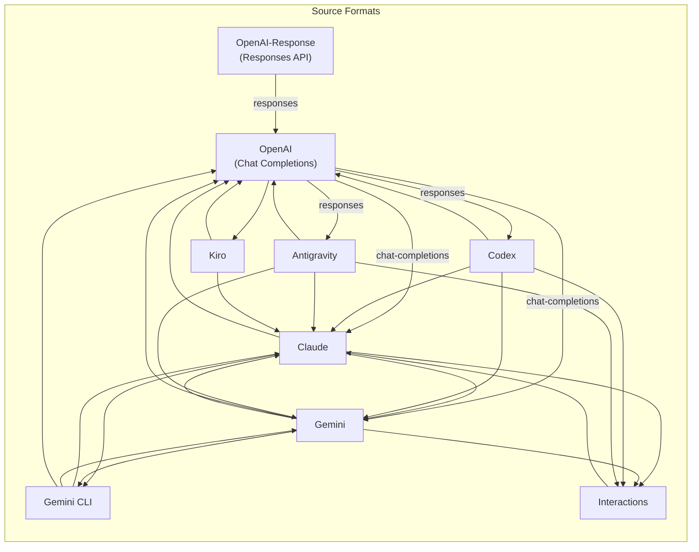

This page documents every built-in translator in the CLIProxyAPIPlus translation mesh. Each translator is a Go package that registers a pair of `RequestTransform` and `ResponseTransform` functions with the central [Translator Registry](8-translator-registry-and-format-conversion) via `init()`. The architecture follows a **source-format → target-format** directory convention, with blank-import activation in `internal/translator/init.go`. Understanding these implementations is critical for anyone extending the proxy with custom providers or diagnosing format-mismatch issues in production.

---

## Registration Mechanism and Lifecycle

Every translator lives under `internal/translator/{source}/{target}/` and follows an identical registration pattern. The package's `init()` function calls `translator.Register(source, target, requestFn, responseStruct)`, where `responseStruct` bundles stream, non-stream, and optionally token-count transforms.

The activation happens through blank imports in a single file that acts as the translation topology manifest:

```go
// internal/translator/init.go
import (
    _ "github.com/router-for-me/CLIProxyAPI/v7/internal/translator/claude/gemini"
    _ "github:///router-for-me/CLIProxyAPI/v7/internal/translator/claude/openai/chat-completions"
    // ... 30+ more imports
)
```

Sources: [internal/translator/init.go](internal/translator/init.go#L1-L39), [internal/translator/openai/claude/init.go](internal/translator/openai/claude/init.go#L1-L21), [internal/translator/translator/translator.go](internal/translator/translator/translator.go#L1-L90)

The internal `translator.Register` wrapper delegates to the SDK's `sdk/translator.Default()` singleton registry. String-based format names (`"openai"`, `"claude"`, etc.) are resolved to typed `Format` values at registration time. The constants originate from `internal/constant/constant.go`:

| Constant | String Value | Purpose |
|----------|-------------|---------|
| `OpenAI` | `"openai"` | OpenAI Chat Completions API |
| `OpenaiResponse` | `"openai-response"` | OpenAI Responses API |
| `Claude` | `"claude"` | Anthropic Messages API |
| `Gemini` | `"gemini"` | Google Generative Language v1beta |
| `Codex` | `"codex"` | OpenAI Responses API (Codex executor variant) |
| `Antigravity` | `"antigravity"` | Antigravity proxy format |
| `Kiro` | `"kiro"` | AWS Kiro/Amazon Q API |
| `GeminiCLI` | `"gemini-cli"` | Google Gemini CLI API |
| `Interactions` | `"interactions"` | Google Interactions API |

Sources: [internal/constant/constant.go](internal/constant/constant.go#L1-L40), [sdk/translator/formats.go](sdk/translator/formats.go#L1-L13)

---

## Translation Topology

The full graph of registered translations forms a mesh where every source format can reach every target format — either directly or through one hop via OpenAI as the hub. The following diagram shows all **directly registered** translation pairs:



Sources: [internal/translator/init.go](internal/translator/init.go#L1-L39)

**Key design insight**: OpenAI Chat Completions serves as the **hub format**. Codex, Antigravity, and Interactions can all reach Claude/Gemini by chaining through OpenAI. The registry's `TranslateRequest` / `TranslateStream` methods handle single-hop lookups; multi-hop routing is performed by the executor layer upstream.

---

## OpenAI Chat Completions ↔ Claude

This is the most complex translator pair, handling bidirectional conversion between OpenAI Chat Completions and Anthropic Messages API formats. The request transformer converts OpenAI messages (with `role`/`content` and `tool_calls`) into Claude's content-block model, while the response transformer reconstructs Claude's SSE event stream from OpenAI delta chunks.

### OpenAI → Claude Request

The `ConvertClaudeRequestToOpenAI` function (Claude-to-OpenAI direction) handles:

- **System message extraction**: Claude's top-level `system` field is split into a `{"role":"system"}` message with typed content blocks.
- **Thinking mode translation**: Claude's `thinking.type`/`thinking.budget_tokens` are mapped to OpenAI's `reasoning_effort` via the `thinking.ConvertBudgetToLevel` helper. Adaptive and disabled thinking are also handled.
- **Content block transformation**: `thinking` blocks become `reasoning_content`, `tool_use` blocks become `tool_calls`, and `tool_result` blocks are converted to `tool` role messages with proper `tool_call_id` mapping.
- **Image conversion**: Claude's `source.media_type`/`source.data` base64 images are converted to OpenAI's `data:` URL format.

Sources: [internal/translator/openai/claude/openai_claude_request.go](internal/translator/openai/claude/openai_claude_request.go#L1-L200)

### Claude → OpenAI Response (Streaming)

The response transformer maintains a **stateful accumulator** (`ConvertOpenAIResponseToAnthropicParams`) that tracks:
- Message ID, model, creation timestamp (extracted from the first chunk)
- Whether `message_start` and `content_block_start` events have been emitted
- Content block indices for text, thinking, and tool-call blocks
- Tool name mapping from the original request (to reverse any name sanitization)

The streaming protocol emits Claude SSE events (`message_start`, `content_block_start`, `content_block_delta`, `content_block_stop`, `message_delta`, `message_stop`) by parsing each OpenAI delta chunk and mapping `reasoning_content` → `thinking_delta`, `content` → `text_delta`, and `tool_calls` → `tool_use` content blocks.

Sources: [internal/translator/openai/claude/openai_claude_response.go](internal/translator/openai/claude/openai_claude_response.go#L1-L200)

### OpenAI → Claude Request (Reverse Direction)

The `ConvertOpenAIRequestToClaude` function handles the inverse: converting OpenAI Chat Completions into Claude Messages API format. This is used when a Claude-native client sends requests through the proxy to an OpenAI backend.

Key transformations include:
- **Reasoning effort → thinking config**: OpenAI's `reasoning_effort` is converted to Claude's `thinking.type` with `output_config.effort` for adaptive models or `thinking.budget_tokens` for legacy models.
- **Tool call ID generation**: Random `toolu_` prefixed IDs are generated since OpenAI tool call IDs may not match Claude's expected format.
- **User ID metadata**: A synthetic `user_id` is generated from UUID-based account/session identifiers for Claude's `metadata` field.
- **System message consolidation**: Multiple system messages and their `cache_control` attributes are merged into the Claude `system` array.

Sources: [internal/translator/claude/openai/chat-completions/claude_openai_request.go](internal/translator/claude/openai/chat-completions/claude_openai_request.go#L1-L200)

---

## OpenAI Chat Completions ↔ Gemini

Bidirectional conversion between OpenAI Chat Completions and Google Gemini v1beta API format.

### OpenAI → Gemini Request

The `ConvertOpenAIRequestToGemini` function performs:

- **Parameter mapping**: `max_tokens`/`max_completion_tokens` → `generationConfig.maxOutputTokens`, `top_p`/`top_k` passthrough, modalities mapping (`"text"` → `"TEXT"`, `"image"` → `"IMAGE"`).
- **Reasoning effort → thinking config**: `"auto"` becomes `thinkingBudget: -1` with `includeThoughts: true`; specific levels become `thinkingLevel`.
- **Message restructuring**: OpenAI's flat `messages` array is split into Gemini's `systemInstruction` (system/developer messages) and `contents` (alternating user/model turns). Tool call IDs are mapped back to function names for `functionResponse` parts.
- **Image handling**: OpenAI's `data:` URLs are decomposed into Gemini's `inlineData` parts with explicit MIME types.
- **Safety settings**: Default safety settings (all categories `OFF` or `BLOCK_NONE`) are attached when absent.

Sources: [internal/translator/gemini/openai/chat-completions/gemini_openai_request.go](internal/translator/gemini/openai/chat-completions/gemini_openai_request.go#L1-L100), [internal/translator/gemini/common/safety.go](internal/translator/gemini/common/safety.go#L1-L48)

### Gemini → OpenAI Response (Streaming)

The `ConvertGeminiResponseToOpenAI` function processes Gemini's streaming response format (JSON payloads with `candidates[].content.parts[]`) and emits OpenAI-compatible `chat.completion.chunk` SSE events. The stateful `convertGeminiResponseToOpenAIChatParams` accumulates:
- Function call indices per candidate (supporting multi-candidate responses)
- Tool call ID generation via an atomic counter (`functionCallIDCounter`)
- Sanitized tool name reverse-mapping

Sources: [internal/translator/gemini/openai/chat-completions/gemini_openai_response.go](internal/translator/gemini/openai/chat-completions/gemini_openai_response.go#L1-L100)

### Gemini → Claude Request

The reverse direction (`ConvertGeminiRequestToClaude`) maps Gemini's `contents[].parts[]` structure to Claude's `messages[].content[]` format, converting `functionCall` → `tool_use` and `functionResponse` → `tool_result`.

Sources: [internal/translator/gemini/claude/init.go](internal/translator/gemini/claude/init.go#L1-L21)

---

## OpenAI Responses API ↔ Chat Completions

The Responses API is OpenAI's newer format using `instructions`/`input`/`tools` instead of `messages`. This translator bridges it with the standard Chat Completions format.

### Responses → Chat Completions

The `ConvertOpenAIResponsesRequestToOpenAIChatCompletions` function:

- Maps `instructions` → system message, `input` array → `messages` array
- Converts `function_call`/`custom_tool_call` input items into assistant `tool_calls` messages
- Converts `function_call_output`/`custom_tool_call_output` items into `tool` role messages
- Handles reasoning content accumulation across tool call batches
- Manages strict tool-call adjacency (ensuring assistant(tool_calls) → tool(tool_call_id) ordering)

Sources: [internal/translator/openai/openai/responses/openai_openai-responses_request.go](internal/translator/openai/openai/responses/openai_openai-responses_request.go#L1-L200)

### Chat Completions → Responses

The reverse direction converts standard messages into the Responses API `input` array, mapping `tool_calls` → `function_call` items and tool responses → `function_call_output` items.

Sources: [internal/translator/openai/openai/responses/init.go](internal/translator/openai/openai/responses/init.go#L1-L20)

---

## Codex (OpenAI Responses Executor)

Codex is registered as a separate format (`"codex"`) that maps to OpenAI Responses API, used specifically by the Codex WebSocket executor. The translation pair `OpenAI → Codex` converts Chat Completions into Responses API format with Codex-specific behavior:

- **Reasoning effort**: Always sets `reasoning.effort` (defaulting to `"medium"`) and `reasoning.summary: "auto"`
- **Stream forced to true**: Codex executor requires streaming
- **Tool name shortening**: Long tool names are abbreviated to fit Codex API constraints
- **Parallel tool calls**: Always enabled (`parallel_tool_calls: true`)
- **Encrypted reasoning content**: Requests include `"reasoning.encrypted_content"` in the `include` field

Sources: [internal/translator/codex/openai/chat-completions/codex_openai_request.go](internal/translator/codex/openai/chat-completions/codex_openai_request.go#L1-L100), [internal/translator/codex/openai/chat-completions/init.go](internal/translator/codex/openai/chat-completions/init.go#L1-L20)

---

## Antigravity

Antigravity is a proxy-native format with bidirectional translators for Claude, Gemini, OpenAI (chat-completions and responses), and Interactions. It includes provider-specific enhancements:

### Claude ↔ Antigravity

The Antigravity translator adds **web search grounding** and **signature validation** on top of standard Claude translation:

- **Web search detection**: If the request contains only `web_search_20250305`/`web_search_20260209` tools with compatible `tool_choice`, the request is intercepted and converted into a Google Search API call with system instructions, domain filtering, and result count limits.
- **Thinking signature handling**: `StripEmptySignatureThinkingBlocks` and `ValidateClaudeBypassSignatures` manage the proxy-generated thinking signature lifecycle for Claude bypass mode.

Sources: [internal/translator/antigravity/claude/web_search.go](internal/translator/antigravity/claude/web_search.go#L1-L100), [internal/translator/antigravity/claude/signature_validation.go](internal/translator/antigravity/claude/signature_validation.go#L1-L47)

Antigravity also maintains translators for Gemini, OpenAI Chat Completions, OpenAI Responses, and Interactions formats — each inheriting from their base Claude/Gemini translators with Antigravity-specific extensions.

---

## Kiro (AWS Amazon Q)

Kiro translates between its proprietary `KiroPayload` structure (with `conversationState`, `profileArn`, `inferenceConfig`) and standard Claude/OpenAI formats. It is the most structurally distinct translator:

### Claude → Kiro Request

The `ConvertClaudeRequestToKiro` function builds a `KiroPayload` with:
- `conversationState.currentMessage.userInputMessage.content` from Claude messages
- `conversationState.history` from preceding messages
- `inferenceConfig` mapping `max_tokens`, `temperature`, `top_p`
- Tool declarations converted to Kiro's tool schema format with 10,237-byte description truncation

### Kiro → Claude Response (Streaming)

The `ConvertKiroStreamToClaude` function parses Kiro's `InvokeModelWithResponseStream` SSE format (with `chunk.bytes` containing base64-encoded JSON) and re-emits as Claude SSE events. It includes:

- **Stream parser**: Incremental parser for Kiro's nested SSE + base64 format
- **Thinking block detection**: Detects `<thinking>...</thinking>` tags in Kiro text output and emits them as Claude `thinking` content blocks
- **Truncation detection**: Monitors for incomplete thinking blocks that may be truncated by Kiro's response limits

Sources: [internal/translator/kiro/openai/kiro_openai_request.go](internal/translator/kiro/openai/kiro_openai_request.go#L1-L50), [internal/translator/kiro/common/constants.go](internal/translator/kiro/common/constants.go#L1-L96), [internal/translator/kiro/common/message_merge.go](internal/translator/kiro/common/message_merge.go#L1-L100)

The Kiro common package also provides **adjacent message merging** — collapsing consecutive same-role messages to satisfy Kiro API requirements, while preserving tool messages individually due to their unique `tool_call_id` identifiers.

---

## Gemini CLI

Gemini CLI is a wrapper format used by Google's CLI client, wrapping Gemini v1beta requests/responses inside a `{"model":"","request":{...}}` envelope. The translators handle:

- **Claude → Gemini CLI**: Wraps Claude messages into `request.contents[]` with `functionDeclarations` tools, `systemInstruction`, and `toolConfig.functionCallingConfig`
- **Gemini CLI → Claude/OpenAI/Gemini**: Unwraps the envelope and delegates to the standard Gemini translators

Sources: [internal/translator/gemini-cli/claude/gemini-cli_claude_request.go](internal/translator/gemini-cli/claude/gemini-cli_claude_request.go#L1-L100)

---

## Interactions (Google Interactions API)

The Interactions format uses a step-based input model (`input[]` with `type: "user_input"/"model_output"/"thought"`) rather than alternating roles. The Claude ↔ Interactions translator handles:

- **Thinking → thought steps**: Claude `thinking` blocks become separate `{"type":"thought"}` input items
- **Tool use → function_call steps**: `tool_use` blocks become `{"type":"function_call"}` items with function name and arguments
- **Tool results → function_response steps**: `tool_result` blocks are converted to function responses
- **Generation config**: Claude's `max_tokens`, `temperature`, `top_p`, `stop_sequences` are mapped to `generation_config.*`
- **Thinking level mapping**: Claude's `thinking.type` → `generation_config.thinking_level` (`disabled` → `"none"`, `enabled` → `"high"`, `adaptive` → `"auto"`)

Sources: [internal/translator/interactions/claude/interactions_claude_request.go](internal/translator/interactions/claude/interactions_claude_request.go#L1-L100), [internal/translator/common/interactions_usage.go](internal/translator/common/interactions_usage.go#L1-L20)

---

## Gemini In-Provider Normalization

The Gemini ↔ Gemini translator is not a cross-format converter but a **request normalizer**. `ConvertGeminiRequestToGemini` ensures incoming v1beta requests are schema-compliant:

- **Role assignment**: Content blocks with missing or invalid roles are assigned alternating `"user"`/`"model"` roles
- **Tool schema normalization**: `functionDeclarations` → `function_declarations`, `parameters` → `parametersJsonSchema`
- **Function response name backfill**: Empty `functionResponse.name` fields are filled from the preceding `functionCall.name`
- **Thought signature sanitization**: Proxy-generated thought signatures are stripped
- **Safety settings**: Default safety settings are attached when absent
- **Response schema key rename**: `responseSchema` → `responseJsonSchema`

Sources: [internal/translator/gemini/gemini/gemini_gemini_request.go](internal/translator/gemini/gemini/gemini_gemini_request.go#L1-L130)

---

## Common Utilities

The `internal/translator/common/` package provides shared building blocks used across all translator implementations:

| Utility | Purpose | Used By |
|---------|---------|---------|
| `bytes.go` — `JoinRawArray` / `SetRawArrayItems` | Efficient raw JSON array construction without intermediate marshaling | All translators |
| `bytes.go` — `SSEEventData` / `AppendSSEEventBytes` | SSE event formatting helpers | All streaming response translators |
| `bytes.go` — `GeminiTokenCountJSON` / `ClaudeInputTokensJSON` | Provider-specific token count JSON builders | Token count translators |
| `cache_control.go` — `AttachCacheControl` / `AttachMessageCacheControl` | Claude `cache_control` attribute propagation | Claude ↔ OpenAI translators |
| `claude_system.go` — `ClaudeMessageSystemReminderText` | Converts Claude system-role messages to `<system-reminder>` wrapped text | Claude → non-Claude translators |
| `file_data.go` — `NormalizeOpenAIFileData` | Parses OpenAI `data:` URLs and file attachments into MIME + base64 | OpenAI → Gemini/Gemini-CLI translators |
| `interactions_usage.go` — `InteractionsUsage` | Extracts usage from multiple possible paths in Interactions responses | Interactions response translators |

Sources: [internal/translator/common/bytes.go](internal/translator/common/bytes.go#L1-L109), [internal/translator/common/cache_control.go](internal/translator/common/cache_control.go#L1-L68), [internal/translator/common/claude_system.go](internal/translator/common/claude_system.go#L1-L57), [internal/translator/common/file_data.go](internal/translator/common/file_data.go#L1-L44)

---

## Cross-Cutting Concerns

### Thinking and Reasoning Mode Translation

Every translator that touches thinking/reasoning must map between provider-specific representations. The translation chain flows through the `internal/thinking` package:

| Source Format | Target Format | Mapping |
|--------------|---------------|---------|
| Claude `thinking.type: "enabled"` + `budget_tokens` | OpenAI `reasoning_effort` | `thinking.ConvertBudgetToLevel(budget)` |
| Claude `thinking.type: "adaptive"` | OpenAI `reasoning_effort: "auto"` | Direct mapping |
| OpenAI `reasoning_effort` | Claude `thinking.type` + `budget_tokens` or `output_config.effort` | `thinking.ConvertLevelToBudget` / adaptive path |
| OpenAI `reasoning_effort` | Gemini `thinkingConfig.thinkingBudget` / `thinkingLevel` | `"auto"` → `thinkingBudget: -1` |
| OpenAI `reasoning_effort` | Codex `reasoning.effort` | Direct passthrough |

Sources: [internal/translator/openai/claude/openai_claude_request.go](internal/translator/openai/claude/openai_claude_request.go#L66-L99), [internal/translator/claude/openai/chat-completions/claude_openai_request.go](internal/translator/claude/openai/chat-completions/claude_openai_request.go#L70-L117), [internal/translator/gemini/openai/chat-completions/gemini_openai_request.go](internal/translator/gemini/openai/chat-completions/gemini_openai_request.go#L44-L57)

### Streaming Response State Management

Every streaming response translator uses a `param *any` mechanism to carry state between incremental chunk processing. The pattern is:

1. On first call (`*param == nil`), allocate a provider-specific params struct
2. Parse the current chunk and emit zero or more translated SSE events
3. The params struct accumulates state across chunks (message ID, model, content block indices, tool call accumulators, finish reasons)

This is critical because OpenAI streams tool calls incrementally (delta by delta) while Claude expects complete tool use blocks with `content_block_start` / `content_block_delta` / `content_block_stop` boundaries.

---

## Extending with Custom Translators

To add a new provider translator, create a package under `internal/translator/{source}/{target}/` with:

1. An `init.go` that calls `translator.Register(source, target, requestFn, responseStruct)`
2. A request transform function with signature `func(model string, rawJSON []byte, stream bool) []byte`
3. A response transform struct with `Stream`, `NonStream`, and optional `TokenCount` fields
4. A blank import entry in `internal/translator/init.go`

The SDK also supports plugin-based translation via the `PluginHooks` interface, which can normalize and translate requests/responses without compiled-in code. See [Custom Provider Example Walkthrough](22-custom-provider-example-walkthrough) for a complete implementation guide.

Sources: [sdk/translator/plugin_hooks.go](sdk/translator/plugin_hooks.go#L1-L13), [sdk/translator/pipeline.go](sdk/translator/pipeline.go#L1-L107), [examples/translator/main.go](examples/translator/main.go#L1-L43)

---

## Further Reading

- [Translator Registry and Format Conversion](8-translator-registry-and-format-conversion) — The central registry architecture, format definitions, and pipeline middleware
- [Signature Validation and Provider Compatibility](18-signature-validation-and-provider-compatibility) — How thinking signatures and provider compatibility checks interact with translators
- [Thinking and Reasoning Mode Handling](19-thinking-and-reasoning-mode-handling) — Deep dive into the reasoning_effort ↔ thinking.config translation logic
- [Custom Provider Example Walkthrough](22-custom-provider-example-walkthrough) — Step-by-step guide to implementing your own translator
- [Executor Architecture and Provider Dispatch](10-executor-architecture-and-provider-dispatch) — How executors select which translator pair to invoke